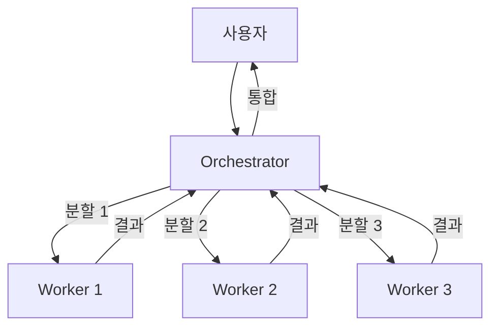
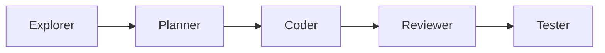
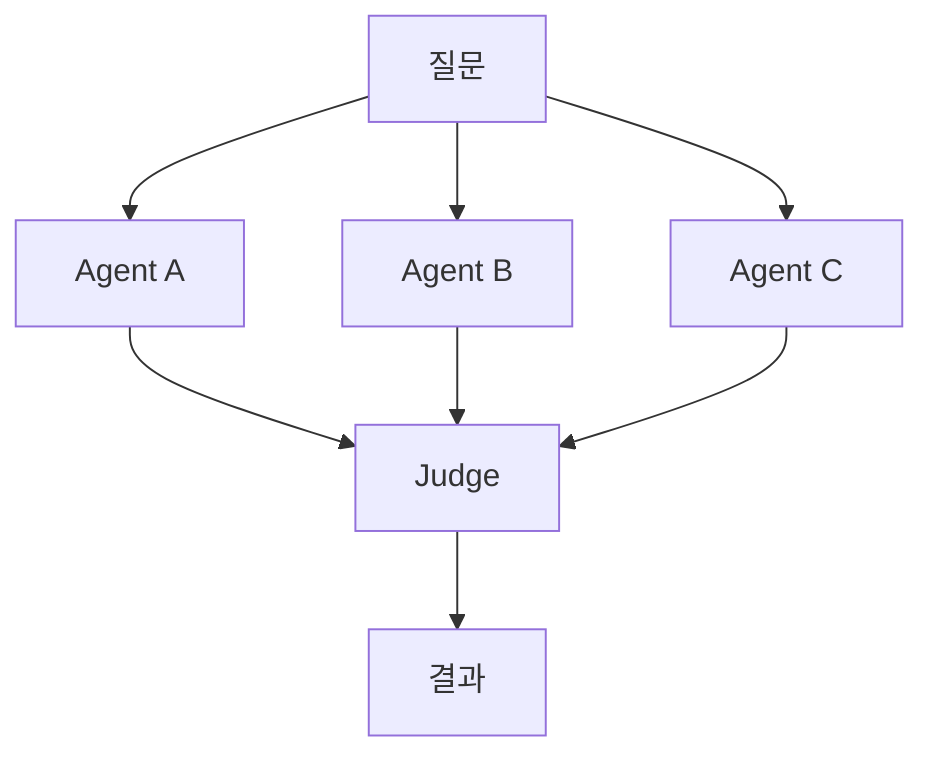
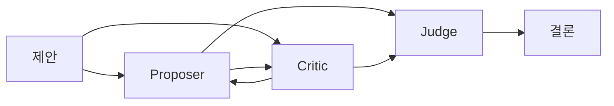
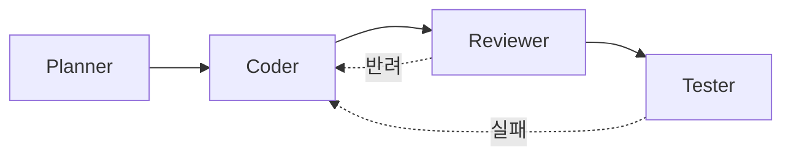

# 서브에이전트 (Subagents)

## 개요

Claude Code의 **서브에이전트(Subagent)**는 메인 대화와 별도로 독립적인 작업을 수행하는 보조 에이전트입니다. 복잡한 작업을 여러 서브에이전트에 나누어 병렬로 처리하거나, 특정 작업을 격리된 환경에서 수행할 수 있습니다.

쉽게 말해, **일을 도와주는 조수를 여러 명 고용하여 동시에 작업시키는 것**과 같습니다.

---

## 서브에이전트란?

### 기본 개념

Claude Code는 메인 에이전트가 작업을 수행하는 중에, 별도의 서브에이전트를 생성하여 독립적인 작업을 맡길 수 있습니다.

```
메인 에이전트 (사용자와 대화)
    ├── 서브에이전트 A: 파일 탐색
    ├── 서브에이전트 B: 코드 분석
    └── 서브에이전트 C: 테스트 검토
```

### 서브에이전트 vs 직접 도구 사용

| 구분 | 직접 도구 사용 | 서브에이전트 사용 |
|------|---------------|-----------------|
| **실행 방식** | 순차적 (하나씩) | 병렬 가능 (동시에 여러 개) |
| **컨텍스트** | 메인 대화와 공유 | 독립적인 컨텍스트 |
| **적합한 작업** | 간단한 단일 작업 | 복잡하고 독립적인 작업 |
| **결과** | 즉시 대화에 반영 | 완료 후 요약하여 보고 |

---

## 서브에이전트를 사용하는 경우

### 서브에이전트가 효과적인 상황

1. **여러 파일을 동시에 분석해야 할 때**
   ```
   사용자: 프론트엔드와 백엔드 코드를 각각 분석해줘
   # 서브에이전트 A: 프론트엔드 분석
   # 서브에이전트 B: 백엔드 분석
   ```

2. **독립적인 조사가 필요할 때**
   ```
   사용자: 이 프로젝트에서 사용되지 않는 의존성과 중복 코드를 찾아줘
   # 서브에이전트 A: 미사용 의존성 탐색
   # 서브에이전트 B: 중복 코드 탐색
   ```

3. **여러 해결책을 탐색해야 할 때**
   ```
   사용자: 이 성능 문제를 해결할 방법 3가지를 제안해줘
   # 서브에이전트들이 각각 다른 접근법을 탐색
   ```

### 직접 도구 사용이 나은 상황

- 단일 파일 수정
- 간단한 명령어 실행
- 순차적으로 진행해야 하는 작업
- 이전 단계의 결과가 다음 단계에 필요한 경우

---

## 서브에이전트 유형

### 1. 범용 서브에이전트 (Agent Tool)

가장 일반적인 서브에이전트입니다. 메인 에이전트와 같은 도구를 사용할 수 있으며, 독립적인 작업을 수행합니다.

```
사용자: 이 프로젝트의 아키텍처를 분석해줘

Claude: 서브에이전트를 활용하여 분석하겠습니다.
  - 에이전트 1: 디렉토리 구조와 파일 구성 분석
  - 에이전트 2: 의존성과 패키지 분석
  - 에이전트 3: 설정 파일과 빌드 시스템 분석
```

### 2. 탐색 서브에이전트 (Explore)

코드베이스를 탐색하고 이해하는 데 특화된 서브에이전트입니다.

**활용 예시**:
```
사용자: 인증 시스템이 어떻게 구현되어 있는지 파악해줘

Claude: 탐색 에이전트를 통해 인증 관련 코드를 조사하겠습니다.
  - 인증 미들웨어 파일 찾기
  - JWT 토큰 처리 로직 확인
  - 세션 관리 방식 분석
  - 관련 API 엔드포인트 매핑
```

### 3. 계획 서브에이전트 (Plan)

작업 계획을 수립하는 데 활용됩니다. 실제 코드 수정 없이 분석과 계획만 수행합니다.

**활용 예시**:
```
사용자: 이 앱에 다크모드를 추가하려면 어떻게 해야 할지 계획을 세워줘

Claude: 계획 에이전트를 통해 분석하겠습니다.
  - 현재 스타일링 시스템 분석
  - 영향받는 컴포넌트 목록 작성
  - 단계별 구현 계획 수립
  - 예상 소요 시간 추정
```

---

## 병렬 실행

서브에이전트의 가장 큰 장점은 **병렬 실행**입니다. 여러 작업을 동시에 수행하여 시간을 절약할 수 있습니다.

### 병렬 실행 예시

```
사용자: 이 프로젝트의 코드 품질을 종합적으로 평가해줘

Claude: 여러 관점에서 동시에 분석하겠습니다.

[병렬 실행]
├── 에이전트 1: 테스트 커버리지 분석
│   → 테스트 파일 탐색, 커버리지 확인
│
├── 에이전트 2: 코드 복잡도 분석
│   → 주요 함수의 복잡도 측정
│
├── 에이전트 3: 보안 취약점 탐색
│   → 알려진 보안 패턴 검사
│
└── 에이전트 4: 의존성 상태 확인
    → 오래된 패키지, 취약한 패키지 확인

[결과 종합]
Claude: 분석 결과를 종합하면...
```

### 순차 vs 병렬 비교

```
# 순차 실행 (서브에이전트 없이)
작업 A (30초) → 작업 B (20초) → 작업 C (25초) = 총 75초

# 병렬 실행 (서브에이전트 사용)
작업 A (30초) ─┐
작업 B (20초) ─┤ = 총 30초 (가장 긴 작업 기준)
작업 C (25초) ─┘
```

---

## 포그라운드 vs 백그라운드 실행

### 포그라운드 실행

서브에이전트의 결과를 기다린 후 다음 작업을 진행합니다.

```
사용자: 이 함수의 모든 호출 위치를 찾아줘

Claude: 서브에이전트로 검색하겠습니다.
[서브에이전트 실행 중... 결과를 기다리는 중]
→ 검색 결과: 5개 파일에서 12곳에서 호출됨
```

- 결과가 바로 필요할 때 사용
- 후속 작업이 결과에 의존할 때 적합

### 백그라운드 실행

서브에이전트가 백그라운드에서 작업하는 동안 메인 에이전트는 다른 작업을 계속합니다.

```
사용자: 테스트를 백그라운드로 실행하면서, 동시에 코드 리뷰를 해줘

Claude:
[백그라운드] 서브에이전트: 테스트 실행 중...
[포그라운드] 코드 리뷰를 진행하겠습니다...
  - app.ts: 에러 처리 누락 발견
  - utils.ts: 타입 안전성 개선 필요

[백그라운드 완료] 테스트 결과: 45개 통과, 2개 실패
```

- 시간이 오래 걸리는 작업에 적합
- 메인 작업과 독립적인 경우 유용

---

## 워크트리 격리 모드 (Worktree Isolation)

### 개념

워크트리 격리 모드는 서브에이전트가 **별도의 Git 워크트리**에서 작업하여, 메인 작업 디렉토리에 영향을 주지 않는 방식입니다.

```
메인 워크트리 (main 브랜치)
├── 서브에이전트 A → 워크트리 A (feature-a 브랜치)
└── 서브에이전트 B → 워크트리 B (feature-b 브랜치)
```

### 장점

1. **안전성**: 서브에이전트의 변경이 메인 코드에 영향을 주지 않음
2. **독립성**: 여러 서브에이전트가 같은 파일을 동시에 수정 가능
3. **롤백 용이**: 문제가 생기면 워크트리를 삭제하면 끝

### 활용 예시

```
사용자: 로그인과 회원가입 기능을 동시에 구현해줘

Claude: 워크트리 격리 모드로 두 기능을 동시에 개발하겠습니다.

[워크트리 A - feature/login 브랜치]
서브에이전트 A: 로그인 기능 구현
  - src/auth/login.ts
  - src/pages/LoginPage.tsx
  - tests/login.test.ts

[워크트리 B - feature/signup 브랜치]
서브에이전트 B: 회원가입 기능 구현
  - src/auth/signup.ts
  - src/pages/SignupPage.tsx
  - tests/signup.test.ts

[완료 후]
두 브랜치를 각각 PR로 생성하겠습니다.
```

---

## 서브에이전트 효과적으로 사용하기

### 모범 사례

#### 1. 명확한 작업 분할

```
# 좋은 예: 독립적이고 명확한 작업 분할
사용자: 다음 3가지를 동시에 해줘:
1. package.json의 의존성을 분석해줘
2. README를 현재 코드에 맞게 업데이트해줘
3. 사용되지 않는 파일을 찾아줘

# 나쁜 예: 의존적인 작업을 억지로 분할
사용자: 먼저 데이터 모델을 설계하고 동시에 그 모델을 사용하는 API도 만들어줘
# → API가 데이터 모델에 의존하므로 병렬 처리 비효율
```

#### 2. 적절한 수의 서브에이전트 사용

서브에이전트가 너무 많으면 오히려 비효율적일 수 있습니다.

```
# 적절한 수: 2-4개
큰 작업을 2-4개의 의미 있는 하위 작업으로 분할

# 과도한 수: 10개 이상
너무 잘게 나누면 오버헤드가 커지고 결과 통합이 어려움
```

#### 3. 결과 통합 고려

서브에이전트의 결과를 어떻게 통합할지 미리 고려하세요.

```
사용자: 프론트엔드, 백엔드, 인프라 각각의 보안 취약점을 찾아줘.
       결과를 하나의 보안 보고서로 정리해줘.

# 각 서브에이전트가 독립적으로 분석
# 메인 에이전트가 결과를 통합하여 보고서 생성
```

#### 4. 에러 처리 인지

서브에이전트가 실패할 수 있음을 고려합니다.

```
사용자: 외부 API를 테스트해줘

Claude: 서브에이전트로 테스트를 실행합니다.
[서브에이전트 1: 성공 - 응답 시간 200ms]
[서브에이전트 2: 실패 - 연결 타임아웃]
→ 일부 테스트가 실패했습니다. 실패 원인을 분석하겠습니다.
```

---

## 실전 활용 예시

### 예시 1: 병렬 코드 리서치

```
사용자: 이 프로젝트에서 에러 처리가 어떻게 되어 있는지 종합적으로 파악해줘

Claude: 여러 에이전트로 동시에 조사하겠습니다.

에이전트 1 - API 레이어 에러 처리:
  → try-catch 패턴 분석
  → HTTP 에러 코드 사용 현황
  → 에러 응답 포맷 확인

에이전트 2 - 프론트엔드 에러 처리:
  → Error Boundary 사용 현황
  → API 에러 핸들링 방식
  → 사용자에게 보여주는 에러 메시지

에이전트 3 - 로깅/모니터링:
  → 로그 라이브러리 확인
  → 에러 추적 서비스 연동 여부
  → 로그 레벨 설정

[종합 결과]
현재 에러 처리 상태와 개선 제안을 정리합니다...
```

### 예시 2: 코드 탐색

```
사용자: 이 프로젝트의 데이터 흐름을 파악해줘.
       사용자가 버튼을 클릭하면 데이터가 어떻게 저장되는지 추적해줘.

Claude: 데이터 흐름의 각 단계를 동시에 추적하겠습니다.

에이전트 1 - 프론트엔드 이벤트 핸들러:
  → 버튼 클릭 이벤트 → API 호출 함수 추적

에이전트 2 - API 라우트 및 컨트롤러:
  → API 엔드포인트 → 서비스 레이어 추적

에이전트 3 - 데이터 액세스 레이어:
  → ORM/쿼리 → 데이터베이스 저장 추적

[결과 통합]
전체 데이터 흐름:
  버튼 클릭 → handleSubmit() → api.createOrder()
  → POST /api/orders → OrderService.create()
  → OrderRepository.save() → INSERT INTO orders
```

### 예시 3: 멀티 파일 리팩토링 계획

```
사용자: 인증 시스템을 리팩토링하고 싶어. 계획을 세워줘.

Claude: 여러 에이전트로 현재 상태를 분석하고 계획을 수립하겠습니다.

에이전트 1 - 현재 인증 코드 분석:
  → 파일 목록, 함수 목록, 의존성 그래프

에이전트 2 - 테스트 현황 분석:
  → 기존 테스트 커버리지, 테스트 케이스 목록

에이전트 3 - 모범 사례 탐색:
  → 프로젝트의 다른 부분에서 사용된 패턴 확인

[리팩토링 계획]
1단계: 인증 로직을 AuthService로 통합 (3개 파일)
2단계: 미들웨어 리팩토링 (2개 파일)
3단계: 테스트 업데이트 (4개 파일)
예상 소요 시간: 약 30분
```

---

## 서브에이전트 사용 시 주의사항

### 1. 토큰 소비

서브에이전트는 별도의 컨텍스트를 사용하므로 토큰 소비가 증가합니다.

```
간단한 작업 → 직접 도구 사용 (토큰 절약)
복잡한 병렬 작업 → 서브에이전트 사용 (시간 절약)
```

### 2. 컨텍스트 독립성

서브에이전트는 메인 대화의 전체 컨텍스트를 공유하지 않습니다. 필요한 정보를 명확히 전달해야 합니다.

### 3. 결과 일관성

여러 서브에이전트가 같은 파일을 수정하면 충돌이 발생할 수 있습니다. 워크트리 격리를 활용하거나 작업 범위를 명확히 분리하세요.

---

## 요약

| 항목 | 설명 |
|------|------|
| **서브에이전트란** | 독립적인 작업을 수행하는 보조 에이전트 |
| **주요 장점** | 병렬 처리로 시간 절약, 작업 격리 |
| **유형** | 범용, 탐색(Explore), 계획(Plan) |
| **실행 방식** | 포그라운드(동기) / 백그라운드(비동기) |
| **워크트리 격리** | 별도 Git 워크트리에서 안전하게 작업 |
| **적절한 수** | 작업당 2-4개 서브에이전트 |
| **주의사항** | 토큰 소비 증가, 컨텍스트 독립성, 충돌 관리 |

서브에이전트를 활용하면 복잡한 작업을 효율적으로 처리할 수 있습니다. 특히 코드 분석, 리서치, 리팩토링 계획 수립 등에서 큰 효과를 발휘합니다.

---

## 멀티에이전트 패턴

> 4가지 조합 패턴. 작업 특성에 맞게 고른다.

### 패턴 1: Orchestrator-Worker (중앙 조정)



**언제 사용하나**
- 큰 작업을 여러 독립 하위 작업으로 쪼갤 수 있을 때
- 각 하위 작업이 다른 컨텍스트를 요구할 때 (예: FE + BE + DB 병행)

**구현**
- Orchestrator = 사람 (또는 메인 Claude Code 세션)
- Workers = Claude Code 서브에이전트 / 별도 세션 / 다른 AI 도구
- 통신 = 파일 (마크다운 리포트) 또는 Task 툴

**예시 프롬프트 (Orchestrator에게)**

```
다음 작업을 독립된 3개 하위 작업으로 나눠라. 각 하위 작업은 다른 세션에서
수행할 수 있어야 한다. 각 세션에 전달할 self-contained 프롬프트를 생성하라.

작업: "상품 검색 기능 추가 (DB 인덱스, API, UI)"

출력 형식:
- sub-task-1.md (DB + 인덱스)
- sub-task-2.md (API 엔드포인트)
- sub-task-3.md (검색 UI)

각 파일은 그 세션에 그대로 붙여넣을 수 있어야 한다.
```

### 패턴 2: Pipeline (순차 파이프)



**언제 사용하나**
- 작업이 자연스럽게 단계를 이룰 때
- 각 단계가 이전 단계의 산출물에 의존할 때

**각 단계의 역할**

| 단계 | 입력 | 출력 | 쓰면 좋은 도구 |
|------|------|------|---------------|
| Explorer | 요구사항 | 관련 파일 지도 + 제약 | Claude Code (탐색형 프롬프트) |
| Planner | 제약 + 목표 | 변경 계획 + 단계 분할 | Claude Code (thinking 강화) |
| Coder | 계획 | 코드 변경 | Claude Code / Cursor / Codex |
| Reviewer | diff | 리뷰 코멘트 + 머지 가부 | **다른** 에이전트 세션 |
| Tester | 코드 | 테스트 결과 + 추가 테스트 | Claude Code (테스트 전용 세션) |

**핵심 원칙**
- **리뷰어는 반드시 다른 세션**이어야 한다. 같은 세션의 자기 리뷰는 사각지대를 공유.
- 각 단계의 산출물은 **파일**로 떨어뜨린다. 메모리 의존 금지.

### 패턴 3: Parallel (병렬 탐색)



**언제 사용하나**
- 한 가지 정답이 없는 문제 (설계 선택, 라이브러리 비교)
- 동일 입력에 여러 관점이 필요할 때

**구현**
- 같은 프롬프트를 서로 다른 세션/도구에 동시 투입
- 결과를 한 파일에 모아 Judge 세션이 비교

**예시 사용**: "이 API를 tRPC로 할지 GraphQL로 할지"를 A/B 에이전트에 각각 주장하게 하고, Judge가 근거 비교

### 패턴 4: Debate (토론 / 2-agent 검증)



**언제 사용하나**
- 제안한 설계/패치에 숨은 결함이 있을지 의심될 때
- 스키마 변경, 보안 관련 변경, 롤백 비용이 큰 변경

**프로토콜**
1. Proposer가 제안 + 근거
2. Critic이 **반대 입장에서만** 반박
3. Proposer가 반박에 대응
4. 2~3회 라운드
5. Judge(사람 또는 제3 세션)가 결론

**주의**: Critic 프롬프트에 **"긍정 코멘트 금지, 반대 논거만"** 을 명시해야 작동. 라운드 2~3회 넘어가면 토큰 낭비.

### 패턴 선택표

| 상황 | 추천 패턴 |
|------|----------|
| 작업이 독립된 3개 서브작업으로 쪼개짐 | Orchestrator-Worker |
| 탐색→계획→구현→리뷰→테스트 순차 | Pipeline |
| 설계 선택 / 라이브러리 결정 | Parallel |
| 고위험 스키마/보안 변경 | Debate |
| 단순 버그 수정 1파일 | 멀티 에이전트 불필요 (단일 + 2단계 프롬프트) |

### 안티패턴

| 하지 마라 | 왜 |
|----------|----|
| 모든 작업을 멀티로 | 컨텍스트 전달 오버헤드가 이득 초과 |
| 리뷰어를 같은 세션에서 | 자기 코드 자기 칭찬 |
| Worker 간 직접 통신 | 결합 증가, 오케스트레이터 우회 |
| Debate를 4라운드+ | 실제 개선 없이 토큰만 소모 |
| 각 세션에 컨텍스트 요약 없이 | "전에 우리가 얘기한" 이 지워짐 |

---

## 역할 기반 협업 (4-Role 모델)

> 한 사람이 여러 에이전트 세션을 각각 다른 "역할"로 운영하는 방식. Pipeline 패턴의 구체화.

### 4-Role 기본 구성



#### 각 역할의 특성

| 역할 | 권한 | 컨텍스트 | 토큰 예산 |
|------|------|---------|----------|
| Planner | 읽기 전용 (강제) | 넓음 — 문서 + 관련 디렉토리 | 중간 |
| Coder | 쓰기 허용 | 좁음 — Planner가 지정한 파일만 | 큼 |
| Reviewer | 읽기 전용 (강제) | 좁음 — diff만 | 작음 |
| Tester | 쓰기 허용 (테스트 파일만) | 테스트 + 타깃 파일 | 중간 |

#### 핵심 원칙
- **각 역할은 다른 세션** (같은 세션에서 역할 교대 금지)
- **각 세션은 자기 역할의 프롬프트로 시작** (역할이 바뀌면 새 세션)
- **역할 간 통신은 파일로만** — 구두 메모리 의존 금지

### Planner 프롬프트

```markdown
## 역할
너는 이 프로젝트의 **Planner**다. 코드를 수정하지 않는다.
변경 계획만 만들어 파일로 떨어뜨린다.

## 참조
- CLAUDE.md
- docs/ 전부
- 관련 소스:
  - <파일/디렉토리 경로들>

## 작업
"<작업 제목>"에 대한 계획을 만든다.

## 출력
다음 내용을 `planning/<slug>.md`로 저장하라. (쓰기 허용되면)
없으면 메시지로 출력하라.

# Plan: <작업 제목>

## 목표
<한 줄>

## 영향 파일
- <파일 1> — <변경 유형>
- <파일 2> — <변경 유형>

## 단계
1. <단계 — 1파일 범위>
2. <단계 — 1파일 범위>
3. ...

## 위험
- <위험 1>
- <위험 2>

## 완료 기준
- [ ] ...
- [ ] ...

## 보존 규칙
- 변경 금지: <공개 API 등>

⚠️ 코드를 수정하지 마라.
⚠️ 실행 가능한 단계만 적어라. "잘 한다"는 단계 금지.
```

### Coder 프롬프트

```markdown
## 역할
너는 이 프로젝트의 **Coder**다. Planner가 만든 계획을 따른다.
계획에서 벗어나지 마라.

## 참조
- CLAUDE.md
- planning/<slug>.md  (← Planner의 계획)
- 계획에 명시된 파일만

## 작업
계획의 단계 <N>을 수행한다.

## 제약
- 계획에 없는 파일을 건드리지 마라
- 보존 규칙을 지켜라 (계획 §보존 규칙)
- 단계 <N>만 작업. 다음 단계는 새 메시지로.
- 완료 후 diff를 먼저 보여주고 내 승인을 기다려라

## 출력
1. 단계 <N>의 diff
2. 수정된 파일 목록
3. 다음 단계 제안 (계획의 N+1)
```

### Reviewer 프롬프트

````markdown
## 역할
너는 이 프로젝트 외부의 **독립 Reviewer**다.
Coder가 아니다. Planner의 계획도 모른다. diff만 본다.

## 참조
- CLAUDE.md (규칙)
- 다음 diff만:

```diff
<diff 붙여넣기>
```

## 작업
이 diff가 머지 가능한지 판단한다.

## 점검 항목
1. CLAUDE.md 규칙 위반 여부
2. 엣지 케이스 / null / 에러 경로
3. 테스트 존재 여부 (diff에 테스트가 있는가?)
4. 공개 API 변경 여부 (의도된 것인지 확인)
5. 보안 / 권한 체크
6. 성능 이상 (N+1, 큰 루프)
7. 가독성 — 이 파일을 2주 후 내가 읽을 수 있는가

## 출력
각 항목: "OK" 또는 "문제: <한 줄>"
마지막: **머지 가능 / 조건부 / 반려** 중 하나 + 이유
````

### Tester 프롬프트

```markdown
## 역할
너는 이 프로젝트의 **Tester**다. 프로덕션 코드를 수정하지 않는다.
테스트 파일만 추가/수정한다.

## 참조
- CLAUDE.md §테스트 정책
- 방금 병합된 파일들:
  - <파일 1>
  - <파일 2>

## 작업
위 변경에 대한 테스트를 추가한다.

## 제약
- 프로덕션 코드 수정 금지 (테스트를 위해서라도)
- 기존 테스트를 약화시키지 마라
- 모킹은 최소한. 진짜 동작을 검증하라.
- 헬퍼/픽스처는 기존 것을 재사용

## 출력
1. 추가할 테스트 파일 목록
2. 각 테스트의 시나리오 1줄 요약
3. 테스트 코드
4. 실행 명령과 예상 결과
```

### Planner/Coder 분리가 주는 효과

| 분리 전 | 분리 후 |
|---------|--------|
| 에이전트가 탐색하다가 바로 수정 | 탐색 단계에서 수정 금지 강제 |
| 계획 없이 파일 5개 건드림 | 각 단계가 1파일 범위로 제한 |
| 나중에 "왜 이렇게 했지?" | 계획 파일이 근거로 남음 |
| 잘못된 방향으로 500줄 작성 | 계획 단계에서 방향 수정 가능 |

### 축약 및 확장

- **2-Role (Planner + Coder)**: 작은 작업이면 Reviewer/Tester는 같은 세션에서 해도 됨. 단 **Planner와 Coder는 반드시 분리**.
- **5-Role (+ Debugger)**: 버그 수정이 많은 주라면 **Debugger** 역할을 추가. 버그수정 프롬프트의 "원인 분석" 단계가 Debugger 역할에 해당.

---

## 실전 예제: 멀티에이전트 리팩토링

> 큰 리팩토링을 Planner -> Coder -> Reviewer -> Tester 4-role로 나눠 실행한 사례.

### 설정

- **작업**: `src/services/order-service.ts` (847줄, 4개 관심사 혼재)를 4개 서비스로 분리
- **도구**:
  - Planner: Claude Code 세션 A (읽기만)
  - Coder: Claude Code 세션 B (쓰기)
  - Reviewer: Claude Code 세션 C (diff만 본다)
  - Tester: Claude Code 세션 D (테스트 파일만)
- **리스크**: 높음 (결제 경로 포함)

### 단계 1: Planner 세션

위 Planner 프롬프트 템플릿을 채워서 투입. 산출물로 `planning/order-refactor.md`를 생성:

```markdown
# Plan: order-service 리팩토링

## 목표
847줄 order-service를 4개 서비스로 분리. 공개 API 유지.

## 현재 진단
- 4개 관심사: OrderCreation(320줄) / Payment(180줄) / Shipping(220줄) / Notification(127줄)
- 테스트는 spec.ts 580줄, 통과 중
- 모킹 22개 (리팩토링 후 10개 이하 목표)

## 단계
### Step 1: 특성화 테스트 추가
### Step 2: PaymentService 추출
### Step 3: ShippingService 추출
### Step 4: NotificationService 추출
### Step 5: OrderCreationService 추출
### Step 6: order-service.ts 제거 (또는 얇은 facade만)

## 위험
- HIGH: 결제 경로 변경. 회귀 시 유저 돈 손실 위험.
- MED: 알림 중복 발송 (idempotency key 누락 시)

## 보존 규칙
- POST /api/orders 요청/응답 스키마 불변
- 에러 코드 불변, 기존 spec.ts 수정 금지, DB 스키마 변경 금지
```

### 단계 2: Coder 세션 (Step 1)

```
## 역할: Coder. Step 1만 수행: characterization 테스트 5개 추가.
## 제약: 프로덕션 코드 0줄 변경. 모킹 없이 실제 DB + in-memory fake 사용.
```

5개 테스트 통과 후 커밋: `test(order): add characterization tests before refactor`

### 단계 3: Coder 세션 (Step 2, 새 세션)

> 같은 세션을 재사용하지 않는다. Step 간 컨텍스트 분리.

PaymentService 추출 계획을 먼저 응답 -> 승인 대기 -> 승인 후 코드 작성 -> 테스트 통과.

커밋: `refactor(order): extract PaymentService (step 2/6)`

### 단계 4: Reviewer 세션 (별도 세션)

Planner/Coder가 뭘 했는지 모르는 상태에서 diff만 보고 리뷰:

```
1. CLAUDE.md: OK
2. 엣지 케이스: 문제 — payment-service.process()에서 timeout 시 retry 없음.
   기존 order-service.processPayment는 3회 retry. 이동 과정에서 사라진 듯.
3. 테스트: 문제 — PaymentService 단위 테스트가 0개.
4~6. OK

판정: **조건부** — retry 로직 복구 + PaymentService 단위 테스트 5개 추가 후 재리뷰.
```

중요한 회귀를 잡음. Coder 세션으로 돌아가 수정 -> 재리뷰 -> "머지 가능" 판정.

### 단계 5: Tester 세션

PaymentService의 실패 경로 테스트 3개 추가 (DB 연결 실패, 게이트웨이 500, 중복 결제).

커밋: `test(payment): add failure path tests (step 2 hardening)`

### Step 3~6 반복

같은 패턴으로 ShippingService / NotificationService / OrderCreationService 추출. 각 단계마다 Coder -> Reviewer -> (필요 시 재수정) -> Tester.

### 결과

| 지표 | Before | After |
|------|--------|-------|
| order-service.ts 줄수 | 847 | 52 (facade) |
| 모킹 수 | 22 | 8 |
| 관심사 분리 | 없음 | 4개 서비스 |
| 기존 테스트 통과 | 통과 | 통과 (하나도 수정 안 함) |
| 신규 단위 테스트 | 0 | 35 |
| characterization 테스트 | 0 | 5 |
| 공개 API 변경 | - | 0 |
| 결제 회귀 | - | 0 (retry 복구 덕분) |
| 총 세션 수 | - | 14개 (각 역할 3~4회) |

### 교훈

1. **Planner 분리로 범위 고정** — Coder가 다른 파일 못 건드림
2. **Reviewer 분리로 회귀 발견** — 같은 세션이었다면 retry 누락을 놓쳤을 것
3. **새 세션마다 컨텍스트 초기화** — planning/ 파일이 컨텍스트 핸드오프 역할
4. **각 단계 = 머지 가능한 그린 상태** — 중간에 멈춰도 손해 없음
5. **전체 소요 시간은 단일 세션 대비 길지만**, 회귀 없이 끝난 게 더 큰 이득

### 이 패턴을 언제 쓰는가

- 변경 파일 10개 이상
- 고위험 영역 (결제 / 인증 / 데이터 마이그레이션)
- 기존 테스트가 약한 곳
- "그냥 정리" 아닌 구조 변경

작은 버그 수정에 이 패턴 쓰면 오버엔지니어링. 위 [패턴 선택표](#패턴-선택표)를 참고.

---

## 관련 문서

- [컨텍스트 관리](../02-핵심개념(concepts)/04-컨텍스트관리(context-management).md) — 서브에이전트 간 컨텍스트 분리와 관리
- [워크플로우 개요](../04-워크플로우(workflows)/README.md) — 기능 개발, 버그 수정, 리팩토링 등 작업별 플레이북
- [성능 최적화](../07-최적화(optimization)/03-성능최적화(performance).md) — 토큰 비용 관리와 병렬 실행 최적화
