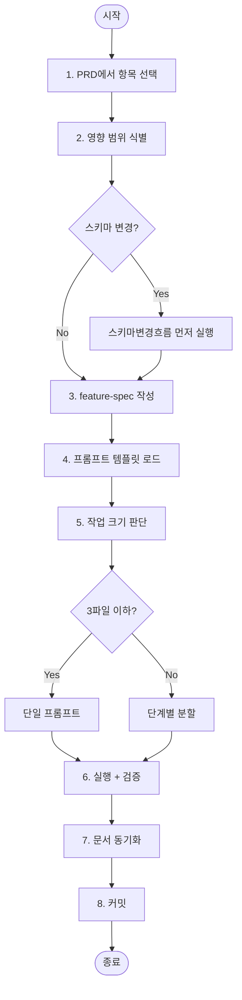

# 02. 기능 개발 흐름 (Feature Development Flow)

> 새 기능을 추가할 때 쓰는 플레이북. 가장 자주 쓰는 흐름.

## 적용 조건

- 기존에 없던 화면/엔드포인트/동작을 추가한다
- PRD에 있는 P0/P1 항목을 구현한다
- "이런 거 되면 좋겠는데" 수준의 아이디어는 먼저 PRD에 넣고 시작한다

## 흐름도



---

## 단계별 체크리스트

### 1. PRD에서 항목 선택

- `docs/PRD.md`를 연다
- 오늘 구현할 항목 1개를 고른다 (복수 X)
- 그 항목에 `[진행 중]` 표시

### 2. 영향 범위 식별

다음 5가지 중 어디에 영향을 주는지 판단:

```
[ ] DB 스키마
[ ] API / 서버 로직
[ ] 프론트엔드 컴포넌트
[ ] 외부 통합 (결제/메일/푸시 등)
[ ] 설정 / 환경 변수
```

영향 범위가 `DB + API + FE`처럼 3개 이상이면 **반드시 단계별 분할**로 간다.

### 3. feature-spec 작성 (5분)

`docs/features/<feature-name>.md`를 만들고, [`08-바이브코딩/03-문서템플릿/feature-spec.template.md`](../08-바이브코딩(vibe-coding)/03-문서템플릿(templates)/feature-spec.template.md)를 복사해서 채웁니다.

최소 채울 항목:
- 목적 1줄
- 사용자 시나리오 2~3줄
- 수용 기준(Acceptance Criteria) 3~5개
- 영향 파일 목록

### 4. 프롬프트 템플릿 로드

[`08-바이브코딩/02-프롬프트템플릿/01-기능개발(feature).md`](../08-바이브코딩(vibe-coding)/02-프롬프트템플릿(prompts)/01-기능개발(feature).md)를 복사합니다.

### 5. 작업 크기 판단

| 변경 파일 수 | 접근 | 이유 |
|-------------|------|------|
| 1~2개 | 단일 프롬프트 | 컨텍스트가 작아 한 번에 가능 |
| 3~5개 | FE/BE 분할 | 관심사 분리로 검증 쉬움 |
| 6개 이상 | 순차 4단계: DB → API → 로직 → UI | 한 번에 하면 롤백 어려움 |

### 6. 실행 + 검증

- 프롬프트 투입
- 에이전트가 만든 변경 사항을 `git diff`로 직접 본다 (자동 수락 금지)
- 수용 기준을 **하나씩** 확인한다

### 7. 문서 동기화

```
[ ] PRD.md — 항목 상태 [완료]로 변경
[ ] erd.md — 스키마 변경 시 업데이트
[ ] architecture.md — 새 컴포넌트 추가 시 다이어그램 갱신
[ ] CLAUDE.md — 새 패턴/규칙이 생겼으면 추가
```

### 8. 커밋

```
feat(<scope>): <한 줄 요약>

- <바뀐 것 1>
- <바뀐 것 2>

docs: update PRD/erd/architecture
```

문서 변경은 **같은 커밋 또는 같은 PR**에 포함합니다. 분리하면 다음 세션이 오염됩니다.

---

## 안티패턴

1. **스코프 확장** — "어차피 여기 만진 김에"로 다른 기능을 건드리면 PR 리뷰가 불가능해집니다.
2. **수용 기준 없이 시작** — "되게 해줘"로 시작하면 언제 끝났는지 모릅니다.
3. **문서 후일 업데이트** — "나중에 한꺼번에" 하면 아무도 안 합니다.

---

## 대응 프롬프트

→ [08-바이브코딩/02-프롬프트템플릿/01-기능개발(feature).md](../08-바이브코딩(vibe-coding)/02-프롬프트템플릿(prompts)/01-기능개발(feature).md)
