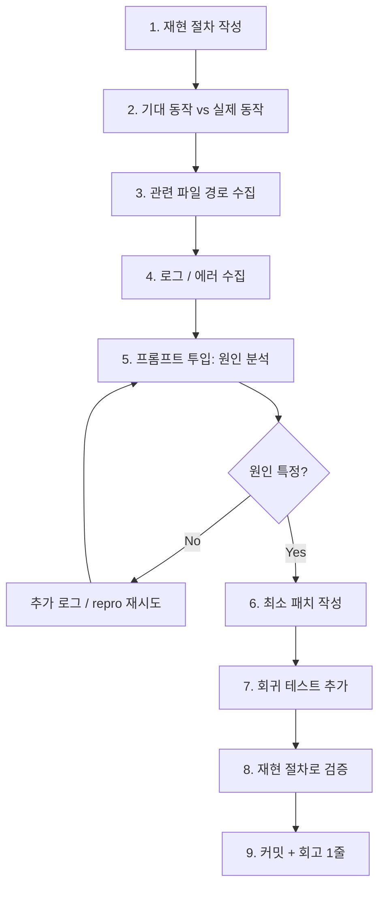

# 03. 버그 수정 흐름 (Bugfix Flow)

> 기존 동작이 깨졌을 때. 속도보다 **재현성**이 중요.

## 원칙

1. **재현 없이 수정 금지** — 재현 안 되는 버그는 아직 버그가 아니다.
2. **원인 확인 없이 패치 금지** — 증상만 가리면 다음 주에 되살아난다.
3. **테스트 없이 종료 금지** — 회귀 방지 테스트가 없으면 고친 게 아니다.

## 흐름도



---

## 필수 수집 정보 (프롬프트 투입 전)

```markdown
## 버그 리포트
### 재현 절차
1. ...
2. ...
3. ...

### 기대 동작
- ...

### 실제 동작
- ...

### 환경
- OS / 브라우저 / Node 버전 / DB 버전
- 최근 변경 (커밋 해시 또는 날짜)

### 에러 로그
```
<붙여넣기>
```

### 관련 파일 (추정)
- src/a.ts
- src/b.ts
```

이 5개 섹션을 채우지 않고 Claude Code에 "버그 고쳐줘" 하면 에이전트가 소설을 씁니다.

---

## 단계별 체크리스트

1. **재현 절차** — 3줄 이하로 딱 떨어지게
2. **기대 vs 실제** — 한 줄씩
3. **관련 파일** — 아는 것만. 모르면 "추정"이라 적기
4. **로그** — 가능한 전부. 잘라내지 말기
5. **원인 분석 프롬프트** — 아래 [프롬프트 템플릿](#1단계-프롬프트-원인-분석) 사용. 바로 수정 요청하지 말고 "원인 먼저 설명" 요구
6. **최소 패치** — 원인 한 곳만 고치기. "근처 정리"는 다른 PR
7. **회귀 테스트** — 고친 버그를 재현하는 테스트 1개 추가
8. **검증** — 1번 재현 절차로 다시 확인
9. **회고 1줄** — `CHANGELOG.md` 또는 `docs/bugs.md`에 "왜 생겼고 어떻게 막는지" 한 줄

---

## 프롬프트 템플릿

> "바로 고쳐줘" 대신 **"원인 먼저 설명하라"**. 이 한 단계가 엉뚱한 파일 수정을 막는다.

버그 수정은 **반드시 2개의 프롬프트**로 나눕니다.

1. **1단계: 원인 분석만** — 수정 금지
2. **2단계: 수정** — 원인 확정 후

### 1단계 프롬프트: 원인 분석

```markdown
## 역할
너는 이 프로젝트의 시니어 개발자다. 지금은 **디버거**로 일한다.

## 참조
- CLAUDE.md
- docs/architecture.md
- 다음 파일들 (버그 의심 영역):
  - src/<a>
  - src/<b>

## 버그 리포트
### 재현 절차
1. <단계 1>
2. <단계 2>
3. <단계 3>

### 기대 동작
<한 줄>

### 실제 동작
<한 줄>

### 환경
- OS / 브라우저 / Node / DB 버전
- 최근 관련 커밋: <해시>

### 에러 로그
```
<전체 로그 붙여넣기, 자르지 말 것>
```

## 지시
다음 순서로 답하라.

1. **재현 경로 역추적**: 재현 절차 → 실제 코드 경로 (파일:라인)
2. **원인 가설 3개**: 각 1~2문장, 가능성 순
3. **가설 검증 방법**: 각 가설을 확정/반증할 최소 실험 (로그 추가, assertion, 테스트)
4. **영향 범위**: 이 버그가 다른 어디에도 영향을 줄 수 있는가?

⚠️ **이 메시지에선 코드를 수정하지 마라.** 파일을 건드리지 말 것.
가설이 확정되면 다음 메시지에서 수정 요청하겠다.
```

### 2단계 프롬프트: 최소 패치

1단계에서 원인이 확정되면:

```markdown
## 역할
너는 시니어 개발자다. 지금은 **최소 패치 작성자**로 일한다.

## 컨텍스트
이전 메시지에서 확정한 원인: <가설 N — 한 줄 요약>
근거: <어느 파일 어느 라인>

## 지시
다음 순서로 작업하라.

1. **최소 패치**: 원인 한 곳만 고친다. 근처 "정리"는 하지 마라.
2. **회귀 테스트**: 이 버그의 재현 절차를 코드로 표현한 테스트 1개. 기존 테스트 파일에 추가.
3. **검증**:
   - 기존 테스트 모두 통과
   - 새 테스트가 패치 전엔 실패, 후엔 성공하는지 설명
4. **회고 1줄**: `docs/bugs.md`에 "언제/무엇이/왜/어떻게 막는지" 한 줄 추가

## 제약
- 다른 파일의 "겸사겸사 수정" 금지
- 새 기능 추가 금지
- 공개 API 시그니처 유지
- 에러 메시지/코드 그대로 유지 (변경이 수정의 일부인 경우만 예외)

## 출력 형식
1. 패치 diff (3-way 포맷 가능)
2. 새 테스트 코드
3. docs/bugs.md에 추가할 한 줄
4. 실행해야 할 명령 (예: `pnpm test src/auth/...`)
```

### 왜 2단계로 나누는가

1단계를 생략하고 "고쳐줘"라고 하면:

- 에이전트가 증상을 가리는 패치를 생성 (null 체크, try/catch로 덮기)
- 원인을 모른 채 5개 파일을 "혹시 몰라서" 고침
- 같은 버그가 다른 경로로 다시 올라옴

2단계로 나누면:

- 인간이 원인을 확인한 뒤에만 코드가 바뀜
- 패치가 최소 범위로 고정됨
- 회귀 테스트가 반드시 포함됨

### 안티패턴

| 하지 마라 | 왜 |
|----------|---|
| 에러 로그 자르고 붙여넣기 | 실제 원인이 잘린 부분에 있을 수 있음 |
| "아마 X 때문인 거 같아" | 선입견을 에이전트에 주입, 가설 탐색이 막힘 |
| 1단계 건너뛰기 | 80% 확률로 엉뚱한 파일 수정 |
| 테스트 없이 종료 | 같은 버그 재발 |
