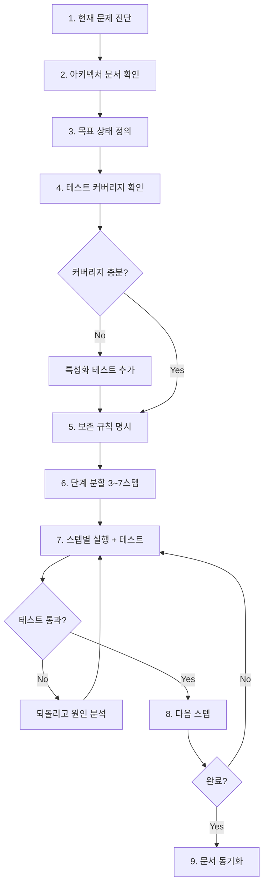

# 04. 리팩토링 흐름 (Refactoring Flow)

> 동작은 맞지만 구조가 나쁜 코드를 개선. **행동 보존**이 절대 원칙.

## 절대 규칙

1. **테스트 없는 코드는 리팩토링 금지** — 먼저 특성화 테스트(characterization test)부터.
2. **한 번에 한 가지** — "이름 변경 + 구조 변경 + 기능 추가"를 섞지 않는다.
3. **퍼블릭 API 변경 금지** (사전 합의 없이는) — 호출측이 같이 변해야 하는 변경은 리팩토링이 아니라 기능 변경.

---

## 흐름도



---

## 프롬프트에 반드시 들어가야 할 3가지

### (1) 현재 문제를 수치로

"깔끔하게 해줘"가 아니라, 줄 수·관심사 수·모킹 수 등 구체적 수치로 문제를 서술합니다.

### (2) 목표 상태를 구조로

"모듈로 쪼개줘"가 아니라, 분리할 모듈 이름·의존 방향·공유 객체를 명시합니다.

### (3) 보존 규칙(Preservation Rules)

API 스키마, 기존 테스트, DB 스키마, 에러 코드, 로그 포맷 등 변경 금지 항목을 명시적으로 나열합니다. 이것이 가장 중요합니다.

---

## 프롬프트 템플릿

> 동작 보존이 절대 원칙. "현재 → 목표 → 보존 규칙"을 명시하지 않으면 리팩토링이 아니라 사고다.

```markdown
## 1. 역할
너는 이 프로젝트의 시니어 개발자다.
지금은 **리팩토링 전담**으로 일한다. 동작을 바꾸지 마라.

## 2. 참조
- CLAUDE.md
- docs/architecture.md
- 리팩토링 대상:
  - src/<대상 파일 1>
  - src/<대상 파일 2>
- 관련 테스트:
  - tests/<테스트 파일>

## 3. 현재 상태 (문제 진단)
정량적으로 적어라. 예:
- `src/services/order.ts` 847줄
- 4개 관심사 혼재: 생성 / 결제 / 배송 / 알림
- 단위 테스트가 모킹 20개를 요구
- 신규 기능 추가 시 평균 3파일 동시 수정

## 4. 목표 상태 (구조)
- `OrderCreationService` — 주문 생성만
- `PaymentService` — 결제만, 자체 Repository
- `ShippingService` — 배송만
- `NotificationService` — 알림만
- 공통 컨텍스트는 `OrderContext` 값 객체로 전달
- 각 서비스는 다른 서비스를 직접 호출하지 않는다 (이벤트 또는 Orchestrator 경유)

(가능하면 Mermaid로 before/after)

## 5. 보존 규칙 (Preservation Rules)
다음은 변경 금지:
- 공개 API: `POST /api/orders` 요청/응답 스키마
- 기존 테스트 `tests/order/*.spec.ts` 전부 통과
- DB 스키마 (필요하면 별도 스키마변경흐름)
- 에러 코드 / 메시지
- 로그 포맷 (관측성 의존)
- 퍼블릭 export 시그니처

## 6. 단계 분할 계획
너 스스로 3~7단계로 나누고, 각 단계가 **독립적으로 머지 가능한 그린 상태**여야 한다.
예:
- Step 1: 특성화 테스트 추가
- Step 2: PaymentService 분리 (원본은 위임 레이어만)
- Step 3: ShippingService 분리
- Step 4: NotificationService 분리
- Step 5: 위임 레이어 제거

## 7. 출력 형식
다음 순서로 답하라.

1. 현재 구조와 목표 구조의 차이 요약 (5줄 이내)
2. **단계 분할 계획** (위 6번에 따라)
3. 보존 규칙 위반 위험이 있는 지점 식별
4. 내가 "Step N부터 시작하자"고 하면 → 해당 단계만 작업
5. 단계 종료 시: 테스트 통과 여부 + 다음 단계 제안

⚠️ 한 메시지에서 여러 단계를 묶어 작업하지 마라.
⚠️ 임의로 다른 파일을 정리하지 마라.
```

### 주의: "리팩토링 중 기능 추가" 금지

리팩토링 도중 "어차피 여기 만진 김에 기능도 추가"는 가장 흔한 사고 원인입니다.

- 리팩토링과 기능 추가는 **항상 별도 커밋/PR**.
- 리팩토링 PR의 diff를 보면 **동작 변경이 0**이어야 합니다.
- 동작이 바뀌면 그건 리팩토링이 아니라 리라이팅입니다.

### 프롬프트 사전 체크리스트

```
[ ] 테스트 커버리지 충분하거나, 특성화 테스트 추가 계획이 있다
[ ] 목표 구조가 구체적이다 (클래스/모듈 이름까지)
[ ] 보존 규칙이 명시적이다
[ ] 단계 분할이 3~7개이고 각각 머지 가능하다
[ ] 동작 변경 0을 확신할 수 있는 검증 방법이 있다
```
