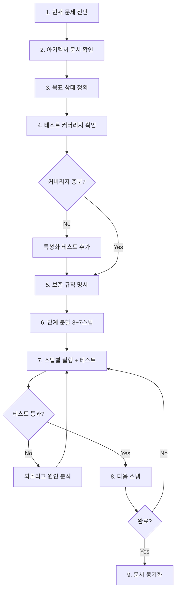

# 04. 리팩토링 흐름 (Refactoring Flow)

> 동작은 맞지만 구조가 나쁜 코드를 개선. **행동 보존**이 절대 원칙.

## 절대 규칙

1. **테스트 없는 코드는 리팩토링 금지** — 먼저 특성화 테스트(characterization test)부터.
2. **한 번에 한 가지** — "이름 변경 + 구조 변경 + 기능 추가"를 섞지 않는다.
3. **퍼블릭 API 변경 금지** (사전 합의 없이는) — 호출측이 같이 변해야 하는 변경은 리팩토링이 아니라 기능 변경.

---

## 흐름도

---

## 프롬프트에 반드시 들어가야 할 3가지

### (1) 현재 문제를 수치로

"깔끔하게 해줘"가 아니라, 줄 수·관심사 수·모킹 수 등 구체적 수치로 문제를 서술합니다.

### (2) 목표 상태를 구조로

"모듈로 쪼개줘"가 아니라, 분리할 모듈 이름·의존 방향·공유 객체를 명시합니다.

### (3) 보존 규칙(Preservation Rules)

API 스키마, 기존 테스트, DB 스키마, 에러 코드, 로그 포맷 등 변경 금지 항목을 명시적으로 나열합니다. 이것이 가장 중요합니다.

> 상세 예시와 복사용 프롬프트는 [08-바이브코딩/02-프롬프트템플릿/03-리팩토링](../08-바이브코딩(vibe-coding)/02-프롬프트템플릿(prompts)/03-리팩토링(refactoring).md)을 참조하세요.

---

## 대응 프롬프트

→ [08-바이브코딩/02-프롬프트템플릿/03-리팩토링(refactoring).md](../08-바이브코딩(vibe-coding)/02-프롬프트템플릿(prompts)/03-리팩토링(refactoring).md)
