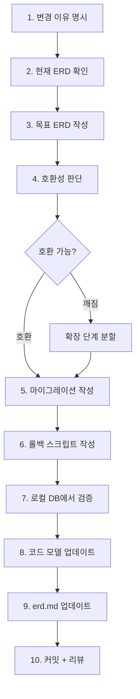

# 05. 스키마 변경 흐름 (Schema Change Flow)

> DB 구조 변경은 바이브 코딩에서 가장 위험한 작업. **ERD 문서가 없으면 시작 금지**.

## 전제 조건

- `docs/erd.md`가 존재하고 현재 상태를 정확히 반영한다
- 프로덕션이면 마이그레이션 롤백 계획이 있다
- 백업이 있다 (프로덕션이면)

---

## 흐름도



---

## Before / After ERD 비교

프롬프트에 **반드시** 현재(Before)와 목표(After) ERD 다이어그램을 함께 넣고, 컬럼별 변경 유형을 요약합니다. 두 상태를 나란히 보여줘야 에이전트가 정확한 마이그레이션을 생성합니다.

---

## 호환성 3단계 마이그레이션 (Expand-Contract)

호환 안 되는 변경은 **반드시** 3단계로 나눕니다.

1. **Expand** — 새 컬럼/테이블을 추가하고 기존과 병존시킵니다.
2. **Migrate** — 기존 데이터를 백필하고 새 쪽에서만 읽도록 전환합니다.
3. **Contract** — 기존 컬럼/테이블을 제거합니다.

단일 배포로 스키마와 코드를 동시에 바꾸면, 롤백 시 데이터 손실이 발생합니다.

> 상세 ERD 예시, SQL 코드, 체크리스트는 [08-바이브코딩/02-프롬프트템플릿/04-스키마마이그레이션](../08-바이브코딩(vibe-coding)/02-프롬프트템플릿(prompts)/04-스키마마이그레이션(schema).md)을 참조하세요.

---

## 롤백 스크립트 필수 템플릿

```sql
-- migrations/20260411_add_legal_name.up.sql
ALTER TABLE users ADD COLUMN legal_name VARCHAR(255);

-- migrations/20260411_add_legal_name.down.sql
ALTER TABLE users DROP COLUMN legal_name;
```

up / down 쌍이 없는 마이그레이션은 머지 금지.

---

## 체크리스트

```
[ ] 현재 erd.md 확인
[ ] 목표 erd.md 작성 (같은 파일 한 섹션 아래)
[ ] 변경 테이블 요약
[ ] 호환성 판단 (호환 or Expand-Contract 필요)
[ ] up/down 마이그레이션
[ ] 로컬 DB에서 up → 앱 동작 → down 검증
[ ] 코드 모델 업데이트
[ ] erd.md에 "After"를 현재 상태로 반영
[ ] 같은 PR에 마이그레이션 + 코드 + 문서 포함
```

---

## 대응 프롬프트

→ [08-바이브코딩/02-프롬프트템플릿/04-스키마마이그레이션(schema).md](../08-바이브코딩(vibe-coding)/02-프롬프트템플릿(prompts)/04-스키마마이그레이션(schema).md)
