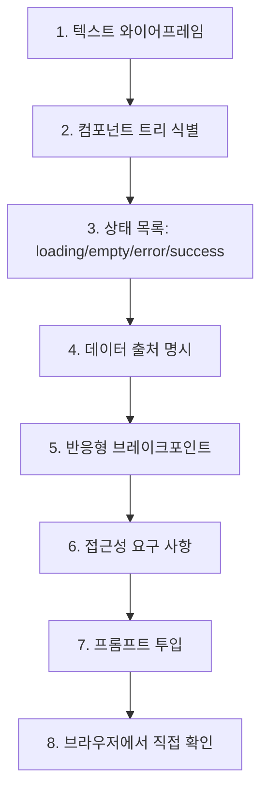

# 06. UI 구현 흐름 (UI Implementation Flow)

> 화면 작업. **텍스트 와이어프레임**이 Figma 스크린샷보다 에이전트 이해도가 높다.

## 왜 텍스트 와이어프레임인가

텍스트 와이어프레임은 에이전트가 가장 정확하게 이해하는 UI 명세 형식입니다. 이미지나 "이런 느낌으로" 같은 추상적 지시보다 구체적인 텍스트 레이아웃이 훨씬 효과적입니다.

> 포맷별 이해도 비교표와 상세 가이드는 [08-바이브코딩/02-프롬프트템플릿/05-UI구현](../08-바이브코딩(vibe-coding)/02-프롬프트템플릿(prompts)/05-UI구현(ui).md)을 참조하세요.

## 텍스트 와이어프레임 예시

```
┌──────────────────────────────────────────┐
│ Header                                   │
│  [Logo]          [Search____]  [Avatar] │
├──────────────────────────────────────────┤
│ Sidebar │ Main                            │
│         │ ┌─ ProductCard ──┐             │
│ [Cat A] │ │ [Image]        │             │
│ [Cat B] │ │ Title          │             │
│ [Cat C] │ │ ₩12,000        │             │
│         │ │ [담기]         │             │
│         │ └───────────────┘             │
│         │ (gridlist, 3 cols on md+)     │
└──────────────────────────────────────────┘

States:
- loading: skeleton 6개
- empty: "상품이 없습니다" + [필터 초기화]
- error: toast + 재시도 버튼
```

3분이면 그립니다. 에이전트는 이 한 장으로 `Header`, `Sidebar`, `ProductCard` 컴포넌트 경계를 바로 잡습니다.

---

## 흐름도



---

## 프롬프트에 들어가야 할 6가지

1. **텍스트 와이어프레임** (위 예시처럼)
2. **컴포넌트 트리** — `ProductList > ProductCard > {Image, Title, Price, AddButton}`
3. **상태별 UI** — loading / empty / error / success 4개 모두
4. **데이터 출처** — `useProducts()` 훅 or `GET /api/products`
5. **반응형** — `sm/md/lg` 각각 어떻게
6. **접근성** — alt, aria, focus order, 키보드 조작

빠진 항목이 있으면 에이전트가 추측하고, 추측은 대부분 틀립니다.

---

## 디자인 시스템이 있을 때

`CLAUDE.md`에 다음을 박아둡니다.

```markdown
## UI 규칙
- 모든 버튼은 `<Button>` 컴포넌트 사용 (직접 `<button>` 금지)
- 색상은 tailwind.config.ts의 디자인 토큰만 사용 (hex 직접 X)
- 아이콘은 `lucide-react`만 사용
- 폼은 react-hook-form + zod
```

이 4줄이 있으면 에이전트가 `<button class="bg-blue-500">` 같은 일회용 스타일을 생성하지 않습니다.

---

## 브라우저 확인 단계 (필수)

AI가 "완료됐습니다" 해도 브라우저에서 직접 봅니다.

- [ ] 디자인과 일치하는지
- [ ] loading / empty / error 상태 재현
- [ ] 모바일/태블릿/데스크톱 모두
- [ ] 키보드만으로 조작 가능
- [ ] 스크린 리더(VoiceOver/NVDA)로 한 번 훑기

타입 체크 통과 = UI 완성이 아닙니다.

---

## 대응 프롬프트

→ [08-바이브코딩/02-프롬프트템플릿/05-UI구현(ui).md](../08-바이브코딩(vibe-coding)/02-프롬프트템플릿(prompts)/05-UI구현(ui).md)
