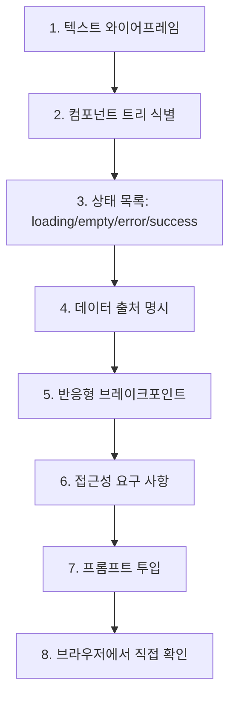

# 06. UI 구현 흐름 (UI Implementation Flow)

> 화면 작업. **텍스트 와이어프레임**이 Figma 스크린샷보다 에이전트 이해도가 높다.

## 왜 텍스트 와이어프레임인가

텍스트 와이어프레임은 에이전트가 가장 정확하게 이해하는 UI 명세 형식입니다. 이미지나 "이런 느낌으로" 같은 추상적 지시보다 구체적인 텍스트 레이아웃이 훨씬 효과적입니다.

아래 [프롬프트 템플릿](#프롬프트-템플릿) 섹션에서 포맷별 이해도 비교표와 상세 가이드를 확인하세요.

## 텍스트 와이어프레임 예시

```
┌──────────────────────────────────────────┐
│ Header                                   │
│  [Logo]          [Search____]  [Avatar] │
├──────────────────────────────────────────┤
│ Sidebar │ Main                            │
│         │ ┌─ ProductCard ──┐             │
│ [Cat A] │ │ [Image]        │             │
│ [Cat B] │ │ Title          │             │
│ [Cat C] │ │ ₩12,000        │             │
│         │ │ [담기]         │             │
│         │ └───────────────┘             │
│         │ (gridlist, 3 cols on md+)     │
└──────────────────────────────────────────┘

States:
- loading: skeleton 6개
- empty: "상품이 없습니다" + [필터 초기화]
- error: toast + 재시도 버튼
```

3분이면 그립니다. 에이전트는 이 한 장으로 `Header`, `Sidebar`, `ProductCard` 컴포넌트 경계를 바로 잡습니다.

---

## 흐름도



---

## 프롬프트에 들어가야 할 6가지

1. **텍스트 와이어프레임** (위 예시처럼)
2. **컴포넌트 트리** — `ProductList > ProductCard > {Image, Title, Price, AddButton}`
3. **상태별 UI** — loading / empty / error / success 4개 모두
4. **데이터 출처** — `useProducts()` 훅 or `GET /api/products`
5. **반응형** — `sm/md/lg` 각각 어떻게
6. **접근성** — alt, aria, focus order, 키보드 조작

빠진 항목이 있으면 에이전트가 추측하고, 추측은 대부분 틀립니다.

---

## 디자인 시스템이 있을 때

`CLAUDE.md`에 다음을 박아둡니다.

```markdown
## UI 규칙
- 모든 버튼은 `<Button>` 컴포넌트 사용 (직접 `<button>` 금지)
- 색상은 tailwind.config.ts의 디자인 토큰만 사용 (hex 직접 X)
- 아이콘은 `lucide-react`만 사용
- 폼은 react-hook-form + zod
```

이 4줄이 있으면 에이전트가 `<button class="bg-blue-500">` 같은 일회용 스타일을 생성하지 않습니다.

---

## 브라우저 확인 단계 (필수)

AI가 "완료됐습니다" 해도 브라우저에서 직접 봅니다.

- [ ] 디자인과 일치하는지
- [ ] loading / empty / error 상태 재현
- [ ] 모바일/태블릿/데스크톱 모두
- [ ] 키보드만으로 조작 가능
- [ ] 스크린 리더(VoiceOver/NVDA)로 한 번 훑기

타입 체크 통과 = UI 완성이 아닙니다.

---

## 프롬프트 템플릿

> Figma 스크린샷보다 **텍스트 와이어프레임**이 에이전트 이해도가 높다.

```markdown
## 1. 역할
너는 이 프로젝트의 시니어 프론트엔드 개발자다.
디자인 시스템과 접근성 규칙을 지킨다.

## 2. 참조
- CLAUDE.md  §UI 규칙
- docs/PRD.md  §<기능>
- docs/architecture.md  §frontend
- src/components/  (기존 디자인 시스템)
- src/app/<라우트>  (추가 대상)

## 3. 목적
<한 줄: 이 화면은 사용자가 어떤 일을 하게 해주는가>

## 4. 텍스트 와이어프레임
```
┌─────────────────────────────────────┐
│ <Header>                            │
│  [Logo]      [Search]     [Avatar] │
├─────────────────────────────────────┤
│ <Sidebar>   │  <Main>               │
│             │  ┌─ Card ──┐          │
│  [Cat A]    │  │ [Image] │          │
│  [Cat B]    │  │ Title   │          │
│             │  │ Price   │          │
│             │  │ [담기]  │          │
│             │  └─────────┘          │
│             │  (grid: 3 cols md+)   │
└─────────────────────────────────────┘
```

## 5. 컴포넌트 트리
- `<ProductListPage>`
  - `<ProductFilters>`
  - `<ProductGrid>`
    - `<ProductCard>` (×N)
      - `<ProductImage>`
      - `<ProductTitle>`
      - `<ProductPrice>`
      - `<AddToCartButton>`

신규 / 재사용 구분:
- 신규: `<ProductGrid>`, `<ProductCard>`
- 재사용: `<Button>`, `<Image>`, `<Price>` (디자인 시스템에서)

## 6. 상태별 UI
- **loading**: skeleton 6개 (카드와 동일 모양)
- **empty**: 일러스트 + "상품이 없습니다" + "[필터 초기화]" 버튼
- **error**: 인라인 에러 + "[다시 시도]" 버튼
- **success**: 위 와이어프레임

## 7. 데이터 출처
- React Query 훅 `useProducts({ filters, page })`
- 내부적으로 `GET /api/products?...` 호출
- 페이지네이션: 무한 스크롤 아님, 페이지 번호 방식, 20개/페이지

## 8. 반응형
- `sm` (<768): 1 column
- `md` (768~1024): 2 columns
- `lg` (>1024): 3 columns
- Sidebar는 `md` 이하에선 숨김, 햄버거 버튼으로 오픈

## 9. 접근성
- `<ProductCard>`는 `<article>`
- `<AddToCartButton>`은 `aria-label="상품명을 장바구니에 담기"`
- 키보드 포커스 순서: 필터 → 그리드 카드 → 페이지네이션
- 이미지 `alt`는 상품명
- 색상만으로 정보 전달 금지 (품절 표시에 아이콘 병행)

## 10. 제약 (CLAUDE.md 규칙)
- 버튼은 `<Button>` 컴포넌트만 (raw `<button>` 금지)
- 색상은 디자인 토큰만 (hex 직접 사용 금지)
- 아이콘은 `lucide-react`만
- 폼은 `react-hook-form` + `zod`
- CSS-in-JS 금지, Tailwind만

## 11. 완료 기준
- [ ] 와이어프레임과 일치
- [ ] loading/empty/error/success 4개 상태 모두 구현
- [ ] 반응형 3개 브레이크포인트 모두 확인
- [ ] 키보드 조작 가능
- [ ] 스크린 리더 랜드마크 체크
- [ ] Storybook 또는 Playwright 스냅샷 1건 이상
- [ ] 기존 테스트 전부 통과

## 12. 출력 형식
1. 이해 요약 (2~3줄)
2. 신규 파일 트리
3. 각 신규 컴포넌트의 Props 타입 (코드 작성 전)
4. 내 승인 후 → 코드 작성
5. 완료 기준 체크 결과
```

### 왜 텍스트 와이어프레임인가

| 입력 | 이해도 | 이유 |
|-----|--------|-----|
| 텍스트 와이어프레임 | ★★★★★ | 에이전트가 파싱 → 컴포넌트 경계/상태 자동 추출 |
| Markdown 레이아웃 설명 | ★★★★☆ | 텍스트지만 경계가 덜 뚜렷 |
| Figma 이미지 | ★★★☆☆ | OCR/비전 의존, 픽셀 간격 추측 |
| "이런 느낌으로" | ★☆☆☆☆ | 판단 기준 없음 |

Figma가 있더라도 **프롬프트에는 텍스트 와이어프레임을 함께** 넣으세요.

### 안티패턴

| 하지 마라 | 왜 |
|----------|----|
| 상태 하나만 (success만) 명시 | 에이전트가 empty/error를 까먹음 |
| 접근성 생략 | 나중에 수정 비용 큼 |
| "알아서 예쁘게" | 디자인 토큰 무시하고 일회용 스타일 생성 |
| Figma 이미지만 던지기 | 픽셀 단위 오차 누적 |
