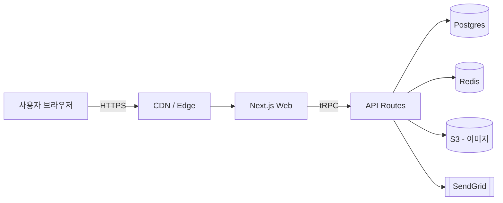
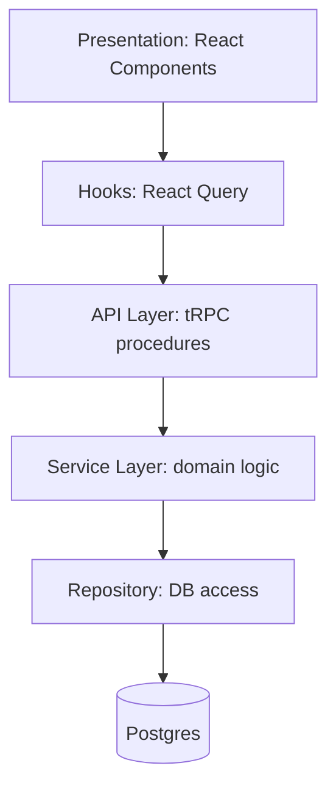
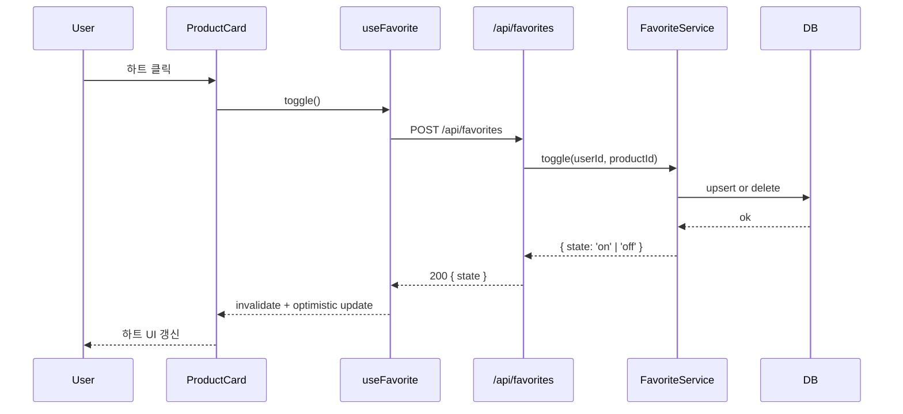
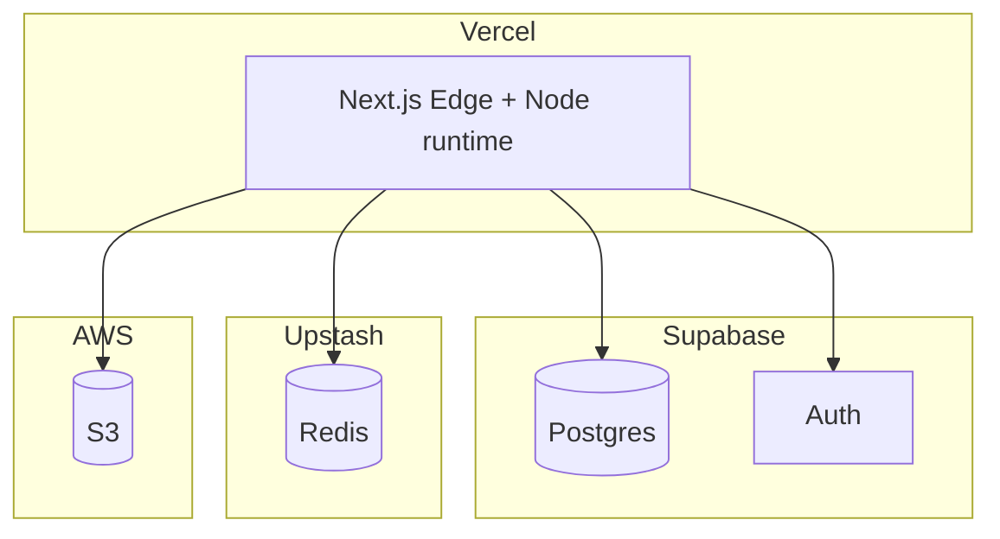
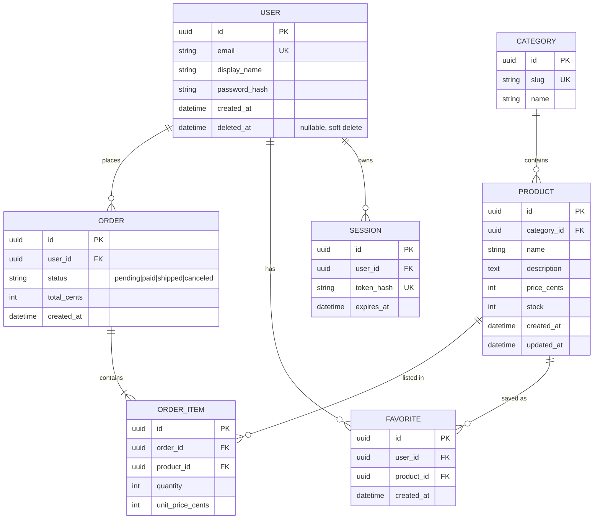
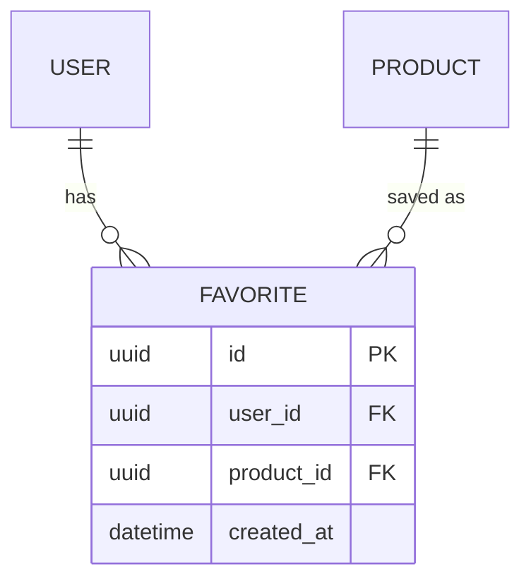
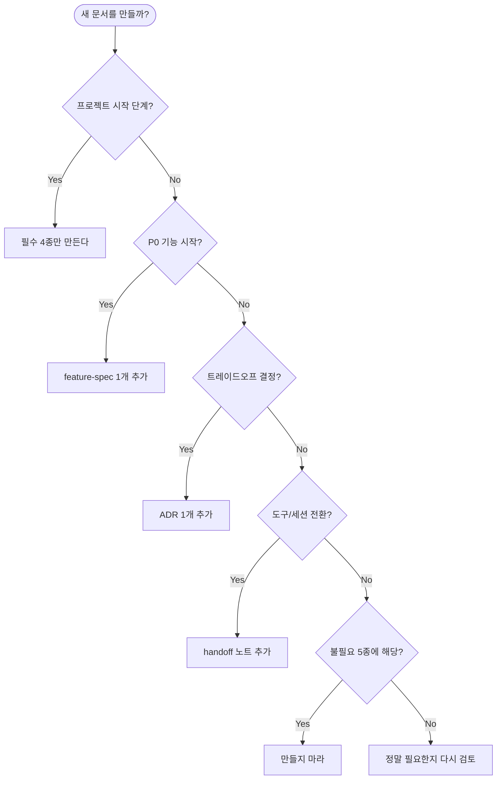

# 00. 개발 문서 종류 정리 — 필수 / 권장 / 불필요

> 솔로 ~ 소규모 팀 + 에이전트 협업 환경에서 **무엇을 만들고 무엇을 만들지 않을 것인가**의 기준.

## 결론 한 줄

대부분 프로젝트는 **필수 4종 + 작업별 1종(feature-spec)** 만으로 충분하다.
"권장 3종"은 규모/리스크가 커지면 추가. "불필요 5종"은 만들지 말 것.

---

## 1. 필수 문서 (Must Have) — 4종

> 이 4개가 없으면 에이전트 협업 자체가 성립하지 않는다.

| # | 문서 | 위치 | 목적 | 에이전트 활용도 | 템플릿 |
|---|------|------|------|----------------|--------|
| M1 | **CLAUDE.md** | 루트 | 프로젝트 규칙 / 금지사항 / 빌드 명령 | ★★★★★ — 세션 시작 시 자동 로드 | [02-CLAUDE-MD작성법](./02-CLAUDE-MD작성법(claude-md).md) §7 참조 |
| M2 | **PRD.md** | `docs/` | 무엇을 왜 만드는가, 우선순위, 범위 밖 | ★★★★★ — 기능 작업의 원천 | 아래 템플릿 참조 |
| M3 | **architecture.md** | `docs/` | 시스템 구조 (Mermaid 1장+) | ★★★★☆ — 영향 범위 판단 | 아래 템플릿 참조 |
| M4 | **erd.md** | `docs/` | 데이터 모델 (Mermaid ER) | ★★★★★ — 스키마 작업의 원천 | 아래 템플릿 참조 |

### 왜 이 4개가 필수인가

| 없으면 생기는 일 |
|----------------|
| **CLAUDE.md 없음** → 에이전트가 매 세션 스택/규칙을 추측 → 환각 |
| **PRD.md 없음** → "범위"가 없어 작업이 무한 확장 |
| **architecture.md 없음** → 영향 범위를 모르고 5개 파일을 건드림 |
| **erd.md 없음** → 스키마 변경 시마다 새로 추론 → ORM과 불일치 |

### 작성 원칙
- 4개 합쳐서 **첫날 30분 이내**에 초안
- "완벽" 금지 — Mermaid 1장 + 핵심 5줄로 시작
- 변경마다 **같은 커밋**에서 업데이트

### M2. PRD 템플릿

<details><summary>📋 템플릿 보기</summary>

```markdown
# PRD — <프로젝트명>

> Product Requirements Document. "무엇을 왜 만드는가". 아키텍처/구현은 여기 적지 않는다.

**마지막 업데이트**: `<YYYY-MM-DD>`
**오너**: `<이름 또는 역할>`
**상태**: Draft / In Progress / Frozen

---

## 1. 문제 정의 (Problem)

### 1.1. 해결하려는 문제
<예시>
현재 유저는 구매한 상품을 나중에 다시 찾기 위해 브라우저 북마크를 써야 한다. 북마크는 장치 간 동기화가 안 되고, 상품이 품절되면 알 수 없다.

### 1.2. 대상 사용자
<예시>
- 주 1회 이상 구매하는 리텐션 유저
- 여러 장치를 오가는 유저 (PC/모바일)

### 1.3. 성공 지표 (North Star)
<예시>
- 즐겨찾기 기능 사용률 30% (WAU 기준) in 8주
- 즐겨찾기 → 구매 전환율 15% 이상

---

## 2. 기능 요구사항 (Functional)

> 각 항목은 **사용자 가치**로 적는다. 구현 방법은 적지 않는다.

### P0 (이번 릴리즈 필수)
- [ ] **F-001** 로그인 유저는 상품을 즐겨찾기로 저장/해제할 수 있다
- [ ] **F-002** 프로필 페이지에서 즐겨찾기 목록을 볼 수 있다
- [ ] **F-003** 즐겨찾기한 상품이 품절되면 목록에서 품절 표시가 보인다

### P1 (다음 릴리즈)
- [ ] **F-010** 즐겨찾기 목록을 카테고리별로 필터링
- [ ] **F-011** 즐겨찾기 목록을 가격순/최근순 정렬

### P2 (나중)
- [ ] **F-020** 즐겨찾기 목록 공유 URL
- [ ] **F-021** 즐겨찾기 상품 할인 알림

---

## 3. 비기능 요구사항 (Non-functional)

| 항목 | 목표 | 측정 방법 |
|------|------|----------|
| 성능 | 즐겨찾기 토글 응답 p95 < 200ms | APM |
| 접근성 | WCAG 2.1 AA | 자동 스캔 + 수동 체크 |
| 보안 | 타 유저 즐겨찾기 조회 불가 | 권한 테스트 |
| 오프라인 | 해당 없음 | - |

---

## 4. 범위 밖 (Out of Scope) ⚠️ 필수

> **이 섹션이 비어있으면 에이전트가 멋대로 기능을 확장합니다.**

- 비로그인 유저의 즐겨찾기 (로컬 스토리지 사용 등)
- 즐겨찾기 상품에 대한 이메일/푸시 알림 (P2로 이동)
- 상품 리뷰 / 평점
- 추천 엔진
- 관리자 대시보드의 즐겨찾기 통계

---

## 5. 사용자 스토리 (Key Scenarios)

### Scenario 1: 처음 저장
1. 유저가 상품 카드의 하트 아이콘을 클릭한다
2. 비로그인 상태면 로그인 모달이 뜬다
3. 로그인 후 하트가 채워진 상태로 바뀐다
4. 토스트 "즐겨찾기에 추가되었습니다" 표시

### Scenario 2: 목록 확인
1. 유저가 프로필 페이지에 간다
2. "즐겨찾기" 탭을 클릭한다
3. 저장한 상품이 그리드로 보인다 (20개/페이지)
4. 품절 상품은 회색 오버레이 + "품절" 배지

---

## 6. 오픈 이슈

- [ ] 즐겨찾기 상한이 필요한가? (스팸 방지)
- [ ] 상품 삭제 시 즐겨찾기는 어떻게 처리? (cascade / 유지 + tombstone)
- [ ] 탈퇴 시 즐겨찾기 데이터는 즉시 삭제? 30일 grace period?

---

## 7. 참조

- 아키텍처: [architecture.md](./architecture.md)
- 데이터 모델: [erd.md](./erd.md)
- 기능 상세: [features/favorites.md](./features/favorites.md)
```

</details>

### M3. Architecture 템플릿

<details><summary>📋 템플릿 보기</summary>

````markdown
# Architecture — <프로젝트명>

> 시스템 구조. **Mermaid 다이어그램 중심**. 긴 설명보다 그림.

**마지막 업데이트**: `<YYYY-MM-DD>`

---

## 1. 시스템 컨텍스트 (한 장)



---

## 2. 논리 레이어



### 레이어 규칙
- **UI**: 상태는 React Query + 최소한의 local state
- **Hooks**: 서버 상태 관리. 비즈니스 로직 금지
- **API**: 요청 검증 (zod), 서비스 호출, 응답 직렬화
- **Service**: 도메인 로직. DB/외부 API를 직접 알지 않음 (Repo 경유)
- **Repository**: SQL/ORM. 다른 Repository 호출 금지 (순환 방지)

---

## 3. 주요 플로우

### 3.1 즐겨찾기 토글



### 3.2 주문 생성 (Saga)

<예시 — 필요 시 sequenceDiagram 또는 flowchart>

---

## 4. 배포 구성



### 환경
- **dev**: 로컬 Postgres (Docker), 로컬 Redis (Docker), 로컬 파일 스토리지
- **staging**: Vercel preview + Supabase staging 프로젝트
- **prod**: Vercel prod + Supabase prod

---

## 5. 핵심 결정 (ADR 요약)

> 상세는 `docs/adr/` 폴더에 개별 기록 권장.

| ID | 결정 | 대안 | 이유 |
|----|------|------|------|
| ADR-001 | tRPC 채택 | REST + OpenAPI | 타입 안정성, 클라이언트 생성 불필요 |
| ADR-002 | Drizzle ORM | Prisma | 빌드 속도, SQL 근접성 |
| ADR-003 | Zustand 사용 안 함 | Zustand / Redux | 서버 상태는 React Query로 충분 |

---

## 6. 비기능 관점

### 관측성
- 로그: Axiom (구조화 JSON)
- 메트릭: Vercel Analytics + 커스텀
- 에러: Sentry
- 트레이싱: (미도입)

### 보안
- 인증: Supabase Auth (쿠키 기반 세션)
- 인가: Row-Level Security (Postgres) + 서버 서비스에서 이중 체크
- 시크릿: Vercel env vars + 로컬은 `.env.local` (git ignore)

### 성능 예산
- 초기 JS 번들: < 200KB (gzip)
- LCP: < 2.5s (p75)
- API p95: < 300ms
- DB 쿼리 p95: < 50ms

---

## 7. 알려진 한계 / 부채

- <예시> 이미지 업로드는 크기 검증만 있음. 악성 파일 검사 없음.
- <예시> Redis 캐시 무효화가 아직 수동.
- <예시> E2E 테스트는 결제 플로우 미포함.
````

</details>

### M4. ERD 템플릿

<details><summary>📋 템플릿 보기</summary>

````markdown
# ERD — <프로젝트명>

> 데이터 모델. **스키마 변경 시 같은 커밋에서 이 파일도 업데이트**.

**마지막 업데이트**: `<YYYY-MM-DD>`
**DB**: `<예: Postgres 16 / SQLite / MySQL 8>`

---

## 1. 전체 ER 다이어그램



---

## 2. 테이블별 상세

### `user`

| 컬럼 | 타입 | 제약 | 설명 |
|------|------|------|------|
| id | uuid | PK | gen_random_uuid() |
| email | varchar(255) | UK, NOT NULL | lowercase 저장 |
| display_name | varchar(100) | NOT NULL | |
| password_hash | varchar(255) | NOT NULL | argon2id |
| created_at | timestamptz | NOT NULL DEFAULT now() | |
| deleted_at | timestamptz | NULL | 소프트 삭제, 쿼리 시 필터 필수 |

**인덱스**
- `user_email_idx` on `email`
- `user_deleted_at_idx` on `deleted_at` (partial: `WHERE deleted_at IS NULL`)

### `favorite`

| 컬럼 | 타입 | 제약 | 설명 |
|------|------|------|------|
| id | uuid | PK | |
| user_id | uuid | FK → user(id), NOT NULL | ON DELETE CASCADE |
| product_id | uuid | FK → product(id), NOT NULL | ON DELETE CASCADE |
| created_at | timestamptz | NOT NULL DEFAULT now() | |

**인덱스 / 제약**
- `favorite_user_product_uk` UNIQUE on `(user_id, product_id)` — 중복 저장 방지
- `favorite_user_created_idx` on `(user_id, created_at DESC)` — 목록 조회용

<다른 테이블 동일 포맷으로 추가>

---

## 3. 불변식 (Invariants)

> 데이터 무결성을 위해 **애플리케이션 레벨에서도** 지키는 규칙.

- `order.total_cents = SUM(order_item.quantity * order_item.unit_price_cents)` — 주문 생성 시 검증
- `product.stock >= 0` — DB CHECK 제약
- 소프트 삭제된 user는 로그인 불가 (서비스 레이어에서 필터)
- `favorite`는 소프트 삭제된 user/product를 가리킬 수 없다 (CASCADE로 정리)

---

## 4. 마이그레이션 이력

> 각 마이그레이션은 `src/db/migrations/` 디렉토리 참조.

| 날짜 | 버전 | 변경 | PR |
|------|------|------|----|
| 2026-01-10 | 0001 | 초기 스키마 (user, product, order) | #1 |
| 2026-02-03 | 0002 | category 테이블 추가 | #12 |
| 2026-03-15 | 0003 | favorite 테이블 추가 | #34 |
| 2026-04-01 | 0004 | user.deleted_at 추가 (소프트 삭제) | #45 |

---

## 5. 대기 중 변경 (Pending)

> Expand-Contract 중이거나 아직 머지되지 않은 스키마 변경.

- [ ] `user.legal_name` 컬럼 추가 (실명 인증 기능) — Expand 완료, Migrate 대기
- [ ] `product.sku` UNIQUE 추가 — 중복 데이터 정리 중

---

## 6. 안티패턴 / 주의

- `order_item.unit_price_cents`는 **주문 시점의** 가격. `product.price_cents`를 조인으로 덮지 말 것.
- `user.email` 쿼리 시 반드시 `LOWER()` (저장 시 lowercase, 조회 시도 lowercase).
- 대용량 `favorite` 삭제 시 배치 처리 (한 번에 10만 건 CASCADE 금지).
````

</details>

### 템플릿 사용 원칙

1. **빈 칸은 `<...>` 로** — 채워야 할 자리를 시각적으로 표시
2. **"삭제해야 할 예시"는 `(예시)` 표시** — 실제 내용을 쓸 때 지우라는 신호
3. **Mermaid는 필수** — 에이전트가 그림 대신 파싱 가능한 구조로 읽음
4. **각 섹션은 독립적** — 다른 섹션을 안 읽어도 의미가 있어야 함
5. **명령형 어투** — "~한다", "~하지 않는다" (설명형 금지)

---

## 2. 권장 문서 (Should Have) — 3종

> 프로젝트가 커지거나 리스크가 올라가면 추가. 처음부터 만들 필요는 없다.

| # | 문서 | 위치 | 추가 시점 | 에이전트 활용도 | 비고 |
|---|------|------|----------|----------------|------|
| R1 | **feature-spec** | `docs/features/<name>.md` | P0 기능 1건당 | ★★★★★ | 작업 단위 컨텍스트. 아래 템플릿 참조 |
| R2 | **ADR (Architecture Decision Record)** | `docs/adr/NNNN-*.md` | "왜 X 대신 Y?" 결정마다 | ★★★☆☆ | 재발 결정 회피, 1결정 = 1파일 |
| R3 | **handoff 노트** | `docs/handoff/YYYY-MM-DD-*.md` | 도구/세션 전환 시 | ★★★★☆ | 세션/도구 전환 시 컨텍스트 전달 |

### 추가 트리거

- **feature-spec**: P0/P1 기능 작업을 시작할 때마다 1개 (작업 끝나면 `[Done]` 표시 후 보존)
- **ADR**: 라이브러리 선택, 패턴 결정, 트레이드오프가 있는 모든 결정. 5분 안에 적을 수 있는 짧은 형식
- **handoff**: Claude Code → Cursor 전환 / 세션 종료 시 다음 세션 위한 짧은 메모

### R1. Feature Spec 템플릿

<details><summary>📋 템플릿 보기</summary>

````markdown
# Feature Spec — <기능 이름>

> 단일 기능의 "끝나는 조건"을 명시. PRD의 P0/P1 항목 1개당 이 파일 1개.
> 경로: `docs/features/<kebab-case-name>.md`

**PRD 항목**: `<F-001 등>`
**상태**: Draft / In Progress / In Review / Done
**오너**: `<이름>`
**마지막 업데이트**: `<YYYY-MM-DD>`

---

## 1. 목적 (한 줄)

<예시>
로그인 유저가 상품을 즐겨찾기로 저장/해제하고, 프로필에서 목록을 확인할 수 있게 한다.

## 2. 사용자 시나리오

### 정상 경로
1. 유저가 상품 카드의 하트를 클릭
2. 즐겨찾기에 저장됨 (하트 채움 + 토스트)
3. 프로필 → 즐겨찾기 탭에서 목록 확인
4. 하트를 다시 클릭하면 해제

### 대안 경로
- 비로그인 상태에서 하트 클릭 → 로그인 모달 → 로그인 성공 후 저장
- 품절 상품 → 회색 오버레이 + "품절" 배지, 장바구니 버튼 비활성화

### 에러 경로
- 네트워크 실패 → 인라인 에러 + 낙관적 업데이트 롤백
- 타인이 만든 데이터 접근 시도 → 403

---

## 3. 수용 기준 (Acceptance Criteria)

**이 체크리스트가 모두 ✅가 되면 "완료"다.**

- [ ] AC-1: 로그인 유저가 상품 카드의 하트를 클릭하면 DB에 저장된다
- [ ] AC-2: 저장된 상품의 하트는 다른 페이지에서도 채워진 상태로 표시된다
- [ ] AC-3: 프로필 "즐겨찾기" 탭에서 최근 저장 순으로 20개씩 페이지네이션 표시
- [ ] AC-4: 품절 상품은 "품절" 배지가 표시되고 "담기" 버튼이 비활성화된다
- [ ] AC-5: 비로그인 유저가 하트를 클릭하면 로그인 모달이 뜬다
- [ ] AC-6: 같은 상품을 두 번 저장해도 1개만 저장된다 (멱등)
- [ ] AC-7: 타 유저의 즐겨찾기 목록을 URL 조작으로 조회할 수 없다
- [ ] AC-8: 응답 p95 < 200ms (토글 + 목록 조회 각각)
- [ ] AC-9: 키보드만으로 하트 토글 가능 (Enter/Space)
- [ ] AC-10: 스크린 리더가 현재 상태를 읽는다 ("즐겨찾기에 추가됨" / "제거됨")

---

## 4. 범위

### 포함
- 백엔드: `POST /api/favorites`, `DELETE /api/favorites/:productId`, `GET /api/users/me/favorites`
- DB: `favorite` 테이블 신규
- 프론트: `<FavoriteButton>`, `ProfileFavoritesTab`
- 테스트: 단위 + E2E 1건

### 제외
- 즐겨찾기 상품의 가격 변동 알림
- 즐겨찾기 목록 공유/공개
- 카테고리 필터링 (P1)
- 추천 기반 즐겨찾기 제안

---

## 5. 영향 파일 (예상)

### 신규
- `src/db/migrations/000X_add_favorite.sql`
- `src/db/schema/favorite.ts`
- `src/server/services/favorite-service.ts`
- `src/server/api/routers/favorite.ts`
- `src/components/FavoriteButton.tsx`
- `src/app/profile/favorites/page.tsx`
- `src/hooks/use-favorite.ts`

### 수정
- `src/components/ProductCard.tsx` (하트 아이콘 추가)
- `src/app/profile/layout.tsx` (즐겨찾기 탭 추가)
- `docs/erd.md` (favorite 엔티티 반영)
- `docs/PRD.md` (F-001~F-003 상태 변경)

---

## 6. 데이터 모델



### 제약
- `UNIQUE(user_id, product_id)` — 중복 방지
- 인덱스: `(user_id, created_at DESC)` — 목록 조회
- FK ON DELETE CASCADE

---

## 7. API 계약

### POST /api/favorites
```ts
// Request
{ productId: string }

// Response 200
{ ok: true, state: 'added' | 'already_exists' }

// Response 401 (비로그인)
{ ok: false, error: 'UNAUTHORIZED' }
```

### DELETE /api/favorites/:productId
```ts
// Response 200
{ ok: true, state: 'removed' | 'not_found' }
```

### GET /api/users/me/favorites?page=1&limit=20
```ts
// Response 200
{
  ok: true,
  data: {
    items: Favorite[],
    total: number,
    page: number,
    limit: number
  }
}
```

---

## 8. 테스트 계획

| 레벨 | 시나리오 |
|------|---------|
| 단위 | `FavoriteService.toggle()` — 추가/제거/멱등 |
| 단위 | `FavoriteService.list()` — 페이지네이션 |
| 통합 | POST → GET → DELETE → GET 라운드트립 |
| E2E | 상품 카드 클릭 → 프로필 탭 확인 (Playwright) |
| 권한 | 타 유저 ID로 GET 요청 → 403 |

---

## 9. 관측성

- 메트릭: `favorite_toggle_total{action="add|remove"}`
- 로그: 토글 이벤트 구조화 로그 (`user_id`, `product_id`, `action`)
- 에러 알람: 5xx 발생 시 Sentry

---

## 10. 오픈 질문

- [ ] 즐겨찾기 상한? (예: 유저당 1000개)
- [ ] 관리자는 유저 즐겨찾기 조회 가능해야 하는가? (지원팀 요청 시)

---

## 11. 롤아웃

- 단계 1: 내부 테스트 (staging, 팀 계정)
- 단계 2: 10% 유저 (feature flag `favorites_v1`)
- 단계 3: 전체 공개
- 롤백: feature flag off
````

</details>

### ADR 미니 템플릿
```markdown
# ADR-0042: tRPC 채택

**Date**: 2026-04-11
**Status**: Accepted

## Context
타입 안정성과 API 문서화가 모두 필요. 클라이언트가 자체 웹뿐.

## Decision
tRPC 채택. REST + OpenAPI 대신.

## Consequences
+ 클라이언트 코드 생성 불필요, 컴파일 타임 안전
- 외부 클라이언트(모바일/3rd party) 노출 시 추가 어댑터 필요
- 팀에 tRPC 학습 비용
```

---

## 3. 불필요 문서 (Don't) — 5종

> 솔로 ~ 소규모 팀 + 에이전트 환경에서는 **만들지 마라**. 만드는 비용이 가치를 초과한다.

| # | 문서 | 왜 불필요한가 | 대신 |
|---|------|-------------|------|
| D1 | 상세 클래스 다이어그램 | 코드 자체가 최신. 다이어그램은 첫 주 후 즉시 stale | architecture.md의 컴포넌트 레벨 한 장만 |
| D2 | API 명세서 (수동 작성) | 코드와 항상 어긋남 | 코드에서 자동 생성 (OpenAPI/tRPC type) |
| D3 | 상세 시퀀스 다이어그램 모음 | 작성 비용 vs 효용 비대칭. 핵심 1~2개면 충분 | architecture.md에 "주요 플로우" 1~2개 |
| D4 | 변경 이력 수동 관리 (CHANGELOG.md를 손으로) | git log가 진짜 이력 | Conventional Commits + 릴리즈 노트 자동 생성 |
| D5 | 코드 주석으로 만든 "사용 가이드" | 코드와 동기화 안 됨 | 단위 테스트가 사용 예시 역할 |

### 자주 묻는 예외

- **"우리는 외부 API 제공자라 명세서가 필요해요"** → D2 예외. 단, **자동 생성** 만 허용.
- **"규제 산업이라 ADR이 의무"** → R2가 의무로 격상. 양식만 강제, 분량은 그대로 짧게.
- **"오픈소스 라이브러리라 사용 가이드 필요"** → D5 예외. 단, README + examples 디렉토리로 통합.

---

## 4. 결정 흐름도



---

## 5. 에이전트 활용도별 정렬

| 등급 | 문서 | 에이전트가 자주 참조하는가 |
|------|------|---------------------------|
| ★★★★★ | CLAUDE.md, PRD.md, erd.md, feature-spec | 거의 모든 작업에서 |
| ★★★★☆ | architecture.md, handoff | 영향 범위 / 컨텍스트 전달 시 |
| ★★★☆☆ | ADR | 비슷한 결정 재발 시 |
| ★★☆☆☆ | (없음 — 불필요 5종은 만들지 않음) | - |

**중요**: 에이전트 활용도가 낮은 문서는 만드는 순간 **유지 비용 > 가치**가 됩니다.

---

## 6. 안티패턴

| 하지 마라 | 왜 |
|----------|----|
| 첫날 7종 모두 작성 | 30분 → 4시간으로 폭증, 90%는 stale |
| 권장 3종을 처음부터 강제 | feature-spec 없는 작업도 많음 |
| 수동 CHANGELOG 유지 | git log + Conventional Commits로 충분 |
| Confluence/Notion에 분산 | 에이전트가 못 읽음. 항상 repo 안에 |
| 문서 전담자 1명 지정 | 작성자 = 코드 변경자가 원칙. 동기화는 같은 PR. |

---

## 7. 빠른 체크리스트

새 프로젝트 첫날:
```
[ ] CLAUDE.md (5섹션만)
[ ] docs/PRD.md (P0 + 범위 밖 3줄)
[ ] docs/architecture.md (Mermaid 1장)
[ ] docs/erd.md (엔티티 3~5개)
```

P0 작업 시작 전:
```
[ ] docs/features/<name>.md
```

도구/세션 전환 시:
```
[ ] docs/handoff/<date>-<slug>.md
```

라이브러리/패턴 결정 시:
```
[ ] docs/adr/NNNN-<slug>.md
```

이게 전부. 다른 건 만들지 마세요.

---

## 관련 문서

- [02-CLAUDE-MD작성법](./02-CLAUDE-MD작성법(claude-md).md) — CLAUDE.md 템플릿 및 작성법
- [05-에이전트친화포맷](./05-에이전트친화포맷(agent-friendly-formats).md) — 어떤 포맷으로 적을지
