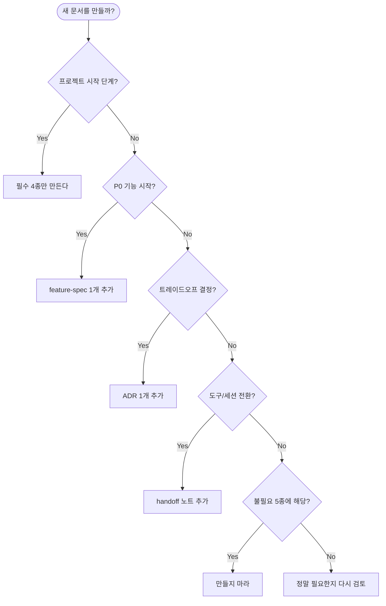

# 00. 개발 문서 종류 정리 — 필수 / 권장 / 불필요

> 솔로 ~ 소규모 팀 + 에이전트 협업 환경에서 **무엇을 만들고 무엇을 만들지 않을 것인가**의 기준.

## 결론 한 줄

대부분 프로젝트는 **필수 4종 + 작업별 1종(feature-spec)** 만으로 충분하다.
"권장 3종"은 규모/리스크가 커지면 추가. "불필요 5종"은 만들지 말 것.

---

## 1. 필수 문서 (Must Have) — 4종

> 이 4개가 없으면 에이전트 협업 자체가 성립하지 않는다.

| # | 문서 | 위치 | 목적 | 에이전트 활용도 | 템플릿 |
|---|------|------|------|----------------|--------|
| M1 | **CLAUDE.md** | 루트 | 프로젝트 규칙 / 금지사항 / 빌드 명령 | ★★★★★ — 세션 시작 시 자동 로드 | [CLAUDE.template.md](../08-바이브코딩(vibe-coding)/03-문서템플릿(templates)/CLAUDE.template.md) |
| M2 | **PRD.md** | `docs/` | 무엇을 왜 만드는가, 우선순위, 범위 밖 | ★★★★★ — 기능 작업의 원천 | [PRD.template.md](../08-바이브코딩(vibe-coding)/03-문서템플릿(templates)/PRD.template.md) |
| M3 | **architecture.md** | `docs/` | 시스템 구조 (Mermaid 1장+) | ★★★★☆ — 영향 범위 판단 | [architecture.template.md](../08-바이브코딩(vibe-coding)/03-문서템플릿(templates)/architecture.template.md) |
| M4 | **erd.md** | `docs/` | 데이터 모델 (Mermaid ER) | ★★★★★ — 스키마 작업의 원천 | [erd.template.md](../08-바이브코딩(vibe-coding)/03-문서템플릿(templates)/erd.template.md) |

### 왜 이 4개가 필수인가

| 없으면 생기는 일 |
|----------------|
| **CLAUDE.md 없음** → 에이전트가 매 세션 스택/규칙을 추측 → 환각 |
| **PRD.md 없음** → "범위"가 없어 작업이 무한 확장 |
| **architecture.md 없음** → 영향 범위를 모르고 5개 파일을 건드림 |
| **erd.md 없음** → 스키마 변경 시마다 새로 추론 → ORM과 불일치 |

### 작성 원칙
- 4개 합쳐서 **첫날 30분 이내**에 초안
- "완벽" 금지 — Mermaid 1장 + 핵심 5줄로 시작
- 변경마다 **같은 커밋**에서 업데이트

---

## 2. 권장 문서 (Should Have) — 3종

> 프로젝트가 커지거나 리스크가 올라가면 추가. 처음부터 만들 필요는 없다.

| # | 문서 | 위치 | 추가 시점 | 에이전트 활용도 | 비고 |
|---|------|------|----------|----------------|------|
| R1 | **feature-spec** | `docs/features/<name>.md` | P0 기능 1건당 | ★★★★★ | 작업 단위 컨텍스트. [템플릿](../08-바이브코딩(vibe-coding)/03-문서템플릿(templates)/feature-spec.template.md) |
| R2 | **ADR (Architecture Decision Record)** | `docs/adr/NNNN-*.md` | "왜 X 대신 Y?" 결정마다 | ★★★☆☆ | 재발 결정 회피, 1결정 = 1파일 |
| R3 | **handoff 노트** | `docs/handoff/YYYY-MM-DD-*.md` | 도구/세션 전환 시 | ★★★★☆ | [크로스 핸드오프](../08-바이브코딩(vibe-coding)/04-에이전트협업(agents)/03-크로스에이전트핸드오프(cross-agent-handoff).md) 참조 |

### 추가 트리거

- **feature-spec**: P0/P1 기능 작업을 시작할 때마다 1개 (작업 끝나면 `[Done]` 표시 후 보존)
- **ADR**: 라이브러리 선택, 패턴 결정, 트레이드오프가 있는 모든 결정. 5분 안에 적을 수 있는 짧은 형식
- **handoff**: Claude Code → Cursor 전환 / 세션 종료 시 다음 세션 위한 짧은 메모

### ADR 미니 템플릿
```markdown
# ADR-0042: tRPC 채택

**Date**: 2026-04-11
**Status**: Accepted

## Context
타입 안정성과 API 문서화가 모두 필요. 클라이언트가 자체 웹뿐.

## Decision
tRPC 채택. REST + OpenAPI 대신.

## Consequences
+ 클라이언트 코드 생성 불필요, 컴파일 타임 안전
- 외부 클라이언트(모바일/3rd party) 노출 시 추가 어댑터 필요
- 팀에 tRPC 학습 비용
```

---

## 3. 불필요 문서 (Don't) — 5종

> 솔로 ~ 소규모 팀 + 에이전트 환경에서는 **만들지 마라**. 만드는 비용이 가치를 초과한다.

| # | 문서 | 왜 불필요한가 | 대신 |
|---|------|-------------|------|
| D1 | 상세 클래스 다이어그램 | 코드 자체가 최신. 다이어그램은 첫 주 후 즉시 stale | architecture.md의 컴포넌트 레벨 한 장만 |
| D2 | API 명세서 (수동 작성) | 코드와 항상 어긋남 | 코드에서 자동 생성 (OpenAPI/tRPC type) |
| D3 | 상세 시퀀스 다이어그램 모음 | 작성 비용 vs 효용 비대칭. 핵심 1~2개면 충분 | architecture.md에 "주요 플로우" 1~2개 |
| D4 | 변경 이력 수동 관리 (CHANGELOG.md를 손으로) | git log가 진짜 이력 | Conventional Commits + 릴리즈 노트 자동 생성 |
| D5 | 코드 주석으로 만든 "사용 가이드" | 코드와 동기화 안 됨 | 단위 테스트가 사용 예시 역할 |

### 자주 묻는 예외

- **"우리는 외부 API 제공자라 명세서가 필요해요"** → D2 예외. 단, **자동 생성** 만 허용.
- **"규제 산업이라 ADR이 의무"** → R2가 의무로 격상. 양식만 강제, 분량은 그대로 짧게.
- **"오픈소스 라이브러리라 사용 가이드 필요"** → D5 예외. 단, README + examples 디렉토리로 통합.

---

## 4. 결정 흐름도



---

## 5. 에이전트 활용도별 정렬

| 등급 | 문서 | 에이전트가 자주 참조하는가 |
|------|------|---------------------------|
| ★★★★★ | CLAUDE.md, PRD.md, erd.md, feature-spec | 거의 모든 작업에서 |
| ★★★★☆ | architecture.md, handoff | 영향 범위 / 컨텍스트 전달 시 |
| ★★★☆☆ | ADR | 비슷한 결정 재발 시 |
| ★★☆☆☆ | (없음 — 불필요 5종은 만들지 않음) | - |

**중요**: 에이전트 활용도가 낮은 문서는 만드는 순간 **유지 비용 > 가치**가 됩니다.

---

## 6. 안티패턴

| 하지 마라 | 왜 |
|----------|----|
| 첫날 7종 모두 작성 | 30분 → 4시간으로 폭증, 90%는 stale |
| 권장 3종을 처음부터 강제 | feature-spec 없는 작업도 많음 |
| 수동 CHANGELOG 유지 | git log + Conventional Commits로 충분 |
| Confluence/Notion에 분산 | 에이전트가 못 읽음. 항상 repo 안에 |
| 문서 전담자 1명 지정 | 작성자 = 코드 변경자가 원칙. 동기화는 같은 PR. |

---

## 7. 빠른 체크리스트

새 프로젝트 첫날:
```
[ ] CLAUDE.md (5섹션만)
[ ] docs/PRD.md (P0 + 범위 밖 3줄)
[ ] docs/architecture.md (Mermaid 1장)
[ ] docs/erd.md (엔티티 3~5개)
```

P0 작업 시작 전:
```
[ ] docs/features/<name>.md
```

도구/세션 전환 시:
```
[ ] docs/handoff/<date>-<slug>.md
```

라이브러리/패턴 결정 시:
```
[ ] docs/adr/NNNN-<slug>.md
```

이게 전부. 다른 건 만들지 마세요.

---

## 관련 문서

- [08-바이브코딩/03-문서템플릿/README.md](../08-바이브코딩(vibe-coding)/03-문서템플릿(templates)/README.md) — 각 템플릿 파일의 복사 방법
- [07-에이전트친화포맷](./07-에이전트친화포맷(agent-friendly-formats).md) — 어떤 포맷으로 적을지
