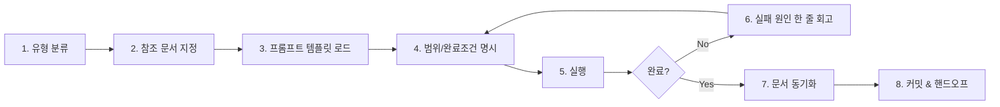

# 00. Vibe Coding 워크플로우 개요

## 핵심 등식

```
좋은 바이브 코딩 = 좋은 문서 + 좋은 프롬프트 구조 + 적절한 작업 분할
```

세 가지 중 하나라도 빠지면 에이전트는 환각하거나, 똑같은 질문을 반복하거나, 엉뚱한 파일을 건드립니다.
이 폴더의 모든 문서는 이 등식의 세 변수를 각각 다룹니다.

| 변수 | 담당 폴더 | 구체 산출물 |
|------|----------|------------|
| 좋은 문서 | [`08-바이브코딩/03-문서템플릿/`](./03-문서템플릿(templates)/) | CLAUDE.md, PRD.md, architecture.md, erd.md |
| 좋은 프롬프트 구조 | [`08-바이브코딩/02-프롬프트템플릿/`](./02-프롬프트템플릿(prompts)/) | 범용 템플릿 + 작업 유형별 7종 |
| 적절한 작업 분할 | [`04-워크플로우/07~11`](../04-워크플로우(workflows)/) | 작업 유형별 단계 체크리스트 |

---

## 작업 유형 5가지 + 공통 루프

바이브 코딩은 **"작업 유형을 먼저 분류하고, 유형에 맞는 플레이북을 실행"** 하는 방식이 가장 재현성이 높습니다.

| 유형 | 언제 | 플레이북 |
|------|------|---------|
| 기능 개발 | 새 기능을 추가할 때 | [04-워크플로우/07-기능개발흐름](../04-워크플로우(workflows)/07-기능개발흐름(feature-flow).md) |
| 버그 수정 | 기존 동작이 깨졌을 때 | [04-워크플로우/08-버그수정흐름](../04-워크플로우(workflows)/08-버그수정흐름(bugfix-flow).md) |
| 리팩토링 | 동작은 맞지만 구조가 나쁠 때 | [04-워크플로우/09-리팩토링흐름](../04-워크플로우(workflows)/09-리팩토링흐름(refactoring-flow).md) |
| 스키마 변경 | DB 구조를 바꿔야 할 때 | [04-워크플로우/10-스키마변경흐름](../04-워크플로우(workflows)/10-스키마변경흐름(schema-flow).md) |
| UI 구현 | 화면 / 레이아웃 작업 | [04-워크플로우/11-UI구현흐름](../04-워크플로우(workflows)/11-UI구현흐름(ui-flow).md) |

### 모든 유형에 공통되는 루프



각 단계의 의미:

1. **유형 분류** — 지금 하려는 게 정확히 5가지 중 무엇인지 적는다. "그냥 좀 고치기"는 금지.
2. **참조 문서 지정** — `CLAUDE.md`, `PRD.md`, `architecture.md`, `erd.md`, 관련 파일 경로를 나열.
3. **프롬프트 템플릿 로드** — `02-프롬프트템플릿/`에서 유형에 맞는 템플릿을 복사.
4. **범위/완료조건** — "어디까지 건드릴지"와 "끝난 건 어떻게 판단할지"를 문장으로 적는다.
5. **실행** — 에이전트에게 프롬프트 투입, 결과 확인.
6. **실패 시 한 줄 회고** — "왜 안 됐지?"를 적고 3번으로 돌아간다. 맹목적 재시도 금지.
7. **문서 동기화** — ERD/PRD/architecture가 바뀌었다면 즉시 업데이트. 안 하면 다음 세션이 오염된다.
8. **커밋 & 핸드오프** — 다음 세션(혹은 다른 에이전트)이 이어받을 수 있게 상태를 남긴다.

---

## "왜 이 루프인가" — 자주 망하는 이유 5가지

1. **컨텍스트 없이 질문** → 에이전트가 `CLAUDE.md`/`PRD.md`를 못 읽어서 엉뚱한 스택을 가정함.
2. **범위 미정** → "로그인 고쳐줘" 하면 에이전트가 5개 파일을 건드림.
3. **완료조건 없음** → 무한 재시도하다 토큰만 소모.
4. **문서 미동기화** → 같은 실수를 다음 세션이 반복.
5. **실패 시 재시도만** → 원인 안 보고 버튼만 누르면 안 됩니다.

이 루프는 위 다섯을 단계별로 방지합니다.

---

## 이 워크플로우가 가정하는 환경

- **주 에이전트**: Claude Code (CLI / VS Code 확장 / Desktop / Web)
- **보조 에이전트**: GPT Codex, Cursor, Windsurf, Aider 등과 병용 가능 (→ [04-에이전트협업/03-크로스에이전트핸드오프](./04-에이전트협업(agents)/03-크로스에이전트핸드오프(cross-agent-handoff).md))
- **문서 포맷**: Markdown + Mermaid (→ [07-최적화/07-에이전트친화포맷](../07-최적화(optimization)/07-에이전트친화포맷(agent-friendly-formats).md))
- **팀 규모**: 솔로 개발자 ~ 소규모 팀 (2-5명)

대규모 팀, 엔터프라이즈 컴플라이언스, RFC 기반 프로세스에는 이 루프만으로 부족합니다. 그땐 이 루프 위에 리뷰/승인 단계를 더하세요.

---

## 다음 문서

→ [01-빠른시작(quickstart).md](./01-빠른시작(quickstart).md) — 새 프로젝트에서 5분 안에 바이브 코딩 루프를 시작하는 방법.
