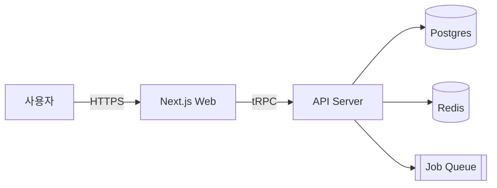
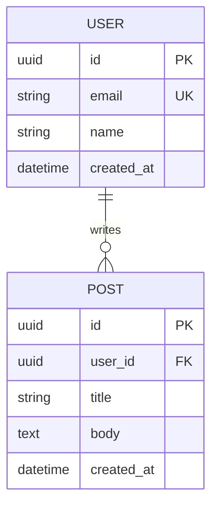

# 01. 빠른 시작 — 5단계 초기화

> 목표: 빈 프로젝트(또는 기존 프로젝트)에서 30분 안에 바이브 코딩 루프를 가동한다.

## 사전 준비

- Claude Code 설치 완료 (→ [01-설치](../01-설치(installation)/02-설치가이드(install-guide).md))
- 프로젝트 디렉토리에서 `claude` 실행 가능 상태

---

## 단계 1: `CLAUDE.md` 작성 (5분)

프로젝트 루트에 `CLAUDE.md`를 만듭니다. Claude Code는 세션 시작 시 이 파일을 자동으로 읽습니다.

```bash
cp claude-code-guide/08-바이브코딩\(vibe-coding\)/03-문서템플릿\(templates\)/CLAUDE.template.md ./CLAUDE.md
```

그리고 다음 5개 섹션만 먼저 채웁니다 (나머지는 나중에):

- **프로젝트 한 줄 요약**
- **기술 스택** (언어/프레임워크/DB)
- **금지 사항** (예: "`any` 타입 금지", "신규 의존성 추가 금지")
- **빌드/테스트 명령**
- **참조 문서 경로** (`PRD.md`, `architecture.md`, `erd.md`)

이 5개만 있어도 에이전트의 헛소리 90%가 사라집니다.

---

## 단계 2: `PRD.md` 작성 (10분)

"무엇을 왜 만드는가"를 한 파일에 둡니다.

```bash
cp claude-code-guide/08-바이브코딩\(vibe-coding\)/03-문서템플릿\(templates\)/PRD.template.md ./docs/PRD.md
```

최소 채워야 할 것:

- **문제 정의** (유저의 고통 한 줄)
- **기능 리스트** (P0/P1/P2로 우선순위 표시)
- **비기능 요구** (성능/보안/접근성 중 해당되는 것만)
- **범위 밖** (무엇을 안 할지 — **이게 제일 중요**)

> TIP: "범위 밖"이 비어 있으면 에이전트가 자기 마음대로 기능을 확장합니다. 최소 3줄은 적으세요.

---

## 단계 3: `architecture.md` 작성 (5분, Mermaid 한 장)

```bash
cp claude-code-guide/08-바이브코딩\(vibe-coding\)/03-문서템플릿\(templates\)/architecture.template.md ./docs/architecture.md
```

핵심은 **Mermaid 다이어그램 1개**입니다. 글은 나중에 채워도 됩니다.



이 한 장이 있으면 에이전트는 "API Server는 어디 있고 DB는 뭐고 캐시는 어디 끼는지"를 한 번에 이해합니다.

---

## 단계 4: `erd.md` 작성 (5분, Mermaid ER 다이어그램)

```bash
cp claude-code-guide/08-바이브코딩\(vibe-coding\)/03-문서템플릿\(templates\)/erd.template.md ./docs/erd.md
```



> TIP: 초기엔 핵심 엔티티 3~5개만 그립니다. 개발하면서 변경할 때마다 즉시 업데이트하세요.

---

## 단계 5: 첫 작업 투입 (5분)

이제 오늘의 첫 작업을 시작합니다.

1. 작업 유형을 정합니다: 기능 / 버그 / 리팩토링 / 스키마 / UI
2. [`02-프롬프트템플릿`](./02-프롬프트템플릿(prompts)/)에서 해당 템플릿을 복사합니다.
3. 빈 칸을 채워 Claude Code 세션에 붙여 넣습니다.
4. 결과를 확인하고, 변경된 문서(`PRD.md`, `erd.md` 등)를 **같은 커밋에 함께** 포함합니다.

---

## 체크리스트

```
[ ] CLAUDE.md — 5개 섹션 채움
[ ] docs/PRD.md — P0 기능 리스트 + 범위 밖 3줄
[ ] docs/architecture.md — Mermaid 다이어그램 1개
[ ] docs/erd.md — 핵심 엔티티 3~5개
[ ] .gitignore에 에이전트 캐시/임시파일 추가
[ ] 첫 프롬프트 템플릿 선택 완료
```

6개 박스가 모두 채워지면 바이브 코딩 루프가 가동 상태입니다.

---

## 흔한 실수 3가지

| 실수 | 증상 | 고치는 법 |
|-----|------|----------|
| CLAUDE.md에 "규칙"이 아니라 "설명"만 씀 | 에이전트가 룰을 안 따름 | 명령형으로 다시 씀 ("~하지 마라", "~하라") |
| PRD에 "범위 밖"을 비워둠 | 에이전트가 스코프를 넘음 | 3줄 이상 명시 |
| ERD를 안 그리고 시작 | 스키마 질문할 때마다 에이전트가 새로 추론 | 첫날 Mermaid로 그려둠 |

---

## 다음 문서

작업 유형별 플레이북:
- → [04-워크플로우/07-기능개발흐름](../04-워크플로우(workflows)/07-기능개발흐름(feature-flow).md)
- → [04-워크플로우/08-버그수정흐름](../04-워크플로우(workflows)/08-버그수정흐름(bugfix-flow).md)
- → [04-워크플로우/09-리팩토링흐름](../04-워크플로우(workflows)/09-리팩토링흐름(refactoring-flow).md)
- → [04-워크플로우/10-스키마변경흐름](../04-워크플로우(workflows)/10-스키마변경흐름(schema-flow).md)
- → [04-워크플로우/11-UI구현흐름](../04-워크플로우(workflows)/11-UI구현흐름(ui-flow).md)
