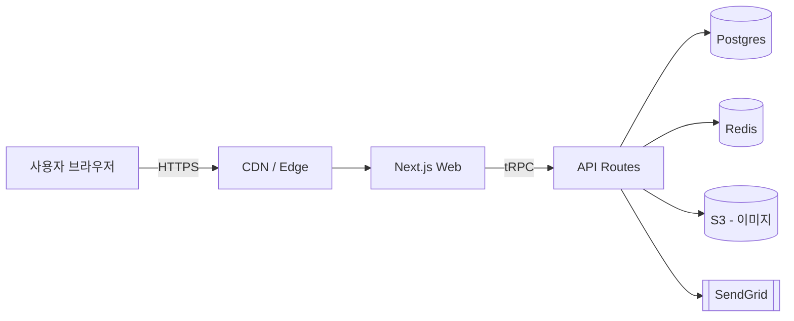
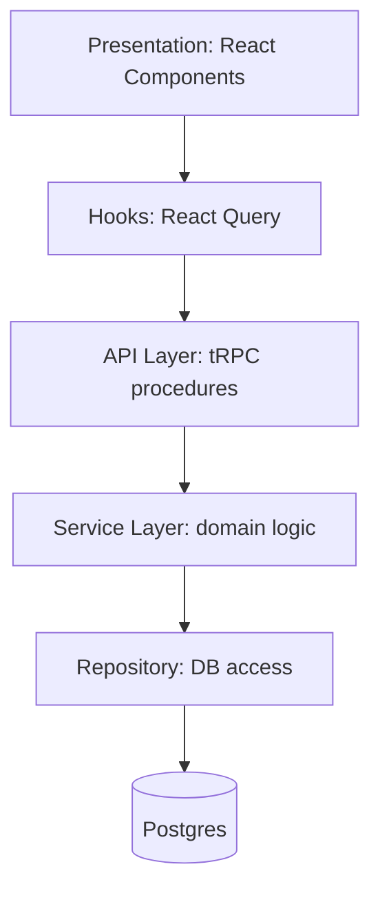
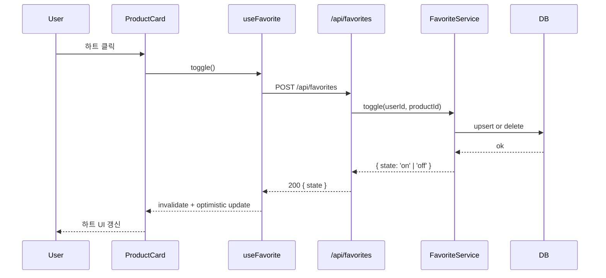
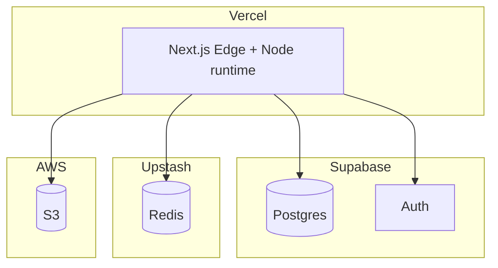

# Architecture — <프로젝트명>

> 시스템 구조. **Mermaid 다이어그램 중심**. 긴 설명보다 그림.

**마지막 업데이트**: `<YYYY-MM-DD>`

---

## 1. 시스템 컨텍스트 (한 장)

---

## 2. 논리 레이어

### 레이어 규칙
- **UI**: 상태는 React Query + 최소한의 local state
- **Hooks**: 서버 상태 관리. 비즈니스 로직 금지
- **API**: 요청 검증 (zod), 서비스 호출, 응답 직렬화
- **Service**: 도메인 로직. DB/외부 API를 직접 알지 않음 (Repo 경유)
- **Repository**: SQL/ORM. 다른 Repository 호출 금지 (순환 방지)

---

## 3. 주요 플로우

### 3.1 즐겨찾기 토글

### 3.2 주문 생성 (Saga)

<예시 — 필요 시 sequenceDiagram 또는 flowchart>

---

## 4. 배포 구성

### 환경
- **dev**: 로컬 Postgres (Docker), 로컬 Redis (Docker), 로컬 파일 스토리지
- **staging**: Vercel preview + Supabase staging 프로젝트
- **prod**: Vercel prod + Supabase prod

---

## 5. 핵심 결정 (ADR 요약)

> 상세는 `docs/adr/` 폴더에 개별 기록 권장.

| ID | 결정 | 대안 | 이유 |
|----|------|------|------|
| ADR-001 | tRPC 채택 | REST + OpenAPI | 타입 안정성, 클라이언트 생성 불필요 |
| ADR-002 | Drizzle ORM | Prisma | 빌드 속도, SQL 근접성 |
| ADR-003 | Zustand 사용 안 함 | Zustand / Redux | 서버 상태는 React Query로 충분 |

---

## 6. 비기능 관점

### 관측성
- 로그: Axiom (구조화 JSON)
- 메트릭: Vercel Analytics + 커스텀
- 에러: Sentry
- 트레이싱: (미도입)

### 보안
- 인증: Supabase Auth (쿠키 기반 세션)
- 인가: Row-Level Security (Postgres) + 서버 서비스에서 이중 체크
- 시크릿: Vercel env vars + 로컬은 `.env.local` (git ignore)

### 성능 예산
- 초기 JS 번들: < 200KB (gzip)
- LCP: < 2.5s (p75)
- API p95: < 300ms
- DB 쿼리 p95: < 50ms

---

## 7. 알려진 한계 / 부채

- <예시> 이미지 업로드는 크기 검증만 있음. 악성 파일 검사 없음.
- <예시> Redis 캐시 무효화가 아직 수동.
- <예시> E2E 테스트는 결제 플로우 미포함.
