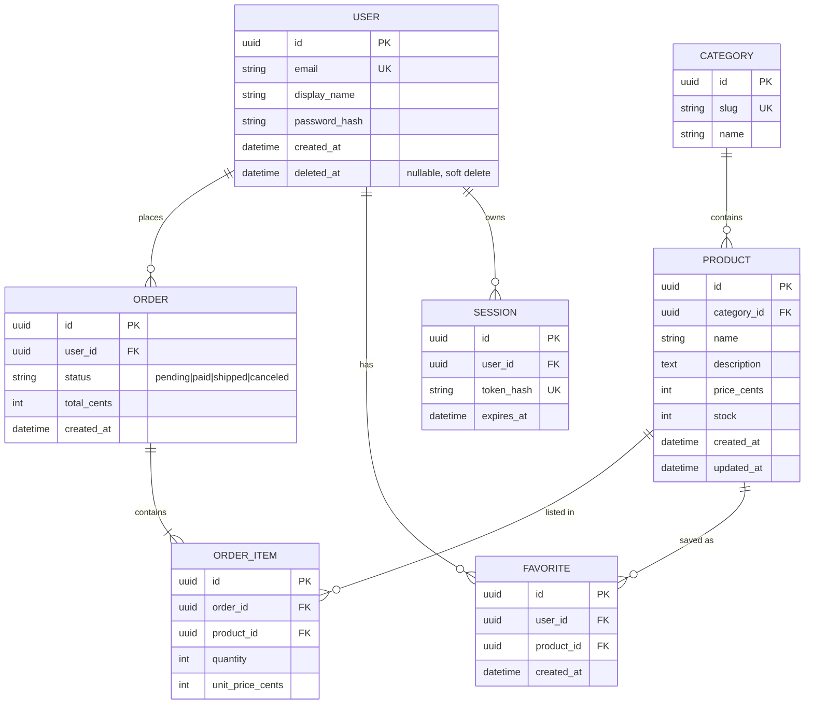

# ERD — <프로젝트명>

> 데이터 모델. **스키마 변경 시 같은 커밋에서 이 파일도 업데이트**.

**마지막 업데이트**: `<YYYY-MM-DD>`
**DB**: `<예: Postgres 16 / SQLite / MySQL 8>`

---

## 1. 전체 ER 다이어그램

---

## 2. 테이블별 상세

### `user`

| 컬럼 | 타입 | 제약 | 설명 |
|------|------|------|------|
| id | uuid | PK | gen_random_uuid() |
| email | varchar(255) | UK, NOT NULL | lowercase 저장 |
| display_name | varchar(100) | NOT NULL | |
| password_hash | varchar(255) | NOT NULL | argon2id |
| created_at | timestamptz | NOT NULL DEFAULT now() | |
| deleted_at | timestamptz | NULL | 소프트 삭제, 쿼리 시 필터 필수 |

**인덱스**
- `user_email_idx` on `email`
- `user_deleted_at_idx` on `deleted_at` (partial: `WHERE deleted_at IS NULL`)

### `favorite`

| 컬럼 | 타입 | 제약 | 설명 |
|------|------|------|------|
| id | uuid | PK | |
| user_id | uuid | FK → user(id), NOT NULL | ON DELETE CASCADE |
| product_id | uuid | FK → product(id), NOT NULL | ON DELETE CASCADE |
| created_at | timestamptz | NOT NULL DEFAULT now() | |

**인덱스 / 제약**
- `favorite_user_product_uk` UNIQUE on `(user_id, product_id)` — 중복 저장 방지
- `favorite_user_created_idx` on `(user_id, created_at DESC)` — 목록 조회용

<다른 테이블 동일 포맷으로 추가>

---

## 3. 불변식 (Invariants)

> 데이터 무결성을 위해 **애플리케이션 레벨에서도** 지키는 규칙.

- `order.total_cents = SUM(order_item.quantity * order_item.unit_price_cents)` — 주문 생성 시 검증
- `product.stock >= 0` — DB CHECK 제약
- 소프트 삭제된 user는 로그인 불가 (서비스 레이어에서 필터)
- `favorite`는 소프트 삭제된 user/product를 가리킬 수 없다 (CASCADE로 정리)

---

## 4. 마이그레이션 이력

> 각 마이그레이션은 `src/db/migrations/` 디렉토리 참조.

| 날짜 | 버전 | 변경 | PR |
|------|------|------|----|
| 2026-01-10 | 0001 | 초기 스키마 (user, product, order) | #1 |
| 2026-02-03 | 0002 | category 테이블 추가 | #12 |
| 2026-03-15 | 0003 | favorite 테이블 추가 | #34 |
| 2026-04-01 | 0004 | user.deleted_at 추가 (소프트 삭제) | #45 |

---

## 5. 대기 중 변경 (Pending)

> Expand-Contract 중이거나 아직 머지되지 않은 스키마 변경.

- [ ] `user.legal_name` 컬럼 추가 (실명 인증 기능) — Expand 완료, Migrate 대기
- [ ] `product.sku` UNIQUE 추가 — 중복 데이터 정리 중

---

## 6. 안티패턴 / 주의

- `order_item.unit_price_cents`는 **주문 시점의** 가격. `product.price_cents`를 조인으로 덮지 말 것.
- `user.email` 쿼리 시 반드시 `LOWER()` (저장 시 lowercase, 조회 시도 lowercase).
- 대용량 `favorite` 삭제 시 배치 처리 (한 번에 10만 건 CASCADE 금지).
