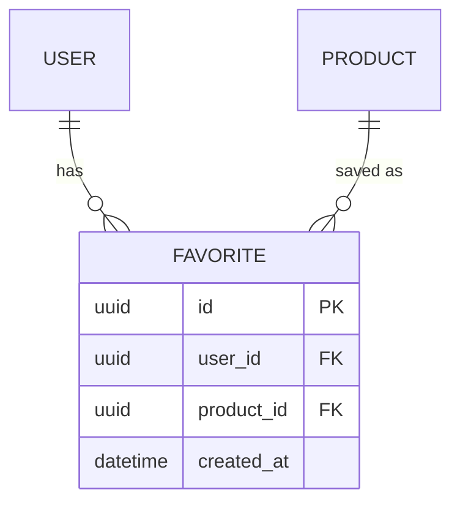

# Feature Spec — <기능 이름>

> 단일 기능의 "끝나는 조건"을 명시. PRD의 P0/P1 항목 1개당 이 파일 1개.
> 경로: `docs/features/<kebab-case-name>.md`

**PRD 항목**: `<F-001 등>`
**상태**: Draft / In Progress / In Review / Done
**오너**: `<이름>`
**마지막 업데이트**: `<YYYY-MM-DD>`

---

## 1. 목적 (한 줄)

<예시>
로그인 유저가 상품을 즐겨찾기로 저장/해제하고, 프로필에서 목록을 확인할 수 있게 한다.

## 2. 사용자 시나리오

### 정상 경로
1. 유저가 상품 카드의 하트를 클릭
2. 즐겨찾기에 저장됨 (하트 채움 + 토스트)
3. 프로필 → 즐겨찾기 탭에서 목록 확인
4. 하트를 다시 클릭하면 해제

### 대안 경로
- 비로그인 상태에서 하트 클릭 → 로그인 모달 → 로그인 성공 후 저장
- 품절 상품 → 회색 오버레이 + "품절" 배지, 장바구니 버튼 비활성화

### 에러 경로
- 네트워크 실패 → 인라인 에러 + 낙관적 업데이트 롤백
- 타인이 만든 데이터 접근 시도 → 403

---

## 3. 수용 기준 (Acceptance Criteria)

**이 체크리스트가 모두 ✅가 되면 "완료"다.**

- [ ] AC-1: 로그인 유저가 상품 카드의 하트를 클릭하면 DB에 저장된다
- [ ] AC-2: 저장된 상품의 하트는 다른 페이지에서도 채워진 상태로 표시된다
- [ ] AC-3: 프로필 "즐겨찾기" 탭에서 최근 저장 순으로 20개씩 페이지네이션 표시
- [ ] AC-4: 품절 상품은 "품절" 배지가 표시되고 "담기" 버튼이 비활성화된다
- [ ] AC-5: 비로그인 유저가 하트를 클릭하면 로그인 모달이 뜬다
- [ ] AC-6: 같은 상품을 두 번 저장해도 1개만 저장된다 (멱등)
- [ ] AC-7: 타 유저의 즐겨찾기 목록을 URL 조작으로 조회할 수 없다
- [ ] AC-8: 응답 p95 < 200ms (토글 + 목록 조회 각각)
- [ ] AC-9: 키보드만으로 하트 토글 가능 (Enter/Space)
- [ ] AC-10: 스크린 리더가 현재 상태를 읽는다 ("즐겨찾기에 추가됨" / "제거됨")

---

## 4. 범위

### 포함
- 백엔드: `POST /api/favorites`, `DELETE /api/favorites/:productId`, `GET /api/users/me/favorites`
- DB: `favorite` 테이블 신규
- 프론트: `<FavoriteButton>`, `ProfileFavoritesTab`
- 테스트: 단위 + E2E 1건

### 제외
- 즐겨찾기 상품의 가격 변동 알림
- 즐겨찾기 목록 공유/공개
- 카테고리 필터링 (P1)
- 추천 기반 즐겨찾기 제안

---

## 5. 영향 파일 (예상)

### 신규
- `src/db/migrations/000X_add_favorite.sql`
- `src/db/schema/favorite.ts`
- `src/server/services/favorite-service.ts`
- `src/server/api/routers/favorite.ts`
- `src/components/FavoriteButton.tsx`
- `src/app/profile/favorites/page.tsx`
- `src/hooks/use-favorite.ts`

### 수정
- `src/components/ProductCard.tsx` (하트 아이콘 추가)
- `src/app/profile/layout.tsx` (즐겨찾기 탭 추가)
- `docs/erd.md` (favorite 엔티티 반영)
- `docs/PRD.md` (F-001~F-003 상태 변경)

---

## 6. 데이터 모델



### 제약
- `UNIQUE(user_id, product_id)` — 중복 방지
- 인덱스: `(user_id, created_at DESC)` — 목록 조회
- FK ON DELETE CASCADE

---

## 7. API 계약

### POST /api/favorites
```ts
// Request
{ productId: string }

// Response 200
{ ok: true, state: 'added' | 'already_exists' }

// Response 401 (비로그인)
{ ok: false, error: 'UNAUTHORIZED' }
```

### DELETE /api/favorites/:productId
```ts
// Response 200
{ ok: true, state: 'removed' | 'not_found' }
```

### GET /api/users/me/favorites?page=1&limit=20
```ts
// Response 200
{
  ok: true,
  data: {
    items: Favorite[],
    total: number,
    page: number,
    limit: number
  }
}
```

---

## 8. 테스트 계획

| 레벨 | 시나리오 |
|------|---------|
| 단위 | `FavoriteService.toggle()` — 추가/제거/멱등 |
| 단위 | `FavoriteService.list()` — 페이지네이션 |
| 통합 | POST → GET → DELETE → GET 라운드트립 |
| E2E | 상품 카드 클릭 → 프로필 탭 확인 (Playwright) |
| 권한 | 타 유저 ID로 GET 요청 → 403 |

---

## 9. 관측성

- 메트릭: `favorite_toggle_total{action="add|remove"}`
- 로그: 토글 이벤트 구조화 로그 (`user_id`, `product_id`, `action`)
- 에러 알람: 5xx 발생 시 Sentry

---

## 10. 오픈 질문

- [ ] 즐겨찾기 상한? (예: 유저당 1000개)
- [ ] 관리자는 유저 즐겨찾기 조회 가능해야 하는가? (지원팀 요청 시)

---

## 11. 롤아웃

- 단계 1: 내부 테스트 (staging, 팀 계정)
- 단계 2: 10% 유저 (feature flag `favorites_v1`)
- 단계 3: 전체 공개
- 롤백: feature flag off
