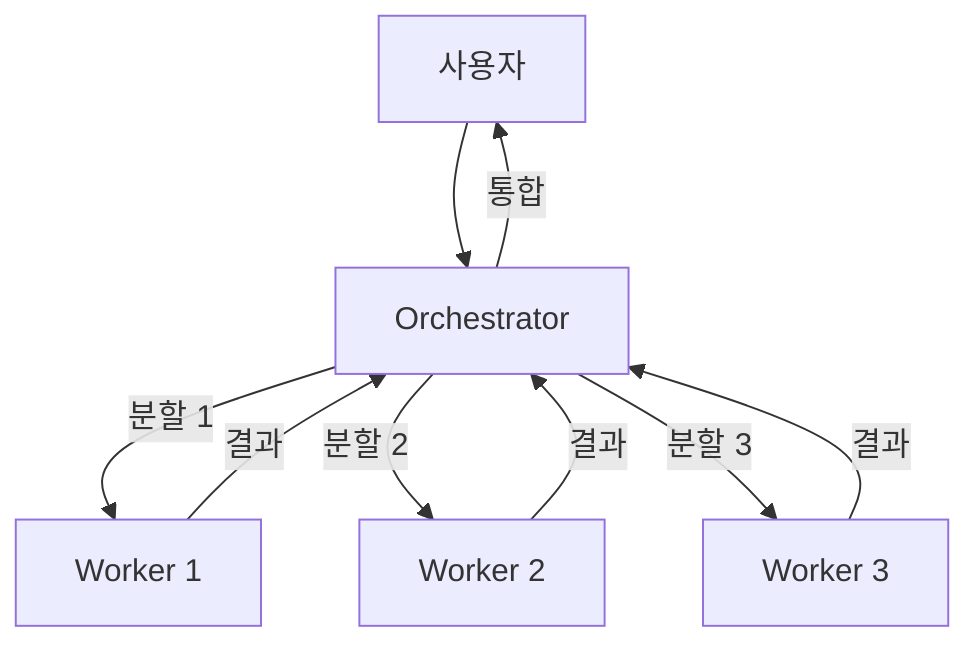
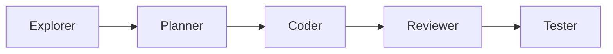
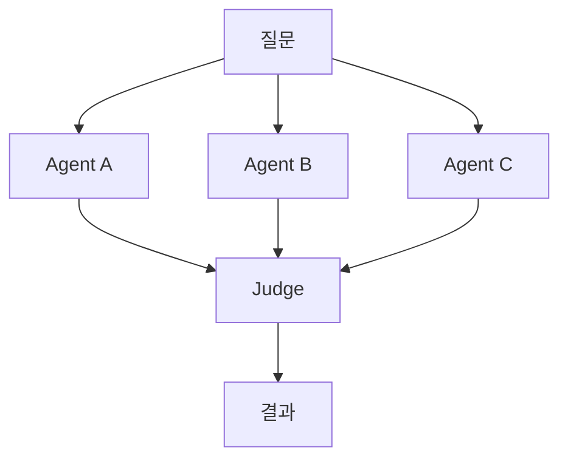
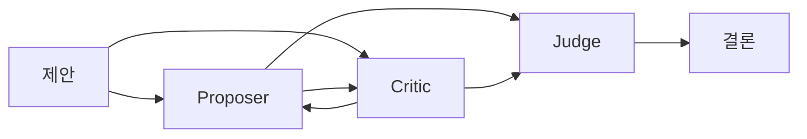

# 01. 멀티 에이전트 패턴

> 4가지 조합 패턴. 작업 특성에 맞게 고른다.

---

## 패턴 1: Orchestrator-Worker (중앙 조정)



### 언제
- 큰 작업을 여러 독립 하위 작업으로 쪼갤 수 있을 때
- 각 하위 작업이 다른 컨텍스트를 요구할 때 (예: FE + BE + DB 병행)

### 구현
- Orchestrator = 사람 (또는 메인 Claude Code 세션)
- Workers = Claude Code 서브에이전트 / 별도 세션 / 다른 AI 도구
- 통신 = 파일 (마크다운 리포트) 또는 Task 툴

### 예시 프롬프트 (Orchestrator에게)

```
다음 작업을 독립된 3개 하위 작업으로 나눠라. 각 하위 작업은 다른 세션에서
수행할 수 있어야 한다. 각 세션에 전달할 self-contained 프롬프트를 생성하라.

작업: "상품 검색 기능 추가 (DB 인덱스, API, UI)"

출력 형식:
- sub-task-1.md (DB + 인덱스)
- sub-task-2.md (API 엔드포인트)
- sub-task-3.md (검색 UI)

각 파일은 그 세션에 그대로 붙여넣을 수 있어야 한다.
```

---

## 패턴 2: Pipeline (순차 파이프)



### 언제
- 작업이 자연스럽게 단계를 이룰 때
- 각 단계가 이전 단계의 산출물에 의존할 때

### 각 단계의 역할

| 단계 | 입력 | 출력 | 쓰면 좋은 도구 |
|------|------|------|---------------|
| Explorer | 요구사항 | 관련 파일 지도 + 제약 | Claude Code (탐색형 프롬프트) |
| Planner | 제약 + 목표 | 변경 계획 + 단계 분할 | Claude Code (thinking 강화) |
| Coder | 계획 | 코드 변경 | Claude Code / Cursor / Codex |
| Reviewer | diff | 리뷰 코멘트 + 머지 가부 | **다른** 에이전트 세션 |
| Tester | 코드 | 테스트 결과 + 추가 테스트 | Claude Code (테스트 전용 세션) |

### 핵심 원칙
- **리뷰어는 반드시 다른 세션**이어야 한다. 같은 세션의 자기 리뷰는 사각지대를 공유.
- 각 단계의 산출물은 **파일**로 떨어뜨린다. 메모리 의존 금지.

---

## 패턴 3: Parallel (병렬 탐색)



### 언제
- 한 가지 정답이 없는 문제 (설계 선택, 라이브러리 비교)
- 동일 입력에 여러 관점이 필요할 때

### 구현
- 같은 프롬프트를 서로 다른 세션/도구에 동시 투입
- 결과를 한 파일에 모아 Judge 세션이 비교

### 예시 사용
- "이 API를 tRPC로 할지 GraphQL로 할지"를 A/B 에이전트에 각각 주장하게 하고, Judge가 근거 비교

---

## 패턴 4: Debate (토론 / 2-agent 검증)



### 언제
- 제안한 설계/패치에 숨은 결함이 있을지 의심될 때
- 스키마 변경, 보안 관련 변경, 롤백 비용이 큰 변경

### 프로토콜
1. Proposer가 제안 + 근거
2. Critic이 **반대 입장에서만** 반박
3. Proposer가 반박에 대응
4. 2~3회 라운드
5. Judge(사람 또는 제3 세션)가 결론

### 주의
- Critic 프롬프트에 **"긍정 코멘트 금지, 반대 논거만"** 을 명시해야 작동
- 라운드 2~3회 넘어가면 토큰 낭비

---

## 패턴 선택표

| 상황 | 추천 패턴 |
|------|----------|
| 작업이 독립된 3개 서브작업으로 쪼개짐 | Orchestrator-Worker |
| 탐색→계획→구현→리뷰→테스트 순차 | Pipeline |
| 설계 선택 / 라이브러리 결정 | Parallel |
| 고위험 스키마/보안 변경 | Debate |
| 단순 버그 수정 1파일 | 멀티 에이전트 불필요 (단일 + 2단계 프롬프트) |

---

## 안티패턴

| 하지 마라 | 왜 |
|----------|----|
| 모든 작업을 멀티로 | 컨텍스트 전달 오버헤드가 이득 초과 |
| 리뷰어를 같은 세션에서 | 자기 코드 자기 칭찬 |
| Worker 간 직접 통신 | 결합 증가, 오케스트레이터 우회 |
| Debate를 4라운드+ | 실제 개선 없이 토큰만 소모 |
| 각 세션에 컨텍스트 요약 없이 | "전에 우리가 얘기한" 이 지워짐 |
