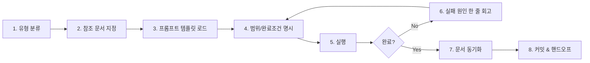

# 08. 바이브 코딩 (Vibe Coding) — 실전 자산

> "최소 문서, 최대 효율" — 에이전트가 읽기 좋은 문서와 재사용 가능한 프롬프트로, 혼자서도 팀 수준의 개발 흐름을 만든다.

이 섹션은 가이드의 다른 섹션(01~07)이 **개념/레퍼런스**를 다룬다면, 여기서는 **복사해서 바로 쓰는 자산** — 프롬프트, 문서 템플릿, 협업 패턴, 예제 — 을 모았습니다.

| 다른 섹션 | 이 섹션 (08) |
|----------|-------------|
| "Claude Code가 뭔지" | "그걸로 내일 출근해서 뭘 할지" |
| 서술형 가이드 | 체크리스트 / 템플릿 / 프롬프트 |
| 기능 릴리즈 기준 갱신 | 프로젝트 회고 기준 갱신 |

---

## 핵심 등식

```
좋은 바이브 코딩 = 좋은 문서 + 좋은 프롬프트 구조 + 적절한 작업 분할
```

세 가지 중 하나라도 빠지면 에이전트는 환각하거나, 똑같은 질문을 반복하거나, 엉뚱한 파일을 건드립니다.

| 변수 | 담당 폴더 | 구체 산출물 |
|------|----------|------------|
| 좋은 문서 | [`03-문서템플릿/`](./03-문서템플릿(templates)/) | CLAUDE.md, PRD.md, architecture.md, erd.md |
| 좋은 프롬프트 구조 | [`02-프롬프트템플릿/`](./02-프롬프트템플릿(prompts)/) | 범용 템플릿 + 작업 유형별 7종 |
| 적절한 작업 분할 | [`04-워크플로우/07~11`](../04-워크플로우(workflows)/) | 작업 유형별 단계 체크리스트 |

---

## 작업 유형 5가지 + 공통 루프

바이브 코딩은 **"작업 유형을 먼저 분류하고, 유형에 맞는 플레이북을 실행"** 하는 방식이 가장 재현성이 높습니다.

| 유형 | 언제 | 플레이북 |
|------|------|---------|
| 기능 개발 | 새 기능을 추가할 때 | [04-워크플로우/07-기능개발흐름](../04-워크플로우(workflows)/07-기능개발흐름(feature-flow).md) |
| 버그 수정 | 기존 동작이 깨졌을 때 | [04-워크플로우/08-버그수정흐름](../04-워크플로우(workflows)/08-버그수정흐름(bugfix-flow).md) |
| 리팩토링 | 동작은 맞지만 구조가 나쁠 때 | [04-워크플로우/09-리팩토링흐름](../04-워크플로우(workflows)/09-리팩토링흐름(refactoring-flow).md) |
| 스키마 변경 | DB 구조를 바꿔야 할 때 | [04-워크플로우/10-스키마변경흐름](../04-워크플로우(workflows)/10-스키마변경흐름(schema-flow).md) |
| UI 구현 | 화면 / 레이아웃 작업 | [04-워크플로우/11-UI구현흐름](../04-워크플로우(workflows)/11-UI구현흐름(ui-flow).md) |

### 모든 유형에 공통되는 루프



각 단계의 의미:

1. **유형 분류** — 지금 하려는 게 정확히 5가지 중 무엇인지 적는다. "그냥 좀 고치기"는 금지.
2. **참조 문서 지정** — `CLAUDE.md`, `PRD.md`, `architecture.md`, `erd.md`, 관련 파일 경로를 나열.
3. **프롬프트 템플릿 로드** — `02-프롬프트템플릿/`에서 유형에 맞는 템플릿을 복사.
4. **범위/완료조건** — "어디까지 건드릴지"와 "끝난 건 어떻게 판단할지"를 문장으로 적는다.
5. **실행** — 에이전트에게 프롬프트 투입, 결과 확인.
6. **실패 시 한 줄 회고** — "왜 안 됐지?"를 적고 3번으로 돌아간다. 맹목적 재시도 금지.
7. **문서 동기화** — ERD/PRD/architecture가 바뀌었다면 즉시 업데이트. 안 하면 다음 세션이 오염된다.
8. **커밋 & 핸드오프** — 다음 세션(혹은 다른 에이전트)이 이어받을 수 있게 상태를 남긴다.

### "왜 이 루프인가" — 자주 망하는 이유 5가지

1. **컨텍스트 없이 질문** → 에이전트가 `CLAUDE.md`/`PRD.md`를 못 읽어서 엉뚱한 스택을 가정함.
2. **범위 미정** → "로그인 고쳐줘" 하면 에이전트가 5개 파일을 건드림.
3. **완료조건 없음** → 무한 재시도하다 토큰만 소모.
4. **문서 미동기화** → 같은 실수를 다음 세션이 반복.
5. **실패 시 재시도만** → 원인 안 보고 버튼만 누르면 안 됩니다.

---

## 이 워크플로우가 가정하는 환경

- **주 에이전트**: Claude Code (CLI / VS Code 확장 / Desktop / Web)
- **보조 에이전트**: GPT Codex, Cursor, Windsurf, Aider 등과 병용 가능 (→ [04-에이전트협업/03-크로스에이전트핸드오프](./04-에이전트협업(agents)/03-크로스에이전트핸드오프(cross-agent-handoff).md))
- **문서 포맷**: Markdown + Mermaid (→ [07-최적화/05-에이전트친화포맷](../07-최적화(optimization)/05-에이전트친화포맷(agent-friendly-formats).md))
- **팀 규모**: 솔로 개발자 ~ 소규모 팀 (2-5명)

대규모 팀, 엔터프라이즈 컴플라이언스, RFC 기반 프로세스에는 이 루프만으로 부족합니다. 그땐 이 루프 위에 리뷰/승인 단계를 더하세요.

---

## 구조

```
08-바이브코딩(vibe-coding)/
├── README.md                              ← (여기) 핵심 등식 + 8단계 공통 루프 + 섹션 안내
├── 01-빠른시작(quickstart).md             5단계 초기화 (CLAUDE.md → PRD → arch → ERD → dev)
├── 02-프롬프트템플릿(prompts)/             재사용 프롬프트 9종
│   ├── README.md
│   ├── 00-범용템플릿(universal).md         7-section 구조 (모든 템플릿의 부모)
│   ├── 01-기능개발(feature).md
│   ├── 02-버그수정(bugfix).md             2단계(원인→패치) 분리 패턴
│   ├── 03-리팩토링(refactoring).md
│   ├── 04-스키마마이그레이션(schema).md
│   ├── 05-UI구현(ui).md
│   ├── 06-코드리뷰(review).md
│   └── 07-탐색분석(exploration).md
├── 03-문서템플릿(templates)/               프로젝트에 복붙할 문서 원본
│   ├── README.md
│   ├── CLAUDE.template.md                  → 프로젝트 루트의 CLAUDE.md
│   ├── PRD.template.md                     → docs/PRD.md
│   ├── architecture.template.md            → docs/architecture.md
│   ├── erd.template.md                     → docs/erd.md
│   └── feature-spec.template.md            → docs/features/<name>.md
├── 04-에이전트협업(agents)/                멀티 에이전트 / 역할 분담 / 핸드오프
│   ├── README.md
│   ├── 01-멀티에이전트패턴(multi-agent-patterns).md   Orchestrator/Pipeline/Parallel/Debate
│   ├── 02-역할기반협업(role-based).md      Planner/Coder/Reviewer/Tester
│   ├── 03-크로스에이전트핸드오프(cross-agent-handoff).md
│   ├── 04-인기에이전트레포(popular-agent-repos).md   wshobson/VoltAgent/0xfurai/... 비교 + 선택 가이드
│   └── 05-에이전트작업별예제(agent-task-examples).md  8 repos × 6 scenarios = 48개 복붙 예제
└── 05-예제(examples)/                     엔드투엔드 워크스루
    ├── README.md
    ├── 01-기능개발예제(feature-walkthrough).md     기능 1개를 80분 4커밋으로
    └── 02-멀티에이전트예제(multi-agent-pipeline).md  847줄 리팩토링 14세션 사례
```

---

## 시작 경로 (5분)

1. **[01-빠른시작](./01-빠른시작(quickstart).md)** 을 읽고 5단계를 그대로 따라 한다.
2. **[03-문서템플릿/CLAUDE.template.md](./03-문서템플릿(templates)/CLAUDE.template.md)** 를 내 프로젝트 루트에 `CLAUDE.md`로 복사·채운다.
3. **[02-프롬프트템플릿/00-범용템플릿](./02-프롬프트템플릿(prompts)/00-범용템플릿(universal).md)** 의 구조를 익힌다.
4. 내 오늘 작업이 "기능/버그/리팩토링/스키마/UI" 중 무엇인지 정하고, **[02-프롬프트템플릿](./02-프롬프트템플릿(prompts)/)** 의 해당 템플릿을 복사해 채운다.
5. 복잡한 작업이라면 **[04-에이전트협업/01-멀티에이전트패턴](./04-에이전트협업(agents)/01-멀티에이전트패턴(multi-agent-patterns).md)** 을 읽고 역할을 나눈다.

---

## 가이드의 다른 섹션과의 연결

이 섹션은 가이드의 다른 부분과 다음과 같이 연결됩니다.

| 궁금한 것 | 보내는 곳 |
|----------|---------|
| Claude Code의 "기능 자체" | [03-주요기능/](../03-주요기능(features)/) |
| 워크플로우 "개념"  (코드 분석, 디버깅, 리팩토링 등) | [04-워크플로우/01~06](../04-워크플로우(workflows)/) |
| 워크플로우 "실전 흐름"  (기능/버그/리팩/스키마/UI) | [04-워크플로우/07~11](../04-워크플로우(workflows)/) |
| 프롬프트 엔지니어링 "원칙" | [07-최적화/01-프롬프트엔지니어링](../07-최적화(optimization)/01-프롬프트엔지니어링(prompt-engineering).md) |
| 프롬프트 "재사용 템플릿" | [02-프롬프트템플릿/](./02-프롬프트템플릿(prompts)/) (이 섹션) |
| CLAUDE.md "작성 방법" | [07-최적화/02-CLAUDE-MD작성법](../07-최적화(optimization)/02-CLAUDE-MD작성법(claude-md).md) |
| CLAUDE.md "복사용 템플릿" | [03-문서템플릿/CLAUDE.template.md](./03-문서템플릿(templates)/CLAUDE.template.md) (이 섹션) |
| 어떤 "문서를 만들지/안 만들지" | [07-최적화/04-문서종류분류](../07-최적화(optimization)/04-문서종류분류(document-types).md) |
| "에이전트 친화 포맷" 선택 | [07-최적화/05-에이전트친화포맷](../07-최적화(optimization)/05-에이전트친화포맷(agent-friendly-formats).md) |
| Claude Code "서브에이전트 기능" | [03-주요기능/05-서브에이전트](../03-주요기능(features)/05-서브에이전트(subagents).md) |
| 멀티 에이전트 "협업 패턴" | [04-에이전트협업/](./04-에이전트협업(agents)/) (이 섹션) |

---

## 설계 원칙

1. **역할 기반 분리** — 워크플로우(언제/왜) / 프롬프트(어떻게 묻나) / 템플릿(무엇을 남기나) / 에이전트(누가 하나) 로 역할 분리.
2. **재사용 우선** — 모든 문서는 복붙해서 바로 채울 수 있는 상태. 설명보다 구조를 남긴다.
3. **재현 가능성** — 같은 입력이면 같은 결과가 나오도록 프롬프트 구조를 고정 (§02-프롬프트템플릿/00-범용템플릿).
4. **에이전트 친화** — 문서는 Markdown + Mermaid만 (→ [07-최적화/05-에이전트친화포맷](../07-최적화(optimization)/05-에이전트친화포맷(agent-friendly-formats).md)).
5. **확장성** — 새 에이전트 / 자동화 / 훅 추가 시 `04-에이전트협업/` 아래에 파일 하나만 추가하면 되도록.
