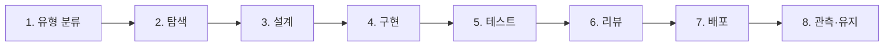
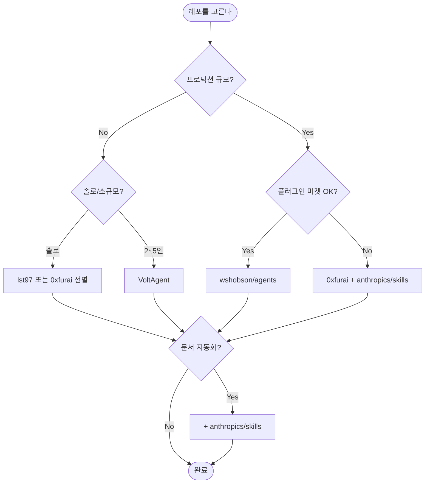

# 04. 인기 Claude Code 에이전트 레포지토리 가이드

> 커뮤니티가 만든 서브에이전트 / 스킬 / 플러그인 컬렉션은 수십 개에 이른다. 이 문서는 **무엇을 / 왜 / 어떻게 설치할지** 를 결정하기 위한 실전 참조 가이드다.

**마지막 검증**: 2026-04 (주요 레포 최신 상태 기준)

---

## 0. 먼저: 용어 5가지 정리

레포지토리를 고르기 전에 각 용어가 무엇을 말하는지 구분해야 합니다. 뭉쳐 쓰면 잘못된 레포를 설치하게 됩니다.

| 용어 | 무엇 | 어디 저장 | 예시 |
|------|-----|----------|------|
| **Subagent** | 특정 도메인 전문 보조 에이전트. 자체 컨텍스트로 실행 | `~/.claude/agents/` 또는 `.claude/agents/` | `backend-architect`, `security-auditor` |
| **Skill** | 동적으로 로드되는 지시/스크립트 묶음 (Agent Skills 스펙) | `~/.claude/skills/` 또는 프로젝트 `.claude/skills/` | `pdf`, `review-pr`, `commit` |
| **Slash Command** | `/xxx` 형태 사용자 호출 명령 | `.claude/commands/` | `/commit`, `/test` |
| **Hook** | 이벤트(예: PreToolUse, PostToolUse)에 따른 자동 실행 스크립트 | `settings.json`의 `hooks` 필드 | pre-commit 포맷, 알림 |
| **Plugin** | 위 4가지를 한 단위로 묶어 배포하는 마켓플레이스 단위 | `/plugin marketplace add ...` | `voltagent-lang`, `agents@wshobson` |

**핵심 구분**:
- Subagent는 **에이전트가 호출하는 보조 세션**
- Skill은 **필요할 때 로드되는 지시서**
- Command는 **사용자가 타이핑하는 단축**
- Hook은 **이벤트 기반 자동 실행**
- Plugin은 **위 4가지의 배포 포장재**

대부분의 "awesome-*" 레포는 이 중 하나 이상을 제공합니다.

---

## 1. 한 장 비교표

아래 8개 레포가 현재 커뮤니티에서 가장 활발합니다. 각각의 상세는 다음 섹션을 참고.

| # | 레포 | 주 내용 | 규모 | 설치 방식 | 라이선스 | 누가 쓰면 좋은가 |
|---|------|--------|------|----------|---------|-----------------|
| 1 | **wshobson/agents** | subagent + plugin + skill + command | 182 agents / 149 skills / 96 commands / 77 plugins / 16 orchestrator | `/plugin marketplace add` | MIT | 프로덕션 규모, 멀티 에이전트 오케스트레이션 필요 |
| 2 | **VoltAgent/awesome-claude-code-subagents** | subagent | 100+ (카테고리 9~10개) | 플러그인 마켓 / 설치 스크립트 / 수동 | (오픈) | 언어/인프라/보안 등 도메인 전문 에이전트가 필요한 풀스택 |
| 3 | **0xfurai/claude-code-subagents** | subagent | 100+ (16 카테고리) | 클론 → `~/.claude/agents/` | MIT | 일관된 포맷, 비용 의식적 (모델 자동 매핑) |
| 4 | **davepoon/buildwithclaude** | agent + command + hook + skill + plugin (메타) | 117 agents / 175 commands / 28 hooks / 26 skills / 50 plugins | 플러그인 마켓 + 웹 UI 검색 | MIT | 한 곳에서 다양한 자산을 검색해서 선택 |
| 5 | **lst97/claude-code-sub-agents** | subagent (풀스택 중심) | 33 + orchestrator | 클론 → `~/.claude/agents/` | 오픈 | 솔로 풀스택 (React/Next.js/Python/Go) |
| 6 | **SuperClaude-Org/SuperClaude_Framework** | framework + persona + command + agent | 16 specialist agents / 30 commands / 14 personas | `pip install SuperClaude` 등 | MIT | "가이드된 방법론"이 필요, 페르소나 기반 |
| 7 | **anthropics/skills** (공식) | skill | 문서/코드/디자인 스킬 | 플러그인 또는 복사 | Apache 2.0 (일부 source-available) | 공식 품질을 신뢰, 문서 조작 등 표준 작업 |
| 8 | **hesreallyhim/awesome-claude-code** | 메타 큐레이션 리스트 | 수백 개 링크 | - (레포가 자산이 아님) | - | "무엇이 있는지" 둘러보고 싶을 때 |

> **메타 리스트 주의**: 6번, 8번은 레포 자체를 설치하는 게 아닙니다. 링크 모음이라 읽기만 합니다. 1~5, 7번만 "설치" 대상입니다.

---

## 2. 레포별 상세

### 2-1. wshobson/agents — 프로덕션 규모 올인원

- **링크**: https://github.com/wshobson/agents
- **규모**: 182 에이전트 / 149 스킬 / 96 커맨드 / 77 플러그인 / 16 오케스트레이터
- **카테고리(24개 일부)**: Development / Languages / Infra & DevOps / Security / AI·ML / Docs / Quality & Testing / Database / Operations / Workflows / Payments / Blockchain / Gaming / Accessibility / ...
- **설치**:
  ```
  /plugin marketplace add wshobson/agents
  /plugin install <plugin-name>@claude-code-workflows
  ```
  플러그인 단위로 쪼개져 있어 **필요한 것만** 설치 가능.
- **라이선스**: MIT

**장점**
1. **규모 · 커버리지**: 거의 모든 스택/도메인 대응.
2. **멀티 에이전트 오케스트레이터 16개** — "전체 기능 개발", "보안 강화", "병렬 코드 리뷰 팀" 등 이미 설계된 워크플로우.
3. **플러그인 세분화 (평균 3.6 컴포넌트/플러그인)** — 토큰 절약, 필요한 것만 로드.
4. **프로덕션 지향 설계** — 관측성, 인시던트 대응, 컴플라이언스 포함.

**단점 / 주의**
1. **학습 곡선 큼** — 에이전트 182개 중 무엇을 언제 쓸지 파악에 시간 소요.
2. **과도한 설치 유혹** — "전부 깔기"는 컨텍스트 충돌·토큰 낭비 원인.
3. 일부 도메인(블록체인/게이밍)은 범용 프로젝트에서 불필요.

**적합한 경우**
- 팀/스타트업/중견, 프로덕션 서비스 운영
- 여러 스택 병용 (백엔드 + 프론트 + 인프라 + 보안)
- 멀티 에이전트 파이프라인을 **이미 설계된 대로** 쓰고 싶을 때

**피해야 할 경우**
- "Hello World" 수준의 학습용 프로젝트
- 엄격한 플러그인 화이트리스트가 필요한 환경

---

### 2-2. VoltAgent/awesome-claude-code-subagents — 도메인 특화 언어 지향

- **링크**: https://github.com/VoltAgent/awesome-claude-code-subagents
- **규모**: 100+ (문서에 따라 130+ 까지). 9~10개 카테고리.
- **카테고리**:
  - Core Development (API/front/back/full-stack) — 11
  - Language Specialists (TS/Python/Go/Rust/Java 등) — 28
  - Infrastructure (DevOps/K8s/Terraform/클라우드) — 16
  - Quality & Security (테스트/리뷰/펜테스트) — 15
  - Data & AI — 13
  - Developer Experience — 14
  - Specialized Domains (블록체인/IoT/게임/핀테크) — 12
  - Business & Product — 11
  - Meta & Orchestration — 13
  - Research & Analysis — 3
- **설치** (4가지):
  1. 플러그인 마켓: `claude plugin marketplace add VoltAgent/awesome-claude-code-subagents`
  2. 스크립트: `./install-agents.sh` (클론 후)
  3. curl 단발 설치
  4. 수동 복사 → `~/.claude/agents/`
- **라이선스**: 오픈(저장소에 LICENSE 존재)

**장점**
1. **언어/프레임워크 전문가 28명** — `typescript-pro`, `python-expert`, `rust-ownership-guru` 등 도메인 언어 수준의 세밀한 조언.
2. **설치 옵션 다양** — 팀 단위 일괄 설치부터 개인 선별 설치까지.
3. **VoltAgent 생태계**와 연결 — `awesome-agent-skills` (스킬), `voltagent-lang`, `voltagent-infra` 등 별도 컬렉션과 호환.

**단점**
1. 에이전트 간 **명명 규칙 일관성이 레포 내부에서도 조금씩 다름**.
2. 오케스트레이션 예시가 wshobson 대비 얕음.
3. "Research & Analysis" 등 일부 카테고리는 코드 작업과 거리가 있음.

**적합한 경우**
- **특정 언어/프레임워크**가 주력인 팀 (예: TypeScript 전담, Go 전담)
- 인프라·보안 전문 에이전트 스태프를 구성하고 싶을 때
- 이미 VoltAgent 생태계(예: Voltagent 프레임워크)를 쓰는 경우

---

### 2-3. 0xfurai/claude-code-subagents — 일관 포맷 · 비용 최적

- **링크**: https://github.com/0xfurai/claude-code-subagents
- **규모**: 100+ / 16 카테고리
- **카테고리**: 언어&프레임워크(23) / 웹&프론트(26) / 모바일&데스크톱(8) / DB&데이터(15) / ORM(5) / Infra&DevOps(9) / Services(7) / 메시징(10) / QA(10) / DS·ML(6) / 관측성(5) / 보안(3) / 빌드 툴(2) / 마이그레이션(3) / Job Queue(3) / 런타임·패키지(3)
- **설치**: 레포를 클론해 `~/.claude/agents/` 로 복사. 배치되면 자동 인식.
- **라이선스**: MIT

**장점**
1. **표준화된 마크다운 포맷**: 모든 에이전트가 동일 구조(Focus / Instructions / Quality Checklist / Output Guidelines)로 작성되어 **커스터마이즈가 쉽다**.
2. **모델 자동 매핑 (비용 최적화)**: 간단한 작업엔 저렴 모델, 복잡한 작업엔 고성능 모델을 사용하도록 에이전트 단위로 지정.
3. **자동 위임(auto-delegation)** + **명시 호출** 둘 다 지원.
4. 명시적 라이선스(MIT) — 사내 반입 결정이 쉽다.

**단점**
1. **플러그인 마켓 미지원** — 수동 복사만. 대규모 팀 배포에 번거로움.
2. 오케스트레이터 / 워크플로우가 없음. 역할별 에이전트만 제공.
3. 업데이트를 받으려면 직접 `git pull` 해야 함.

**적합한 경우**
- "내가 쓸 에이전트만 몇 개 골라 커스터마이즈"하고 싶은 개인
- 토큰 비용에 민감한 환경
- **플러그인 마켓을 사용하지 않는** 보수적 설정 환경 (사내 보안 정책 등)

---

### 2-4. davepoon/buildwithclaude — 통합 마켓플레이스 허브

- **링크**: https://github.com/davepoon/buildwithclaude (웹 UI: buildwithclaude.com)
- **규모**: 117 agents / 175 commands / 28 hooks / 26 skills / 50 번들 플러그인
- **카테고리**: 11 (agents), 22 (commands), 8 (hooks) 등
- **설치**:
  ```
  /plugin marketplace add davepoon/buildwithclaude
  /plugin install <plugin-name>@buildwithclaude
  ```
  또는 레포 수동 클론 후 복사.
- **라이선스**: MIT

**장점**
1. **웹 UI로 검색·필터·브라우징** — 플러그인 쇼핑몰 같은 경험.
2. **agent / command / hook / skill 전부** 를 한 마켓에서.
3. 외부 마켓플레이스(20k+ 커뮤니티 플러그인, 4,500+ MCP 서버, 1,100+ 마켓플레이스)도 인덱싱.
4. "One-click install command" 복사 지원 — 온보딩 문서에 붙여넣기 용이.

**단점**
1. 허브 성격이라 **개별 에이전트의 품질은 기여자 편차** 가 있음 — 쓰기 전에 각 에이전트 내용을 꼭 확인.
2. 명령/훅/스킬이 섞여 있어 **개념 혼동** 위험 (§0 용어 정리 필수).
3. wshobson 대비 멀티 에이전트 오케스트레이션이 약함.

**적합한 경우**
- 여러 소스에서 자산을 **한 번에 둘러보고** 고르고 싶을 때
- 팀 온보딩 문서에 "이 명령들 설치" 식으로 링크를 줄 때
- 단일 마켓플레이스로 **거버넌스** 를 두고 싶은 팀

---

### 2-5. lst97/claude-code-sub-agents — 솔로 풀스택 집중형

- **링크**: https://github.com/lst97/claude-code-sub-agents
- **규모**: 33 에이전트 + 1 메타 오케스트레이터(`agent-organizer`)
- **카테고리 6**: Development / Infrastructure / Quality & Testing / Data & AI / Security / Business & Specialization
- **설치**: 레포 클론 → `~/.claude/agents/`. MCP 서버를 옵션으로 붙일 수 있음. 프로젝트 단위로는 `CLAUDE.md`를 복사.
- **라이선스**: 오픈 (LICENSE 파일 존재)

**장점**
1. **33개로 딱 떨어지는 크기** — 에이전트 목록 전체를 읽고 파악 가능.
2. **풀스택 중심** (React/Next.js/Python/Go/TS/PostgreSQL/GraphQL/AWS·Azure·GCP) — 모던 웹 스택에 바로 맞춤.
3. `agent-organizer` 한 명이 여러 에이전트를 오케스트레이션 — 복잡한 설정 없이 멀티 에이전트 경험.

**단점**
1. **규모가 작아** 특수 도메인(블록체인/게이밍/모바일 네이티브)은 커버 부족.
2. 플러그인 마켓 미지원 (수동 복사).
3. "개인 사용"을 명시 — 프로덕션 규모 팀 배포에는 다른 선택이 나음.

**적합한 경우**
- **솔로 / 2~3인 풀스택** 팀
- "에이전트가 너무 많아 헷갈린다"고 느끼는 경우
- 모던 웹 스택 (Next.js + Postgres + TS) 표준 조합

---

### 2-6. SuperClaude-Org/SuperClaude_Framework — 방법론 프레임워크

- **링크**: https://github.com/SuperClaude-Org/SuperClaude_Framework
- **규모**: 16 specialist agents / 30 commands / 14 cognitive personas
- **특징**: "설정 프레임워크" — Claude Code 위에 **행동 지시 + 컴포넌트 오케스트레이션** 레이어를 얹음. 사용자 요청의 키워드/패턴을 보고 페르소나가 **자동 활성화**.
- **설치**: Python 기반. `pip install SuperClaude` 등 (README 지시 따름).
- **라이선스**: MIT

**주요 개념**
- **Persona** (14개): `architect`, `frontend`, `backend`, `analyzer`, `security`, `mentor`, `refactorer`, `performance`, `qa`, `devops`, `scribe`, `iterative`, `context`, `introspector` — 각 페르소나는 일관된 가치관/출력 형식을 가짐.
- **Auto-activation**: "리팩토링" 같은 키워드가 나오면 `refactorer` 페르소나가 활성화.
- **명령어**: `/sc:research`, `/sc:build`, `/sc:test` 등 30개.

**장점**
1. **방법론이 내장** — 별도 플레이북 없이도 일관된 출력 스타일을 얻음.
2. 페르소나/명령어/에이전트가 **서로 연동** 되게 설계.
3. 오픈소스 커뮤니티 활발, 문서화 상세.

**단점**
1. **학습 곡선**이 가장 큼 — 용어(페르소나/프레임워크/명령어) 이해 필요.
2. 다른 커뮤니티 에이전트 컬렉션과 **개념 충돌** 가능 (페르소나 vs 서브에이전트).
3. Python 기반 설치 — 환경에 따라 추가 세팅 부담.

**적합한 경우**
- "방법론 세트"를 통째로 받아 쓰고 싶은 사람
- 페르소나 기반 설계를 선호하는 팀
- 한 프레임워크 내에서 **일관성**이 최우선인 경우

**피해야 할 경우**
- 이미 wshobson/VoltAgent 등 다른 컬렉션을 깊게 쓰는 프로젝트 (혼선 위험)

---

### 2-7. anthropics/skills — 공식 Anthropic 스킬

- **링크**: https://github.com/anthropics/skills
- **성격**: **공식 Anthropic 레포**. Agent Skills 스펙 + 예시 스킬 + 템플릿.
- **카테고리**:
  - Creative & Design (아트/뮤직/디자인)
  - Development & Technical (웹 테스트, MCP 서버 생성 등)
  - Enterprise & Communication (커뮤니케이션/브랜딩)
  - Document Skills (**docx / pdf / pptx / xlsx** 생성·편집) — 프로덕션 Claude 앱의 참조 구현
- **설치**: 플러그인으로 설치 또는 `~/.claude/skills/`로 복사. 각 스킬은 `SKILL.md` + (옵션) 스크립트/리소스 폴더.
- **라이선스**:
  - 대부분 스킬: **Apache 2.0** (오픈소스)
  - Document skills (docx/pdf/pptx/xlsx): **source-available** (오픈소스 아님, 참조 구현)

**장점**
1. **공식 품질 보증** — 스펙 준거, 지속 업데이트, 보안 검증.
2. Document 생성 스킬은 타 레포에서 보기 어려운 **독자적 가치**.
3. 스킬 **템플릿 + 스펙**이 포함되어 자체 스킬 작성 출발점으로 최적.

**단점**
1. **커버리지가 좁음** — 182개 짜리 wshobson과 달리 "모든 작업" 대상이 아님.
2. Document skills의 라이선스 제약을 반드시 확인 (사내 배포 전).
3. 공식 레포라 실험적 기능/PR 머지가 보수적.

**적합한 경우**
- 문서 조작(PDF/Office)이 **작업의 한 축** 인 팀
- 자체 스킬을 만들 계획이라 **스펙/템플릿**이 필요한 경우
- "공식만 쓴다"는 거버넌스 원칙이 있는 조직

---

### 2-8. hesreallyhim/awesome-claude-code — 메타 큐레이션 리스트

- **링크**: https://github.com/hesreallyhim/awesome-claude-code
- **성격**: 레포가 자산이 아닌 **링크 큐레이션 리스트** ("awesome-*" 포맷).
- **카테고리**:
  - Agent Skills
  - Workflows & Knowledge Guides (General / Teams / Ralph Wiggum 자동화 루프)
  - Tooling (IDE 통합, 모니터링, 오케스트레이터, 설정 관리)
  - Status Lines (터미널 statusline)
  - Hooks (라이프사이클 이벤트)
  - Slash-Commands (버전 관리/테스트/문서/CI/PM)
  - CLAUDE.md Files (언어·도메인 특화 템플릿)
  - Alternative Clients / 공식 문서

**장점**
1. **전 생태계 조망** — 새 레포가 어디 있는지 빠르게 파악.
2. 카테고리가 **용어 기반** 이라 §0 정리와 매핑이 쉬움.
3. 커뮤니티 활발 (팔로워/기여자 많음).

**단점**
1. 품질 필터 없음 — 링크된 모든 레포가 **같은 수준이 아님**.
2. "깊이 있는 가이드"가 아닌 **인덱스** 이므로 선택 피로감.
3. 업데이트는 메인테이너 속도에 의존.

**사용법**
- 선택지를 **한 번 훑고**, 마음에 드는 걸 1~2개 골라 이 문서의 §3 선택 가이드로 검증.
- 그 자체를 설치하지 않음.

---

## 3. 선택 가이드

"무엇을 고를지"는 **프로젝트 유형 × 기술 스택 × 작업 단계** 3축으로 결정합니다.

### 3-1. 프로젝트 유형별

| 프로젝트 유형 | 1순위 | 2순위 | 이유 |
|-------------|------|------|------|
| **솔로 사이드 프로젝트** (웹 앱) | lst97 (33) | 0xfurai (선별) | 규모 작음, 풀스택 커버, 학습 부담 적음 |
| **솔로 OSS 라이브러리** | 0xfurai (선별) | anthropics/skills | 언어/테스트/문서 집중 — 광범위 불필요 |
| **2~5인 스타트업** | VoltAgent | wshobson (선별) | 도메인 전문가 + 언어 전문 조합 |
| **10인+ 팀 / 프로덕션** | wshobson | VoltAgent + anthropics/skills | 오케스트레이션 · 관측성 · 컴플라이언스 포함 |
| **학습·실험용** | hesreallyhim (읽기만) | lst97 (가볍게 시험) | 둘러보고 감 잡기 → 작게 시작 |
| **레거시 대형 리팩토링** | wshobson `refactorer` + `reviewer` 오케스트레이터 | 0xfurai `testing-*` | 4-role 협업([02-역할기반협업](./02-역할기반협업(role-based).md)) 필수 |
| **사내 보안 엄격 (플러그인 금지)** | 0xfurai | lst97 | 수동 복사 · 외부 마켓 미의존 |
| **문서·리포트 생성 중심** | anthropics/skills (docx/pdf/pptx/xlsx) | wshobson `docs-*` | Office 계열은 Anthropic 공식만이 안정적 |

### 3-2. 기술 스택별

| 스택 | 추천 에이전트 (레포) | 추가 팁 |
|------|-------------------|--------|
| **Next.js + TypeScript + Postgres** | `frontend-react` + `backend-typescript` + `database-postgres` (VoltAgent 또는 wshobson) | lst97의 풀스택 조합도 OK |
| **Python (FastAPI/Django) + Postgres** | `python-pro` + `database-*` + `test-pytest` (wshobson 또는 VoltAgent) | FastAPI는 `api-designer` 병행 |
| **Go 마이크로서비스** | VoltAgent `go-specialist` + wshobson `kubernetes-architect` | 관측성 에이전트 권장 |
| **Rust 시스템 프로그래밍** | VoltAgent `rust-ownership-guru` / 0xfurai `rust-*` | wshobson은 비중 낮음 |
| **Java/Spring** | wshobson `jvm-*` + `security-api` | 엔터프라이즈 조합 |
| **React Native / Flutter** | 0xfurai `mobile-*` + `testing-e2e` | wshobson의 모바일 커버리지는 얇음 |
| **Kubernetes / Terraform / 멀티 클라우드** | wshobson `infrastructure-*` + `deployment-engineer` | 16 orchestrator 중 "deployment"/"security-hardening" 활용 |
| **ML / LLM 앱** | wshobson `ai-engineer` + `mlops-engineer` + `prompt-engineer` | anthropics/skills의 MCP server skill도 점검 |
| **블록체인 / 스마트컨트랙트** | wshobson `solidity-engineer` + `smart-contract-auditor` | VoltAgent도 일부 커버 |
| **게임 개발 (Unity/Unreal)** | wshobson `game-*` | 다른 레포는 대부분 없음 |
| **문서 자동화 (PDF/Office)** | anthropics/skills `pdf`, `docx`, `xlsx`, `pptx` | 라이선스(source-available) 확인 필수 |

> **조합 원칙**: "언어 전문 1명 + 프레임워크 전문 1명 + 인프라 전문 1명 + 리뷰어 1명" 4명 세트가 기본. 더 많은 에이전트는 오히려 오버헤드.

### 3-3. 작업 절차(워크플로우 단계)별

`claude-code-guide/04-워크플로우` 의 8단계 공통 루프를 따라, 각 단계에서 "어떤 에이전트가 좋은가"를 정리.



| 단계 | 하는 일 | 쓸만한 에이전트 유형 | 레포 예시 |
|------|--------|------------------|---------|
| **1. 유형 분류** | 기능/버그/리팩토링/스키마/UI 중 무엇? | 사람이 직접 — 에이전트 안 씀 | - |
| **2. 탐색** | 낯선 코드베이스 파악, 영향 범위 식별 | `code-explorer`, `codebase-analyzer`, `architect` | wshobson `Explore`, lst97 `agent-organizer`(읽기), 0xfurai `code-analyzer` |
| **3. 설계** | PRD→architecture→API 계약 | `backend-architect`, `api-designer`, `system-architect` | VoltAgent Core Dev 11개, SuperClaude `architect` persona |
| **4. 구현** | 실제 코드 작성 | 언어/프레임워크 전문가 (`typescript-pro`, `python-expert`, `react-specialist` 등) | VoltAgent Language Specialists (28개), 0xfurai 언어·프레임워크 (23개) |
| **5. 테스트** | 단위/통합/E2E 테스트 추가 | `test-engineer`, `test-*`, `qa-automation` | wshobson `Quality & Testing`, 0xfurai `testing-*` (10개) |
| **6. 리뷰** | 코드 리뷰 (2차 의견) | `code-reviewer`, `security-auditor`, `performance-reviewer` | wshobson `parallel code review teams` 오케스트레이터, VoltAgent `Quality & Security` (15개) |
| **7. 배포** | 마이그레이션, CI/CD 업데이트 | `deployment-engineer`, `database-migrator`, `kubernetes-*` | wshobson `Infrastructure & DevOps` + deployment orchestrator |
| **8. 관측·유지** | 로그/메트릭/알람, 인시던트 대응 | `observability-engineer`, `incident-responder`, `diagnostic-*` | wshobson `Operations` (4개) |

**단계별 조합 패턴 (권장)**

- **작은 작업 (1~2파일)**: 단일 에이전트. `typescript-pro` 같은 언어 전문가 하나면 충분.
- **중간 작업 (3~5파일)**: 2단계 — 구현 에이전트 + 리뷰 에이전트. 예: `backend-architect` → `code-reviewer`.
- **큰 작업 (6파일+)**: 4-role — Planner → Coder → Reviewer → Tester ([02-역할기반협업](./02-역할기반협업(role-based).md)). wshobson의 오케스트레이터를 그대로 쓰거나 직접 구성.

### 3-4. 의사결정 흐름도



---

## 4. 설치 패턴 3가지

### 4-1. Plugin Marketplace (권장)

공식 `/plugin` 명령으로 관리. 업데이트/제거가 쉽고, 의존성 표시가 명확.

```bash
# 마켓플레이스 추가
/plugin marketplace add wshobson/agents
/plugin marketplace add VoltAgent/awesome-claude-code-subagents
/plugin marketplace add davepoon/buildwithclaude

# 특정 플러그인 설치
/plugin install backend-architect@claude-code-workflows
/plugin install voltagent-lang@VoltAgent
```

**장점**: 버전 고정, 일괄 업데이트, 제거 깔끔.
**단점**: 사내 보안 정책이 외부 마켓을 막는 경우 사용 불가.

### 4-2. 전역 수동 복사 (`~/.claude/agents/`)

플러그인 마켓 없이 레포를 클론해 **홈 디렉토리**에 복사.

```bash
# 예: 0xfurai
git clone https://github.com/0xfurai/claude-code-subagents.git /tmp/0xfurai
mkdir -p ~/.claude/agents
cp /tmp/0xfurai/agents/*.md ~/.claude/agents/

# 또는 선별 복사
cp /tmp/0xfurai/agents/typescript-*.md ~/.claude/agents/
cp /tmp/0xfurai/agents/postgres-*.md ~/.claude/agents/
```

**장점**: 외부 의존 없음, 사내 보안 통과.
**단점**: 업데이트 시 수동 `git pull`+재복사 필요.

**선별 복사 원칙**: 처음엔 5~10개만. 그 이상 복사하면 자동 위임 시 혼선.

### 4-3. 프로젝트 로컬 설치 (`.claude/agents/`)

프로젝트 루트 `.claude/agents/` 에 두면 **그 프로젝트에서만** 사용.

```bash
# 프로젝트 루트에서
mkdir -p .claude/agents
cp ~/.claude/agents/backend-architect.md .claude/agents/
cp ~/.claude/agents/typescript-pro.md .claude/agents/
# 프로젝트 특화 에이전트는 .claude/agents/에 직접 추가
```

**장점**:
1. **CLAUDE.md와 함께 git에 커밋** 되어 팀원 간 동기화.
2. 프로젝트마다 **다른 에이전트 세트** 사용 가능.
3. 다른 프로젝트에 영향 없음.

**단점**: 프로젝트마다 중복 저장.

**팀 공유 프로토콜**:
- `.claude/agents/` 를 git에 커밋
- `CLAUDE.md`에 "사용 중인 에이전트 / 출처" 명시
- 업데이트 주기를 정해두고 (분기 1회 등) 일괄 동기화

### 4-4. 설치 전 체크리스트

```
[ ] 레포 라이선스 확인 (사내 반입 정책과 호환?)
[ ] 마지막 커밋 날짜 확인 (3개월 이상 방치? 주의)
[ ] 스타/포크 수만 보지 말고 이슈/PR 활성도 확인
[ ] 내가 쓸 에이전트 파일을 1개 이상 직접 읽어봄 (품질 샘플링)
[ ] 에이전트가 어떤 툴(예: Bash, WebFetch)에 접근하는지 확인
[ ] 에이전트 내부에 외부 URL 호출이 있으면 목적 파악
[ ] 프로젝트 로컬 설치 시 CLAUDE.md에 출처 기록
```

---

## 5. 보안·품질 주의사항

### 5-1. 커뮤니티 에이전트는 "임의 코드 실행"에 가깝다

에이전트 파일(Markdown)은 단순 문서처럼 보이지만, 실제로는 **Claude Code 세션의 행동 지시**입니다. 악의적이거나 부주의한 에이전트는:

- 민감 파일(`.env`, `~/.ssh/`)을 읽으라고 지시할 수 있음
- 외부 API로 코드를 전송하라고 할 수 있음
- `rm -rf` 같은 파괴적 명령을 제안할 수 있음
- Git credentials을 남용할 수 있음

**완화책**:
1. **화이트리스트**: `settings.json` 의 `permissions.allow` / `deny` 로 허용 도구를 제한.
2. **샌드박스 모드** 또는 격리된 워크트리에서 처음 실행.
3. 미리 **`git diff` 를 반드시 리뷰** 한 뒤 수락.
4. 작성자 정체가 불분명한 레포는 피함. GitHub 프로필 확인.

### 5-2. 품질 편차

awesome-* 리스트나 커뮤니티 마켓플레이스의 에이전트는 **품질 검증이 통일되지 않음**. 일부는:

- **모호한 지시** ("best practices를 따른다") — 에이전트가 자기 해석으로 탈선
- **낡은 라이브러리** 의존 (예: 2년 전 버전의 패턴 강요)
- **토큰 낭비** — 불필요하게 긴 사례 포함
- **상충 규칙** — 다른 에이전트와 지시가 충돌

**완화책**:
1. 에이전트 파일을 **설치 전 반드시 읽기** (대부분 100~300줄).
2. 첫 주는 **1~2개만** 써보고 결과를 검증.
3. 맞지 않으면 주저 없이 삭제.

### 5-3. 자동 위임(auto-delegation)의 함정

많은 컬렉션은 에이전트가 **키워드에 자동 반응** 하도록 설정되어 있습니다. 이 편의성의 비용:

- 의도하지 않은 에이전트가 **동시에 활성화** 되어 토큰 낭비
- 두 에이전트가 **상충 제안** 을 내놓아 사용자가 혼란
- **중복 실행** — 같은 작업을 여러 에이전트가 수행

**완화책**:
1. 처음엔 자동 위임을 끄고 **명시 호출** 만 사용 (`@agent-name`).
2. 익숙해진 뒤 자동 위임을 1개씩 켜면서 관찰.
3. 팀 단위면 **허용 에이전트 화이트리스트**를 `CLAUDE.md` 에 명시.

### 5-4. 라이선스 주의

- **MIT / Apache 2.0**: 상업적 사용/수정/재배포 자유.
- **source-available**: 공개되어 있지만 **오픈소스 아님** (예: anthropics/skills의 document skills). 사내 배포 전 조건 확인.
- **라이선스 명시 없음**: 기본적으로 **사용 불가** 로 간주 (저작권법 보수 원칙).

---

## 6. 추천 스타터 세트 (3가지 프리셋)

"오늘 당장 설치할 것"이 고민되면, 아래 세트 중 하나를 그대로 시작하세요.

### 프리셋 A: 솔로 풀스택 (Next.js + Postgres + TypeScript)

```
설치:
- lst97/claude-code-sub-agents (33개 전체) — 수동 복사
- anthropics/skills (pdf, docx만 선택) — 플러그인 또는 복사

실제로 쓰는 에이전트 (7개):
- agent-organizer (meta)
- typescript-pro
- react-specialist (또는 frontend-architect)
- backend-architect
- database-postgres
- test-automator
- code-reviewer
```

**운영 방식**: [02-역할기반협업](./02-역할기반협업(role-based).md)의 Planner/Coder/Reviewer 3-role을 lst97 에이전트로 매핑.

### 프리셋 B: 스타트업 (2~5인, 다양한 언어)

```
설치:
- VoltAgent/awesome-claude-code-subagents (Language Specialists + Infrastructure + Quality & Security)
- anthropics/skills (선택)

핵심 에이전트 (10~12개):
- 언어: typescript-pro, python-expert, go-specialist
- 프레임워크: react-specialist, fastapi-expert
- 인프라: kubernetes-architect, terraform-engineer
- 품질: code-reviewer, security-auditor, test-engineer
- 메타: multi-agent-coordinator
```

**운영 방식**: 기능 개발은 [04-워크플로우/07-기능개발흐름](../../04-워크플로우(workflows)/07-기능개발흐름(feature-flow).md)을 따르고, 리팩토링/스키마 변경은 해당 흐름을 준수.

### 프리셋 C: 프로덕션 팀 (10인+, 멀티 서비스)

```
설치:
- wshobson/agents (플러그인 마켓으로 선별 설치)
- anthropics/skills (docx/pdf/pptx/xlsx 포함 전체)
- 옵션: VoltAgent/awesome-agent-skills (보완)

핵심 플러그인 (6~8개):
- claude-code-workflows (오케스트레이터)
- security-hardening
- performance-analysis
- infra-kubernetes
- database-engineering
- observability-ops
- parallel-code-review-teams
```

**운영 방식**:
- **wshobson의 16 orchestrator 중 하나를 매일 하나씩 읽고** 팀 공유.
- CI/CD 변경 시 `deployment-engineer` + `security-auditor` 2-role 검증 필수.
- 인시던트 대응 플레이북은 wshobson `Operations` 오케스트레이터를 프로젝트에 맞게 포크.

---

## 7. 자주 하는 실수 7가지

| 실수 | 결과 | 해결 |
|------|------|------|
| "전부 설치해두면 유용할 것 같아" | 자동 위임 충돌, 토큰 낭비, 혼란 | 5~10개로 시작 |
| 에이전트 파일을 안 읽고 사용 | 엉뚱한 패턴 강요, 라이브러리 버전 충돌 | 설치 전 3개 이상 파일 샘플 리뷰 |
| 같은 역할 에이전트 2개 설치 | 응답 충돌, 선택 피로 | 1역할 1에이전트 원칙 |
| `~/.claude/agents/`에만 설치, 팀과 미공유 | 동료와 결과가 달라짐 | 프로젝트 `.claude/agents/`로 이동 + git 커밋 |
| 레포 마지막 커밋 확인 안 함 | 낡은 라이브러리 버전 강요 | 3개월 이상 방치 레포는 피함 |
| 라이선스 확인 안 함 | 사내 감사 시 문제 | 설치 체크리스트(§4-4) 필수 |
| 자동 위임만 믿고 작업 시작 | 세션 중반에 엉뚱한 에이전트 활성화 | 초기엔 명시 호출만 |

---

## 8. 업데이트 · 유지보수

### 정기 점검 (분기 1회)

```
[ ] 설치된 모든 에이전트 레포의 `git log` 확인
[ ] 사용 안 한 에이전트 식별 → 제거
[ ] 새 에이전트는 1개씩만 추가하며 관찰
[ ] CLAUDE.md 의 "사용 중 에이전트" 목록 갱신
[ ] 팀 단위면 공유 `.claude/agents/` 변경 이력 리뷰
```

### 변경 관리

- 팀에서 에이전트를 추가/제거할 때는 **PR 머지 절차**를 거친다 (`.claude/agents/` 도 코드 리뷰 대상).
- 중요한 변경은 `CHANGELOG.md` 또는 `docs/adr/` 에 **간단한 ADR**로 남긴다.

---

## 9. 관련 문서

- [01-멀티에이전트패턴](./01-멀티에이전트패턴(multi-agent-patterns).md) — Orchestrator-Worker / Pipeline / Parallel / Debate
- [02-역할기반협업](./02-역할기반협업(role-based).md) — Planner/Coder/Reviewer/Tester 4-role
- [03-크로스에이전트핸드오프](./03-크로스에이전트핸드오프(cross-agent-handoff).md) — 도구 전환 시 컨텍스트 유지
- [03-주요기능/05-서브에이전트](../../03-주요기능(features)/05-서브에이전트(subagents).md) — Claude Code 서브에이전트 기능 자체 설명
- [07-최적화/04-비용관리](../../07-최적화(optimization)/04-비용관리(cost-management).md) — 에이전트 다수 사용 시 토큰 비용

