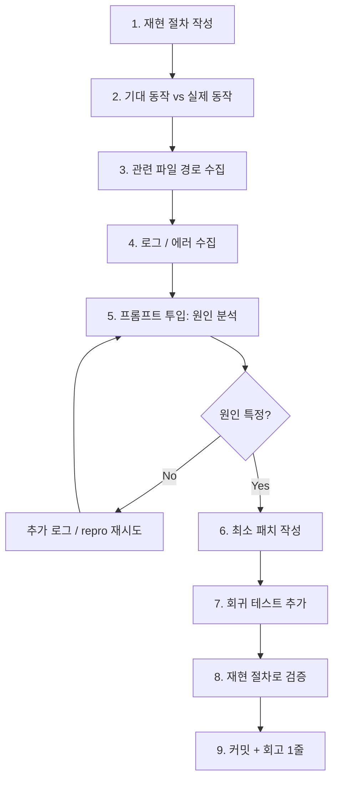

# 03. 버그 수정 흐름 (Bugfix Flow)

> 기존 동작이 깨졌을 때. 속도보다 **재현성**이 중요.

## 원칙

1. **재현 없이 수정 금지** — 재현 안 되는 버그는 아직 버그가 아니다.
2. **원인 확인 없이 패치 금지** — 증상만 가리면 다음 주에 되살아난다.
3. **테스트 없이 종료 금지** — 회귀 방지 테스트가 없으면 고친 게 아니다.

## 흐름도



---

## 필수 수집 정보 (프롬프트 투입 전)

```markdown
## 버그 리포트
### 재현 절차
1. ...
2. ...
3. ...

### 기대 동작
- ...

### 실제 동작
- ...

### 환경
- OS / 브라우저 / Node 버전 / DB 버전
- 최근 변경 (커밋 해시 또는 날짜)

### 에러 로그
```
<붙여넣기>
```

### 관련 파일 (추정)
- src/a.ts
- src/b.ts
```

이 5개 섹션을 채우지 않고 Claude Code에 "버그 고쳐줘" 하면 에이전트가 소설을 씁니다.

---

## 단계별 체크리스트

1. **재현 절차** — 3줄 이하로 딱 떨어지게
2. **기대 vs 실제** — 한 줄씩
3. **관련 파일** — 아는 것만. 모르면 "추정"이라 적기
4. **로그** — 가능한 전부. 잘라내지 말기
5. **원인 분석 프롬프트** — [`02-프롬프트/02-버그수정`](../02-프롬프트(prompts)/02-버그수정(bugfix).md) 사용. 바로 수정 요청하지 말고 "원인 먼저 설명" 요구
6. **최소 패치** — 원인 한 곳만 고치기. "근처 정리"는 다른 PR
7. **회귀 테스트** — 고친 버그를 재현하는 테스트 1개 추가
8. **검증** — 1번 재현 절차로 다시 확인
9. **회고 1줄** — `CHANGELOG.md` 또는 `docs/bugs.md`에 "왜 생겼고 어떻게 막는지" 한 줄

---

## "원인 먼저" 프롬프트 패턴

> 절대 바로 수정 요청하지 마세요. 원인을 먼저 설명하게 만듭니다.

```
위 버그 리포트를 기반으로, 다음 순서로 답해주세요.

1. 재현 경로를 코드 위치로 역추적 (파일:라인)
2. 원인 가설 (3개 이하, 각각 1~2문장)
3. 가설을 검증할 최소 실험 (가능한 로그/assertion)
4. 수정안은 이 메시지에선 **작성하지 마세요**

수정안은 가설이 확정된 뒤 다음 메시지에서 요청하겠습니다.
```

이 한 단계가 "엉뚱한 파일 10개 수정" 재앙을 막습니다.

---

## 대응 프롬프트

→ [02-프롬프트/02-버그수정(bugfix).md](../02-프롬프트(prompts)/02-버그수정(bugfix).md)
