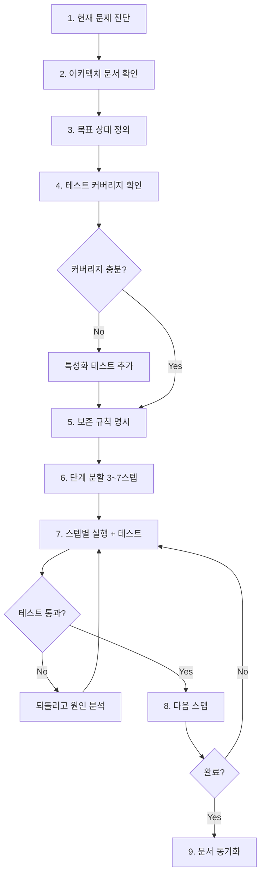

# 04. 리팩토링 흐름 (Refactoring Flow)

> 동작은 맞지만 구조가 나쁜 코드를 개선. **행동 보존**이 절대 원칙.

## 절대 규칙

1. **테스트 없는 코드는 리팩토링 금지** — 먼저 특성화 테스트(characterization test)부터.
2. **한 번에 한 가지** — "이름 변경 + 구조 변경 + 기능 추가"를 섞지 않는다.
3. **퍼블릭 API 변경 금지** (사전 합의 없이는) — 호출측이 같이 변해야 하는 변경은 리팩토링이 아니라 기능 변경.

---

## 흐름도



---

## 프롬프트에 반드시 들어가야 할 3가지

### (1) 현재 문제를 수치로

나쁜 예: "이 코드 좀 깔끔하게 해줘"

좋은 예:
> `src/services/order.ts`가 847줄이며, 주문 생성 / 결제 / 배송 / 알림 4개의 관심사가 한 클래스에 섞여 있다. 단위 테스트가 모킹 20개를 요구한다.

### (2) 목표 상태를 구조로

나쁜 예: "모듈로 쪼개줘"

좋은 예:
> 4개의 서비스(`OrderCreation`, `Payment`, `Shipping`, `Notification`)로 분리. 각 서비스는 자기 레포지토리만 의존. 공통은 `OrderContext` 값 객체로 전달.

### (3) 보존 규칙(Preservation Rules)

이게 제일 중요합니다.

```markdown
## 보존 규칙
- `POST /api/orders` 요청/응답 스키마 변경 금지
- 기존 테스트 `tests/order/*.spec.ts`는 모두 통과해야 함
- DB 스키마 변경 금지 (필요하면 별도 스키마변경흐름 실행)
- 에러 코드 / 메시지 그대로
- 로그 포맷 그대로 (관측성 파이프라인 의존)
```

---

## 단계 분할 예시

847줄 서비스 리팩토링을 하루에 하지 마세요.

```
Step 1. 특성화 테스트 추가 (PR 1)
Step 2. Payment 관심사 분리 — 원본 클래스는 위임만 (PR 2)
Step 3. Shipping 관심사 분리 (PR 3)
Step 4. Notification 관심사 분리 (PR 4)
Step 5. OrderCreation만 남은 원본 정리 (PR 5)
Step 6. 중간 위임 레이어 제거 (PR 6)
```

각 PR은 **그린 상태**로 머지 가능해야 합니다. 중간에 쪼개진 상태의 PR은 금지.

---

## 대응 프롬프트

→ [02-프롬프트/03-리팩토링(refactoring).md](../02-프롬프트(prompts)/03-리팩토링(refactoring).md)
