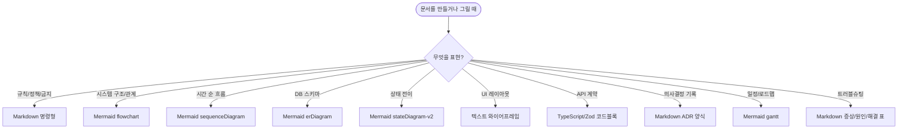

# 01. 문서 종류별 최적 포맷 매칭

> "어떤 문서를 어떤 포맷으로 적을지"의 결정표. README의 일반론을 **문서 종류별로** 구체화.

## 한 장 결정표

| 문서 종류 | 1순위 포맷 | 2순위 / 보조 | 절대 쓰지 마라 |
|----------|----------|-------------|--------------|
| **CLAUDE.md** (규칙) | Markdown (명령형) | 표 (정책 비교) | HTML, 이미지 |
| **PRD.md** (요구사항) | Markdown 리스트 + 표 | Mermaid gantt (로드맵) | Word/PDF, 슬라이드 |
| **architecture.md** | **Mermaid flowchart** + Markdown 설명 | sequenceDiagram (주요 플로우) | draw.io, Visio |
| **erd.md** | **Mermaid erDiagram** | Markdown 표 (컬럼 상세) | DBeaver export, PNG |
| **feature-spec** | Markdown + 체크박스 + Mermaid | sequenceDiagram (시나리오) | 이미지 와이어프레임 단독 |
| **ADR** | Markdown (Context/Decision/Consequences) | - | 긴 산문 |
| **handoff 노트** | Markdown 체크리스트 + 코드블록 | git log 발췌 | - |
| **API 계약** | TypeScript / Zod 코드블록 | Mermaid sequenceDiagram | 수동 OpenAPI YAML |
| **상태 머신** | **Mermaid stateDiagram-v2** | - | 산문 설명만 |
| **UI 와이어프레임** | **텍스트 박스 ASCII** | Markdown 컴포넌트 트리 | Figma 단독 (병기 OK) |
| **데이터 흐름** | Mermaid flowchart LR | sequenceDiagram | 산문만 |
| **로드맵 / 일정** | Mermaid gantt | Markdown 표 | Excel, MS Project |
| **트러블슈팅 가이드** | Markdown 표 (증상→원인→해결) | - | FAQ 산문 |
| **테스트 시나리오** | Markdown Given/When/Then | - | Excel 시나리오 |

---

## 매칭 근거

### 1. CLAUDE.md → Markdown 명령형

**왜**: 에이전트가 줄단위로 파싱. 명령형 ("~하지 마라") 이 의도 전달이 가장 강함.
**어떻게**: 섹션 헤더 + 불릿 + 코드 블록 (빌드 명령). 산문 금지.

```markdown
## 금지 사항
- `console.log` 커밋 금지
- `as any` 금지
```

### 2. PRD.md → Markdown 리스트 + 표

**왜**: 우선순위 (P0/P1/P2) 가 시각적으로 분리되어야 함. 체크박스로 진행 상태 표시.
**보조**: 로드맵이 필요하면 Mermaid `gantt`.

```markdown
### P0
- [ ] F-001 ...
- [x] F-002 ...
```

### 3. architecture.md → Mermaid flowchart + sequenceDiagram

**왜**: 시스템 구조는 노드/엣지 그래프. 주요 플로우는 시간 축. 두 다이어그램이 80% 커버.
**경계**: flowchart 한 장이 30 노드를 넘으면 분할.

### 4. erd.md → Mermaid erDiagram

**왜**: ER 다이어그램은 표준 표기. 에이전트가 직접 파싱해서 ORM 코드 생성에 사용.
**보조**: 컬럼 타입/제약은 별도 Markdown 표.


### 5. feature-spec → Markdown 체크박스

**왜**: 수용 기준이 **검증 가능한 단위**여야 함. 체크박스가 강제.
**보조**: 시나리오는 sequenceDiagram, UI는 텍스트 와이어프레임.

### 6. ADR → Markdown Context/Decision/Consequences

**왜**: ADR 표준 구조. 짧고 고정. 변경 안 됨 (Superseded만 가능).
**금지**: 긴 산문 — 5분 안에 읽어야 함.

### 7. UI 와이어프레임 → 텍스트 ASCII 박스

**왜**: 에이전트 이해도 ★★★★★. Figma 이미지 ★★★☆☆.
**보조**: Figma가 있어도 **반드시 텍스트 와이어프레임 병기**.

```
┌──────────┐
│ [Logo]   │
│  [Btn]   │
└──────────┘
```

### 8. API 계약 → TypeScript / Zod 코드블록

**왜**: 수동 OpenAPI는 코드와 즉시 어긋남. 코드 자체가 명세.
**예외**: 외부 API 공개 시 자동 생성된 OpenAPI. 수작성 금지.

```ts
// 직접 적는다
const Favorite = z.object({
  productId: z.string().uuid(),
});
```

---

## 포맷별 사용 가이드

### Markdown (모든 문서의 뼈대)
- 헤더: `##`, `###`까지만 (`####` 이상은 컨텍스트 분실)
- 표: 10행 이하 권장
- 코드 블록: 언어 태그 필수 (` ```ts`, ` ```sql`, ` ```bash`)
- 링크: 상대 경로
- 강조: `**볼드**`만 사용 (`*이탤릭*`은 가독성 ↓)

### Mermaid (구조/관계/시간)
| 다이어그램 | 용도 | 노드 한도 |
|-----------|------|----------|
| flowchart LR/TD | 시스템 구조, 데이터 흐름 | ~30 |
| sequenceDiagram | 시간순 상호작용 | ~10 actors |
| erDiagram | DB 스키마 | ~15 entities |
| stateDiagram-v2 | 상태 머신 | ~10 states |
| gantt | 일정/로드맵 | ~20 tasks |
| classDiagram | (사용 비추천 — 코드와 어긋남) | - |

### 텍스트 와이어프레임 (UI 전용)
- 박스: `┌ ─ ┐ │ └ ┘` (또는 ASCII `+ - |`)
- 인터랙티브: `[버튼]`, `[입력_필드]`
- 상태: 박스 아래 "States:" 블록
- 반응형: "sm/md/lg: ..." 줄

---

## 안티 매칭 (자주 보는 잘못된 조합)

| 잘못된 조합 | 왜 안 되는가 | 옳은 조합 |
|------------|------------|---------|
| 아키텍처를 산문으로만 | 영향 범위 추론 불가 | + Mermaid flowchart |
| ERD를 dbdiagram.io 이미지로 | 버전 관리/diff 불가 | Mermaid erDiagram |
| UI를 Figma 이미지만 | 에이전트가 픽셀 추측 | + 텍스트 와이어프레임 |
| API 명세를 수동 OpenAPI로 | 코드와 어긋남 | TS/Zod 코드 자체가 명세 |
| 로드맵을 Excel로 | 에이전트 못 읽음 | Mermaid gantt |
| 트러블슈팅을 산문 FAQ로 | 검색성 ↓ | "증상 / 원인 / 해결" 표 |
| ADR을 5페이지로 | 안 읽힘 | 1페이지 미만 |

---

## 도구 의존성 매트릭스

> "이 포맷을 사람이 보려면 / AI가 보려면 / git diff로 보려면 무엇이 필요한가"

| 포맷 | 사람 | AI 에이전트 | git diff | 추천도 |
|------|-----|-----------|---------|--------|
| Markdown | 에디터 | ✅ 직접 | ✅ 줄단위 | ★★★★★ |
| Mermaid (in MD) | GitHub/IDE 렌더러 | ✅ 직접 (텍스트) | ✅ 줄단위 | ★★★★★ |
| ASCII 와이어 | 에디터 | ✅ 직접 | ✅ | ★★★★★ |
| PlantUML | Java + 렌더러 | ✅ 텍스트 | ✅ | ★★★☆☆ |
| draw.io (.drawio) | draw.io 앱 | ❌ XML 추정 | △ XML diff | ★★☆☆☆ |
| Figma | 브라우저 + 계정 | ❌ 비전 의존 | ❌ | ★★☆☆☆ (UI에만) |
| Word/PDF | 전용 리더 | △ 추출 의존 | ❌ | ★☆☆☆☆ |
| Confluence | 플랫폼 + 계정 | ❌ | ❌ | ☆☆☆☆☆ |

**선택 원칙**: 세 열 (사람/AI/diff) 모두 ✅인 것만 1순위.

---

## 빠른 의사결정



---

## 관련 문서

- [05-포맷/README.md](./README.md) — 포맷 일반 원칙 + Mermaid 스니펫 모음
- [03-문서템플릿/00-문서종류분류](../03-문서템플릿(templates)/00-문서종류분류(document-types).md) — 어떤 문서를 만들지 (필수/권장/불필요)
- [03-문서템플릿/](../03-문서템플릿(templates)/) — 각 문서의 실제 템플릿 파일
