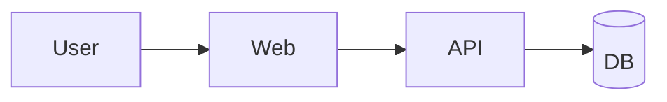
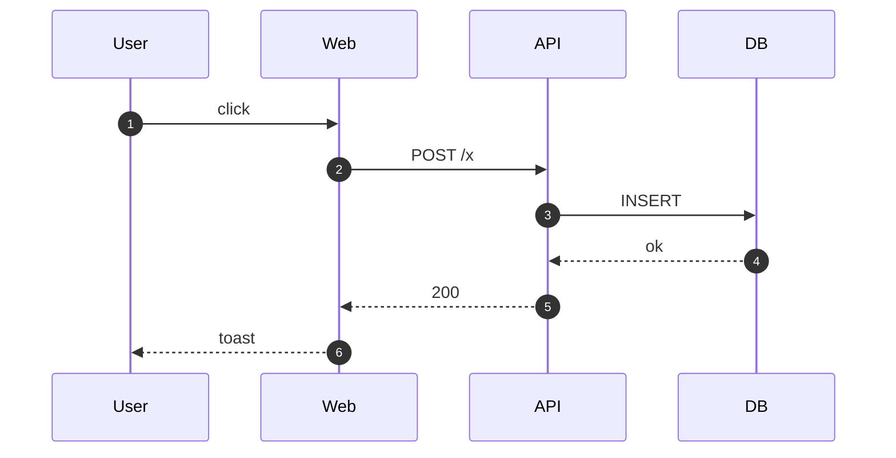
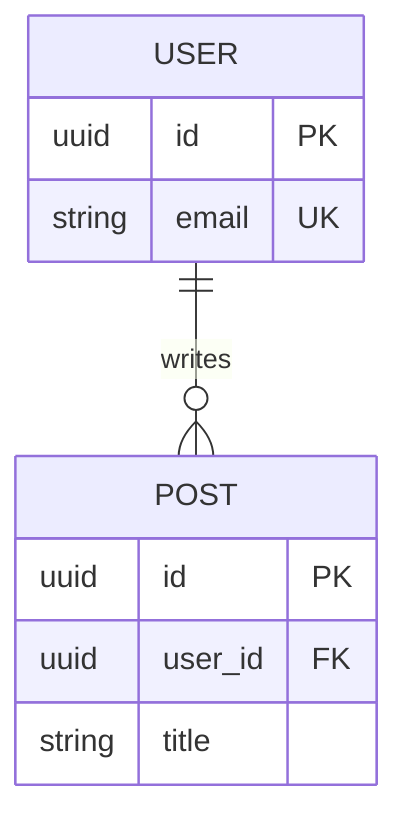
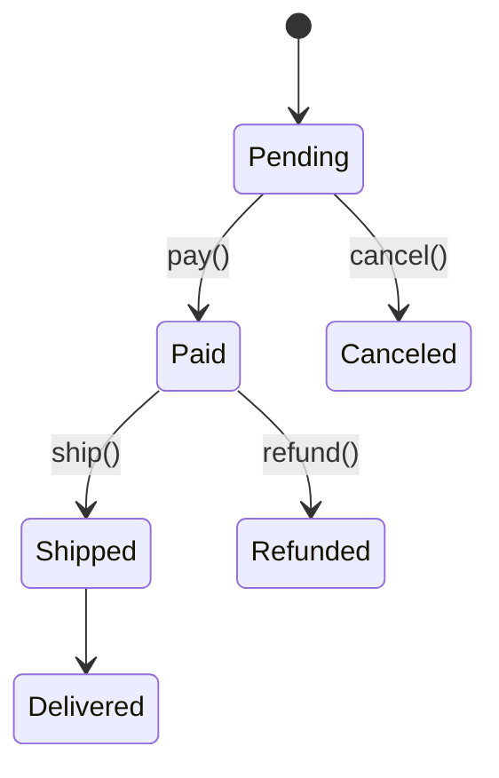
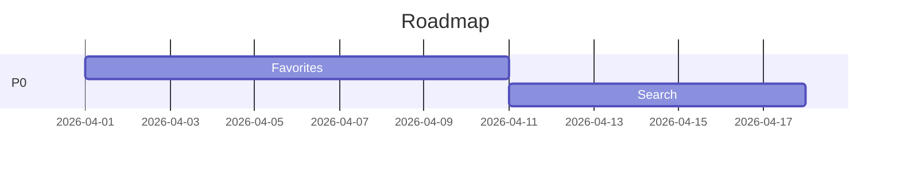

# 05. 에이전트 친화 포맷

> "Markdown + Mermaid 조합으로 모든 문서 요구를 덮을 수 있다." — vibe coding의 문서 포맷 기본 원칙.

## 한 줄 결론

| 상황 | 쓸 것 |
|------|-------|
| 규칙 / 설명 / 체크리스트 | **Markdown** |
| 시스템/컴포넌트 구조 | **Mermaid flowchart** |
| 시퀀스 / 상호작용 | **Mermaid sequenceDiagram** |
| DB 스키마 | **Mermaid erDiagram** |
| 상태 전이 | **Mermaid stateDiagram-v2** |
| UI 레이아웃 | **텍스트 와이어프레임 (박스 문자)** |
| 표 형태 데이터 | **Markdown table** |

다른 건 거의 필요 없습니다.

---

## 포맷 비교 표

| 포맷 | 사람 가독성 | AI 이해도 | Diff 용이성 | 도구 의존 | 추천도 |
|------|-----------|----------|------------|----------|--------|
| **Markdown** | ★★★★★ | ★★★★★ | ★★★★★ | 없음 | ★★★★★ |
| **Mermaid** | ★★★★☆ | ★★★★★ | ★★★★★ | 렌더러 | ★★★★★ |
| PlantUML | ★★★★☆ | ★★★★☆ | ★★★★☆ | Java 설치 | ★★★☆☆ |
| draw.io (.drawio) | ★★★★★ | ★★☆☆☆ | ★☆☆☆☆ | GUI | ★★☆☆☆ |
| Figma | ★★★★★ | ★★★☆☆ | ★☆☆☆☆ | 계정/브라우저 | UI에만 |
| Confluence/Notion 독점 포맷 | ★★★★☆ | ★★☆☆☆ | ★☆☆☆☆ | 플랫폼 | ★☆☆☆☆ |
| PDF | ★★★★★ | ★★★☆☆ | ★☆☆☆☆ | 리더 | ★☆☆☆☆ |

### 선택 기준

1. **git diff가 의미 있게 나오는가** — 변경 이력을 코드처럼 다루려면 텍스트 기반이어야 함
2. **AI가 파싱할 수 있는가** — 바이너리/이미지는 에이전트가 추정에 의존
3. **외부 도구 없이 보이는가** — IDE/GitHub만으로 열리는가

Markdown + Mermaid는 세 기준을 모두 만족하는 유일한 조합에 가깝습니다.

---

## Mermaid 실전 스니펫

### 시스템 구조 (flowchart)


### 시퀀스 (sequenceDiagram)


### ER (erDiagram)


### 상태 전이 (stateDiagram-v2)


### 간트 (gantt)


---

## 텍스트 와이어프레임 규칙

1. 박스는 `┌ ─ ┐ │ └ ┘`로 (ASCII 대체: `+ - | +`)
2. 버튼/입력은 `[...]`, 링크는 `[text]`
3. 상태 표기는 박스 아래에 별도 블록
4. 반응형은 "sm/md/lg: ..." 문구로

예시: [UI 구현 프롬프트](../02-프롬프트(prompts)/05-UI구현(ui).md) §4

---

## Markdown 스타일 규칙 (agent-friendly)

### 좋음
- 제목 레벨 2~3까지만 (깊어지면 AI가 맥락을 놓침)
- 표는 작게 (10행 넘으면 리스트로)
- 코드 블록은 언어 태그 포함 (` ```ts`)
- 링크는 상대 경로
- 파일/경로는 백틱으로 감싸기

### 피함
- HTML 임베드 (AI가 파싱 우회)
- 장식 이미지 (대신 Mermaid)
- 매우 긴 표 (30행+)
- 섹션 번호 5단계 이상 (`5.3.2.1.4`)

---

## 예외: 언제 Mermaid로 부족한가

- **픽셀 단위 UI 디자인**: Figma가 맞지만, 에이전트에겐 **텍스트 와이어프레임을 병기**.
- **복잡한 데이터 시각화**: 실제 차트는 코드로 생성 (예: Observable, matplotlib 스크립트).
- **UML 전체 14종**: Mermaid는 일부만 지원. 대부분 프로젝트엔 Mermaid로 충분.

---

## 참고: 이 레포 자체의 포맷 규칙

이 `vibe-coding/` 폴더의 모든 문서는 위 규칙을 **그대로** 따르고 있습니다. 새 문서를 추가할 때도 동일하게 유지하세요.
